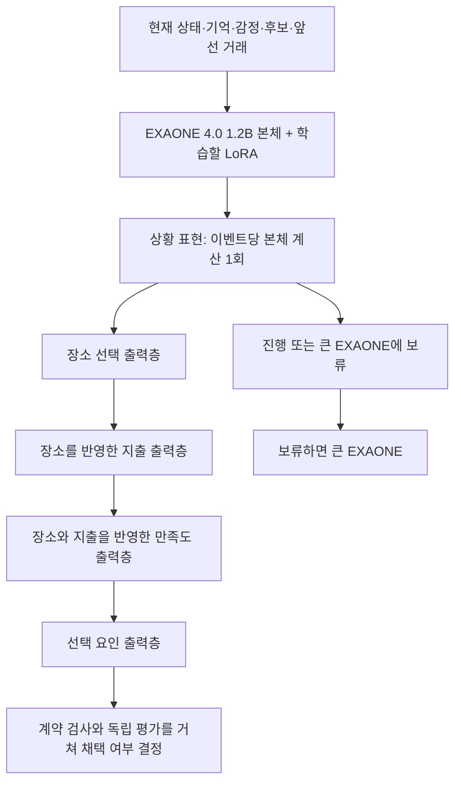

# 우리가 만드는 모델: EXAONE-SimDecision-1.2B

## 목표를 정확히 정리하면

**LG EXAONE을 우리 시뮬레이션의 빠른 판단 모델로 학습시킵니다.** 평소 음식점 선택은 이 모델이 담당하고, 중요한 변화나 판단하기 어려운 상황은 큰 EXAONE으로 넘기는 것이 목표입니다.

예를 들어, 익숙한 점심 상황에서는 장소·지출·경험 만족도를 빠르게 결정합니다. 누적 불만, 감정 변화, 새로운 정책처럼 복잡한 요인이 있으면 큰 모델의 판단을 요청합니다. 감정과 기억은 계속 다음 행동에 반영합니다.

이전에 보고한 CPU 전처리 가속은 보조 작업입니다. 이번에 추가한 핵심은 **EXAONE의 내부 표현으로 직접 결정을 내리는 학습 가능한 신경망과 그 학습 코드**입니다.

## 모델은 어떻게 생겼나



큰 계산은 EXAONE 본체가 맡고, 그 뒤의 작은 신경망들이 결정합니다. 문장이나 JSON을 한 글자씩 생성하지 않으며, 언어 생성용 출력층도 사용하지 않습니다. 새 출력층과 EXAONE 내부 LoRA를 함께 학습합니다.

장소·지출·만족도를 독립적으로 고르면 서로 맞지 않는 결과가 나올 수 있습니다. 그래서 출력층 사이에서는 앞선 선택을 전달합니다. 이 작은 출력층 계산 때문에 EXAONE 본체를 다시 실행하지는 않습니다. 하루에 여러 번 소비한다면 앞선 거래를 입력에 포함해 **이벤트별로** 본체를 실행합니다. 하루 전체가 무조건 한 번이라는 뜻은 아닙니다.

## 이전 코드와 이번 모델의 차이

| 구분 | 이전 비교용 구현 | 이번 전용 모델 |
|---|---|---|
| 판단 점수를 읽는 곳 | EXAONE의 기존 언어 출력층에서 선택 코드 점수 | 새로 학습하는 판단 출력층 |
| 실제로 학습하는 부분 | 기존 선택 코드 분류를 위한 LoRA | EXAONE LoRA + 판단 출력층 + 앞선 선택을 전달하는 임베딩 |
| 본체 실행 | 라우팅 1회 + 이벤트마다 최대 4회 | 이벤트마다 1회 |
| 출력 | 제한 선택지 점수 | 진행·장소·지출·만족도·요인의 조건부 점수 |
| 상태 | 비교 기준으로 유지 | 새로운 모델 개발 대상 |

본체 호출 횟수가 줄어드는 것은 코드로 확인했습니다. **실제 소요 시간이 그 비율만큼 줄어든다고 단정할 수는 없습니다.** 두 방식의 입력 형식과 학습 구조도 다르므로 품질 비교가 필요합니다.

## 무엇을 학습시키나

기존 데이터 수집기가 저장한 큰 EXAONE의 결정을 감독 신호로 사용합니다. 사람 ID 단위의 학습·보정·평가 분리를 유지하고, 사후 보정된 교사 출력과 합성 검사용 자료를 구분합니다.

- 상황만 보고 진행/보류와 장소를 맞히도록 학습합니다.
- 교사가 고른 장소를 조건으로 지출을, 장소와 지출을 조건으로 만족도를 학습합니다.
- 현재 결정의 정답은 EXAONE 본체 입력에 넣지 않습니다. 다음 이벤트의 입력에는 앞서 완료된 거래만 포함합니다.
- 중간에 보류 라벨이 있으면 뒤의 정답을 임의로 만들어 학습하지 않습니다.
- 실제 추론에서는 교사 답 없이 작은 모델이 고른 앞선 선택을 사용합니다. 이때 오류가 누적되는 정도는 별도로 평가해야 합니다.

**현재 라우팅 정답은 초기 적용 범위를 정한 규칙에서 얻은 임시 감독 신호입니다.** 작은 모델이 언제 틀리는지 측정한 정답이나, 특징적인 행동 변화를 사람이 판정한 정답은 아닙니다. 실제 학습 단계에서는 변화 사례·실패 사례의 검토 자료를 보강하고, 독립 자료에서 보류 기준을 검증해야 합니다. 현재의 높은 점수를 정답 확률로 취급하지 않습니다.

## 지금 완료한 것과 남은 것

| 항목 | 현재 상태 |
|---|---|
| EXAONE + 전용 판단 출력층 모델 클래스 | 구현 |
| 기존 수집 자료를 모델 학습쌍으로 변환 | 구현, 입력·정답 분리 검사 |
| LoRA와 출력층의 공동 학습 | 구현, 작은 무작위 EXAONE으로 CPU 검사 |
| 어댑터·출력층·토크나이저 저장/재로딩 | 구현, 파일 지문 검사 |
| 학습 모델로 과거 캡처 재실행 | 구현, 운영 결정을 바꾸지 않는 오프라인 경로 |
| 실제 EXAONE 사전학습 가중치로 학습 | **미실행: GPU 및 실제 학습 자료 필요** |
| 새 구조의 확률 보정·현실 예측력·전체 속도 검증 | **미실행** |
| 시뮬레이션의 실제 자동 라우팅 활성화 | **독립 품질 검증 후 적용** |

CPU 테스트용 무작위 모델은 실제 납품할 EXAONE 파생 모델이 아닙니다. 원래 EXAONE 가중치와 새 판단 출력층을 실제 자료로 함께 학습한 체크포인트가 최종 모델입니다.

이번 변경 후 관련 검사 **175개 통과, 1개 건너뜀**을 확인했습니다. 새 모델 검사 12개에는 본체 호출 1회, 출력층 사이의 선택 반영, 이전 거래 입력, 정답 누출 방지, 마스킹, 패딩, CPU LoRA·출력층 학습과 체크포인트 재로딩이 포함됩니다. 건너뛴 검사는 기존 Stage1의 실제 자료 경로가 연결되지 않은 경우입니다.

실제 EXAONE 토크나이저로 합성 예시의 새 모델 입력도 검사했습니다(432토큰, 후보 2개). 이는 입력 형식 검사이며 예측 성능 측정이 아닙니다. 로컬 결과는 `sim_output/fast_decision/decision_dry_run/dry_run.json`, `sim_output/fast_decision/decision_input_validation.json`에 있습니다.

## 실행 방법

기존 수집·자료 분리 명령은 [실행 안내](../scripts/sim/fast_decision/README.md)를 사용합니다. 이번 모델의 학습 명령은 `decision_training`입니다. 이전 `training`은 비교용 선택 코드 모델입니다.

GPU 없이 자료 변환과 조건부 정답만 검사:

```powershell
python -m scripts.sim.fast_decision.decision_training --input sim_output/fast_decision/dataset-001/train.jsonl --output sim_output/fast_decision/decision-check-001 --dry-run
```

GPU 연결 후 실제 학습:

```powershell
$revision = '3abf2810673c7c0778df64a73c2d52eab32d91c4'
python -m scripts.sim.fast_decision.decision_training --input sim_output/fast_decision/dataset-001/train.jsonl --output sim_output/fast_decision/EXAONE-SimDecision-1.2B --revision $revision --device cuda --allow-download
```

`--allow-download`가 없으면 로컬 가중치만 읽습니다. GPU가 없으면 가중치 다운로드 전에 중단합니다. 모델 결과에는 `adapter/`, `decision_heads.safetensors`, `decision_config.json`, `tokenizer/`, `training_manifest.json`이 포함됩니다. 출력 경로는 새 실험마다 새로 지정합니다.

학습에 쓰지 않은 사람들의 캡처를 별도 파일로 준비한 뒤:

```powershell
python -m scripts.sim.fast_decision.decision_inference --checkpoint sim_output/fast_decision/EXAONE-SimDecision-1.2B --input sim_output/fast_decision/held-out-captures.jsonl --output sim_output/fast_decision/decision-replay-001.jsonl --device cuda
python -m scripts.sim.fast_decision.evaluation --input sim_output/fast_decision/decision-replay-001.jsonl --output sim_output/fast_decision/decision-comparison-001.json
```

이 비교 결과는 큰 EXAONE과의 차이입니다. 실제 방문·소비·감정 자료와 장기 실행 검증도 필요합니다. 기존 선택 코드 모델의 어댑터나 온도 보정 파일을 새 판단 출력층에 적용하면 안 됩니다.

## Jev에서 가져온 것

Jev는 텍스트 생성 대신 구조화된 결정과 확률을 출력하는 방향을 제시합니다. TypeSafe는 별도 구조와 병렬 샘플러, RLCD 학습을 소개합니다. 공개 설명만으로 그 전체를 복제했다고 말할 수는 없습니다. [TypeSafe 공식 발표](https://typesafe.ai/blog/introducing-system-one-models-and-jev), [RLCD 개요](https://docs.typesafe.ai/introduction/machine-learning-primer)

우리는 그 방향을 EXAONE에 적용한 **시뮬레이션 전용 조건부 판단 모델**을 만듭니다. 이번 구현의 학습법은 감독 학습이며 RLCD 구현은 아닙니다. 구조를 제한하면 후보 밖 ID 같은 오류는 줄일 수 있지만, 합법적인 후보 중 잘못 고르는 예측 오류까지 사라지는 것은 아닙니다. [LG EXAONE 기반 모델](https://huggingface.co/LGAI-EXAONE/EXAONE-4.0-1.2B)
