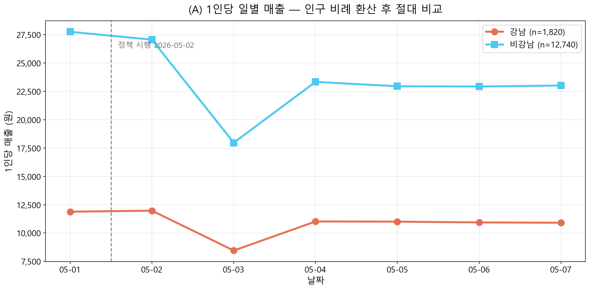
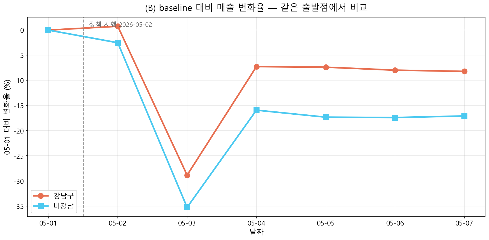
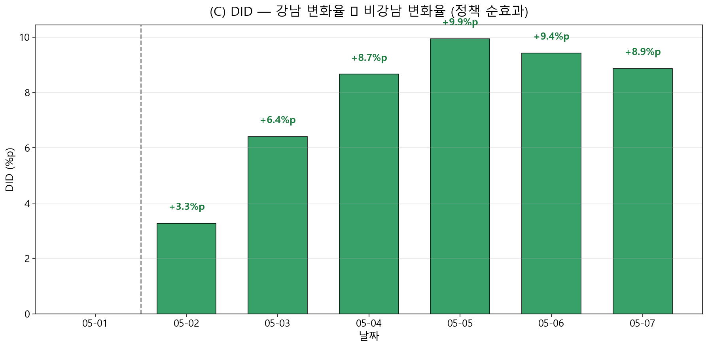
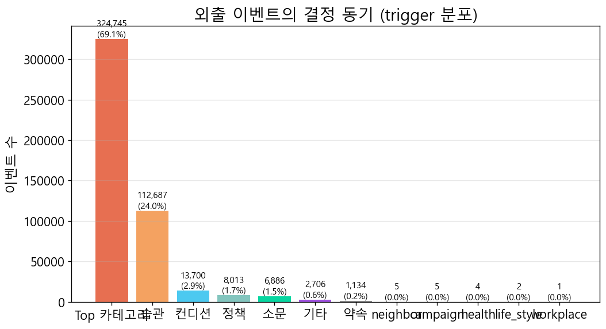
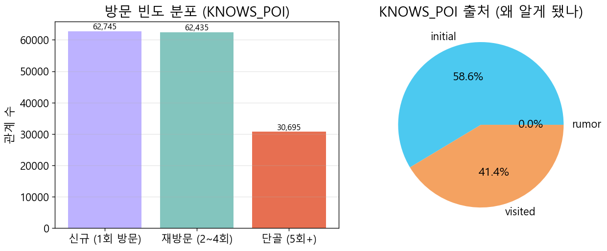
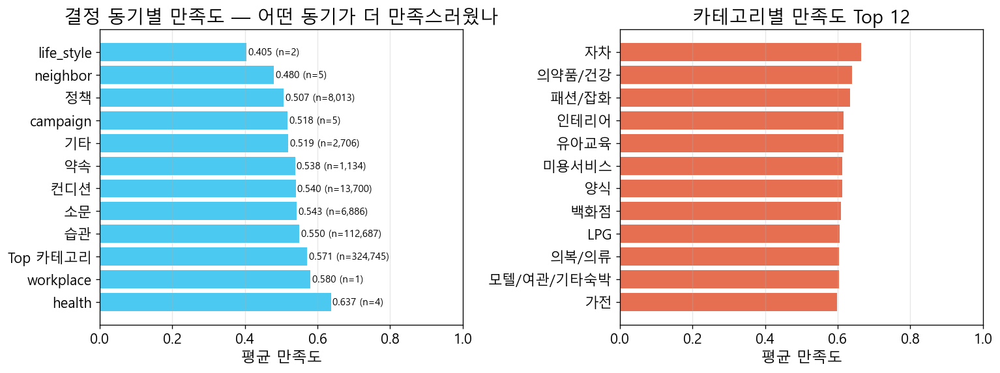

# 서울 상권정책 시뮬레이션 — 최종 보고서

**작성일**: 2026-05-20 23:05 KST

**기간**: 2026-05-01 ~ 2026-05-07 (7일) · **모델**: Qwen3-14B-AWQ · **정책 시행**: 2026-05-02

## 1. 시뮬레이션 조건 요약

| 항목 | 값 |
|---|---:|
| 기간 | 2026-05-01 ~ 2026-05-07 |
| 일수 | 7 |
| 정책_시행일 | 2026-05-02 |
| Agent 수 | 14,881 |
| Plan 수 | 101,708 |
| INCLUDES 엣지 | 842,011 |
| State 수 | 116,586 |
| Memory(visited) | 444,914 |
| Memory(rumor) | 51,275 |
| Conversation 약속 | 349 |
| Conversation 추천 | 58,553 |
| Conversation 이슈 | 1 |
| Conversation 기타 | 46,256 |

## 2. 정책 시행 전 vs 후 매출 추이

### 평균 일간 매출 비교

| 자치구 | 시행 전 | 시행 후 | 변화율 |
|---|---:|---:|---:|
| 강남 (정책 대상) | 21,630,000원 | 19,506,000원 | **-9.82%** |
| 비강남 (대조군) | 353,682,000원 | 291,490,000원 | -17.58% |

**DID (정책 순효과)**: 강남 변화율 − 비강남 변화율 = **+7.76%p**

## 3. 간접 영향 (Spillover) — 강남 vs 인접 자치구

강남구 정책이 인접한 서초·송파에 어떤 파급을 줬는지, 멀리 떨어진 강북과 비교. 인접 자치구의 강남 대비 매출 격차가 좁혀지면 spillover로 해석.

## 4. 소비자 행동·심리 분석

### 4-1. 방문 목적·이동 패턴 — 결정 동기 (trigger) 분포

외출(집·직장 제외)의 결정 동기 분류:

| 동기 | 건수 | 비율 |
|---|---:|---:|
| Top 카테고리 | 324,745 | 69.11% |
| 습관 | 112,687 | 23.98% |
| 컨디션 | 13,700 | 2.92% |
| 정책 | 8,013 | 1.71% |
| 소문 | 6,886 | 1.47% |
| 기타 | 2,706 | 0.58% |
| 약속 | 1,134 | 0.24% |
| neighbor | 5 | 0.0% |
| campaign | 5 | 0.0% |
| health | 4 | 0.0% |
| life_style | 2 | 0.0% |
| workplace | 1 | 0.0% |

### 4-2. 단골 vs 신규

| 구분 | 관계 수 |
|---|---:|
| 신규 (1회 방문) | 62,745 |
| 재방문 (2~4회) | 62,435 |
| 단골 (5회+) | 30,695 |

전체 KNOWS_POI(방문 경험 있음) 관계 수: **155,875**

### 4-3. 만족도·피드백 — 어떤 동기로 외출했을 때 더 만족했나

| 동기 | 평균 만족도 | 표본 수 |
|---|---:|---:|
| health | 0.637 | 4 |
| workplace | 0.58 | 1 |
| Top 카테고리 | 0.571 | 324,745 |
| 습관 | 0.55 | 112,687 |
| 소문 | 0.543 | 6,886 |
| 컨디션 | 0.54 | 13,700 |
| 약속 | 0.538 | 1,134 |
| 기타 | 0.519 | 2,706 |
| campaign | 0.518 | 5 |
| 정책 | 0.507 | 8,013 |
| neighbor | 0.48 | 5 |
| life_style | 0.405 | 2 |

## 5. 1대1 인터뷰 — 페르소나별 대표 (positive / negative / neutral)

### [positive] 정책 적극 활용 + 만족도 ↑ — `AGT_11215780_M_30대_002`

- **페르소나**: 30대 M · 마케팅 전문직 · 중곡제1동 거주 · 소득 중
- **라이프스타일**: 주말에는 친구 및 외식 활동 증가

**Q. 정책(강남구 카페·디저트 바우처)에 대해 어떻게 느끼셨나요? 직접 사용하셨다면 왜 사용했고, 안 쓰셨다면 왜 안 쓰셨는지 알려주세요.**

> 강남구 카페·디저트 바우처는 30% 환급 혜택이 있어서 꽤 유용하게 사용했어요. 특히 평일 오후나 주말에 카페에서 휴식을 취할 때 자주 썼는데, 예를 들어 2026년 5월 5일에 에이림을 방문했을 때 바우처 잔액이 충분해서 썼어요. 정책이 있어서 조금 더 편하게 카페를 즐길 수 있었던 것 같아요. 라이프스타일상 외식과 카페 이용이 많아서 이런 혜택은 정말 반가운데요, 다만 소비 성향이 보통이라 큰 금액을 쓰는 건 부담스러웠어요.

**Q. 가장 자주 가신 가게는 어디고, 왜 그곳을 자주 갔나요?**

> 가장 자주 가는 곳은 에그슬럿이에요. 평일 Top 카테고리에 한식 15%가 포함되어 있고, 직장 근처에 있어서 편리하게 이용할 수 있었어요. 어제 만족도가 0.66이었고, 이전 방문도 만족도가 높았던 터라 다시 갔어요. 라이프스타일상 실속형이라, 가까운 곳을 자주 이용하는 편이에요.

**Q. 친구·동료가 추천한 곳에 가신 적 있나요? 있다면 누가 추천했고, 갔더니 어땠나요?**

> 네, 있었습니다. AGT_11620615_M_30대_001이 에그슬럿을 추천했어요. 그날은 퇴근 후 식사 장소를 찾고 있었는데, 에그슬럿은 평소에 자주 가는 곳이라서 그 추천을 받고 바로 가봤어요. 가봤더니 만족도가 0.66이었는데, 평소에 가는 곳이라 그런지 익숙해서 기분도 좋았고, 저녁 식사로는 딱 좋은 곳이었어요. 둘이서 함께 가면 좋을 것 같아요.

**Q. 약속을 잡으신 적이 있다면 그 약속이 왜 잡혔는지 설명해주세요.**

> 약속은 없었어요. 주로 습관이나 정책, 만족도에 따라 장소를 선택했죠. 예를 들어 5월 6일 오후 13시30분 에이림 카페를 갔는데, 그건 강남 여름 카페 바우처 정책 때문이었어요. 30% 환급 혜택을 받을 수 있어서 그날 잔액도 충분했고, 카페 좋아하는 성향도 있어서 갔어요.

**Q. 이번 주 가장 만족스러웠던 외출과 가장 별로였던 외출을 하나씩 꼽아주세요.**

> 이번 주 가장 만족스러웠던 외출은 5월 5일에 갔던 에이림 카페입니다. 강남 여름 카페 바우처 30% 환급 정책을 활용한 거라서 잔액도 아끼면서 즐거운 휴식을 취할 수 있었거든요. 만족도도 0.60으로 괜찮았어요.  

가장 별로였던 외출은 5월 7일에 갔던 대청마루 한식점이에요. 만족도가 0.57으로 평소보다 낮았고, 라이프스타일상 단골은 아니어서 그런지 음식도 별로였어요. 다음엔 다른 곳을 찾아봐야겠네요.

**Q. 다음 주에도 비슷한 패턴으로 다닐 건가요, 바꾸실 건가요? 그 이유는?**

> 아직은 비슷한 패턴으로 다닐 것 같아요. 평일에 편의점, 한식, 주유소를 자주 이용하는 습관이 있고, 특히 에그슬럿 같은 단골 식당이나 가까운 주유소는 계속 가게 될 것 같아요. 정책도 아직 적용 중이라서 카페는 30% 할인 혜택을 받으면서도 꾸준히 이용할 예정이에요. 소비 성향도 중산형이라 큰 변화는 없을 것 같고, 일상적인 루틴을 유지하는 게 더 편할 것 같아요.

---

### 5-negative — 샘플 없음

### [neutral] 정책 무관심 + 만족도 보통 — `AGT_11350600_M_40대_002`

- **페르소나**: 40대 M · 중소기업 경리 · 공릉2동 거주 · 소득 중상
- **라이프스타일**: 가계관리에 신경 씀

**Q. 정책(강남구 카페·디저트 바우처)에 대해 어떻게 느끼셨나요? 직접 사용하셨다면 왜 사용했고, 안 쓰셨다면 왜 안 쓰셨는지 알려주세요.**

> 강남구 카페·디저트 바우처는 제가 직접 사용하지 않았어요. 정책이 발표된 시점의 컨디션이랑 소득 수준, 라이프스타일을 고려하면 큰 소비를 줄이려는 절약형 성향에 맞지 않아서요. 평소에 카페를 자주 방문하지 않으며, 주유소·할인점·슈퍼마켓 같은 필수 소비에 더 신경 쓰는 편이라 그런 거죠. 만족도나 정책의 혜택률도 제가 직접 경험해보진 못했어요.

**Q. 가장 자주 가신 가게는 어디고, 왜 그곳을 자주 갔나요?**

> 가장 자주 가는 곳은 GS25공릉원룸점이에요. 출근 전에 간단한 아침 식사를 위해 가는 게 습관이었고, 거리도 가까워요. 평일 Top 카테고리에 편의점이 10% 포함되어 있어서 필수적으로 가야 할 장소로 생각했거든요. 절약형 성향이라서, 가격도 착하고 편의성이 좋아 자주 가게 되었어요.

**Q. 친구·동료가 추천한 곳에 가신 적 있나요? 있다면 누가 추천했고, 갔더니 어땠나요?**

> 아주 최근에 AGT_11260620_F_30대_001이 황금코다리라는 곳을 추천했었는데, 아직 가보진 않았어요. 사실 제가 추천한 곳은 삼시세끼덮밥이었는데, AGT_11350600_M_50대_004가 저에게 추천한 거예요. 그분은 저녁에 자주 가시는 것 같아서, 한 번 가보고 싶어서 추천해 주셨던 것 같아요. 만족도가 0.57이라서 괜찮아 보여서 다음에 시간이 되면 꼭 가봐야겠어요.

**Q. 약속을 잡으신 적이 있다면 그 약속이 왜 잡혔는지 설명해주세요.**

> 약속은 잡은 적 없어요. 일상적인 소비와 가계 관리에 주력하는 페르소나라, 특별한 약속보다는 단골 가게와 습관적인 장소를 우선으로 이용하고 있거든요. 예를 들어, GS25공릉원룸점이나 삼시세끼덮밥 같은 곳은 거리가 가까우면서 만족도도 괜찮아서 자주 가는 편이에요. 정책이나 소문으로 인해 새로운 장소를 방문할 때도 있지만, 그건 일시적인 탐색일 뿐 약속으로 이어지지 않았어요.

**Q. 이번 주 가장 만족스러웠던 외출과 가장 별로였던 외출을 하나씩 꼽아주세요.**

> 이번 주 가장 만족스러웠던 외출은 5월 5일에 방문한 수유골목냉면먹골점이에요. 평일 Top 카테고리에 한식 14% 포함이라 점심으로 외출했고, 단골이지만 가끔 새 곳도 시도하는 탐색 성향이 있어서 가봤어요. 만족도가 0.67이었거든요. 반면, 가장 별로였던 외출은 5월 3일에 갔던 복지공릉충전소-부품이에요. 주유소 카테고리로 주말 Top 15%에 포함되어 있었지만, 만족도가 0.63으로 좀 떨어졌어요. 라이프스타일이 절약형이라 큰돈 쓰기 부담스러웠던 것 같아요.

**Q. 다음 주에도 비슷한 패턴으로 다닐 건가요, 바꾸실 건가요? 그 이유는?**

> 아마도 비슷한 패턴으로 다닐 거 같아요. 평일에는 편의점, 한식 식당, 슈퍼마켓을 자주 이용하는 게 습관이 되었거든요. 특히 GS25공릉원룸점이나 삼시세끼덮밥 같은 곳은 거리도 가까우면서 만족도도 괜찮아서 자주 가게 되었고, 라이프스타일이 절약형이라 큰 금액을 쓰는 건 피하려고 해요. 소문이나 추천도 없이, 그냥 일상적인 활동 중심으로 움직이려는 편이에요.

---

## 부록

- 본 보고서는 `scripts/sim/generate_final_report.py`로 자동 생성됨.
- 시뮬 원본 데이터는 Neo4j에 보존 (Plan/State/Memory/Conversation 노드).
- 인터랙티브 시각화: `output/sim/visualization/sim_standalone.html`
