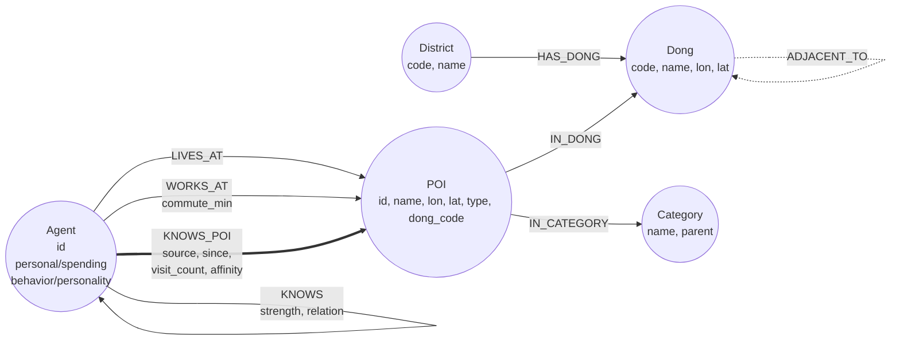
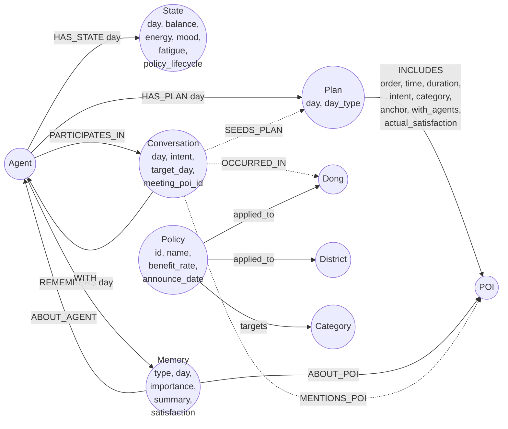

# 🗺️ Neo4j 온톨로지 + Day 0 적재 가이드

> 상권정책 소비행동 시뮬레이션의 Neo4j 그래프 스키마 정의와 적재 절차를 한 곳에 모은 문서.
> **이 한 파일만 보면 동일한 그래프를 재현할 수 있다**.

---

## 0. 한 줄 요약

- **목적**: 60일 시뮬을 위한 Day 0 그래프 적재 (Agent ~15K, POI ~54만, 엣지 ~220만)
- **저장소**: Neo4j Community 5.x **단일** (PostgreSQL/Graphiti 미사용)
- **쿼리 방식**: agentic RAG 아님 — Python 컨텍스트 빌더가 Cypher 사전 조회 → LLM 프롬프트 주입
- **LLM**: vLLM + Qwen3-32B 단일 인스턴스 (시뮬 단계에서만)

---

## 1. 환경 요구사항

| 항목 | 최소 | 권장 |
|---|---|---|
| OS | Ubuntu 22.04+ / Windows + WSL2 Ubuntu | 동일 |
| Neo4j | 5.x Community | 5.26.x |
| Java | OpenJDK 21 | 동일 |
| RAM | 8 GB | 12 GB (시뮬 진행 시 24 GB+) |
| 디스크 여유 | 10 GB | 20 GB |
| CPU | 4코어 | 8코어 |
| Python | 3.10+ | 3.12+ |

### Neo4j 설정 (`/etc/neo4j/neo4j.conf`)
```conf
server.memory.heap.initial_size=4g
server.memory.heap.max_size=6g
server.memory.pagecache.size=8g
server.default_listen_address=0.0.0.0
```

### Python 의존성 (`requirements.txt`)
```
neo4j>=5.20,<7
openpyxl>=3.1
pyyaml>=6.0
requests>=2.31   # (선택) V-WORLD geocoding
```

---

## 2. 온톨로지 정의

### 2.1 정적 그래프 (Day 0 시점에 모두 적재)



#### 노드 5종

| 라벨 | 핵심 속성 | 카디널리티 (실측) |
|---|---|---|
| `:District` | `code` (UNIQUE), `name` | 25 (서울 자치구) |
| `:Dong` | `code` (UNIQUE, NSO 8자리), `name`, `lon`, `lat` | 427 (서울 행정동) |
| `:Category` | `name` (UNIQUE), `parent` (L1 그루핑) | 93 (L2, 12 L1) |
| `:POI` | `id` (UNIQUE), `name`, `lon`, `lat`, `type ∈ {residence,workplace,commerce}`, `dong_code` | ~544K |
| `:Agent` | `id` (UNIQUE) + 페르소나 nested + flat 복제 (`p_gender`, `p_age_group` 등) | 14,881 |

#### 엣지 5종

| 엣지 | 방향 | 속성 | 의미 |
|---|---|---|---|
| `:HAS_DONG` | District → Dong | — | 자치구가 행정동 보유 |
| `:ADJACENT_TO` | Dong ↔ Dong | — | 중심좌표 ≤ 1.5km 인접 (양방향) |
| `:IN_DONG` | POI → Dong | — | POI의 소속 행정동 |
| `:IN_CATEGORY` | POI → Category | — | commerce POI만 카테고리 보유 |
| `:LIVES_AT` | Agent → POI(residence) | — | 거주지 (agent당 1) |
| `:WORKS_AT` | Agent → POI(workplace) | `commute_min:int` | 직장 (agent당 0~1, 학생/은퇴/주부는 없음) |
| `:KNOWS_POI` | Agent → POI | `source`, `since`, `visit_count`, `avg_satisfaction`, `last_visit`, `affinity` | **사전 인지 + 평가 집계 캐시**. Stage 2 LLM 메타 |
| `:KNOWS` | Agent ↔ Agent | `strength`, `relation ∈ {colleague,neighbor}` | 지인 풀 (양방향) |

### 2.2 런타임 그래프 (시뮬 진행 중 매일 누적)



#### 런타임 노드 5종

| 라벨 | 카디널리티 (60일·60K agent 시뮬 기준) | 비고 |
|---|---|---|
| `:State` | 60K × 60 = 3.6M | agent×day 시계열, in-place 덮어쓰기 안 함 |
| `:Plan` | 60K × 60 = 3.6M | Day t 일별 계획 |
| `:Memory` | 매일 ~700K append | type ∈ {visited, rumor, sns, policy} 4종. **`initial`은 폐기** |
| `:Conversation` | 매일 ~60K | Night 의도 분류 결과. intent ∈ {약속, 이슈, 추천, 기타} |
| `:Policy` | 정책 발표 시 | LangChain LLM이 자연어 정책 → Pydantic 추출 |

#### 핵심 설계 결정 (반드시 알아둘 것)

1. **Episode 노드 없음** — Plan의 시간대별 이벤트는 `(Plan)-[:INCLUDES]->(POI)` 엣지 속성에 인라인 (60K×60×7≈25M 노드 회피)
2. **Memory 단일 라벨 + type 속성** — 라벨 5종 분리(`:VisitMemory` 등) 폐기. Dawn ③ Top-N이 단일 엣지로 깔끔
3. **🆕 Day 0 initial Memory 폐기** — Day 0 사전 인지는 `KNOWS_POI {source:'initial', since, affinity:0.5}` 엣지 속성으로만 표현. initial Memory 938K 노드는 KNOWS_POI 엣지의 중복일 뿐이고 시계열 가치도 없어서 redundant
4. **KNOWS_POI = 집계 캐시 + LLM 노출 메타** — Stage 2 candidate 모집단은 `(Stage 1 행정동) ∩ (Stage 1 카테고리)` POI 전체. KNOWS_POI 엣지가 있으면 그 메타가 LLM에 보임 (단골/탐색 신호)
5. **정책 두 엣지** — `[:applied_to]→Dong/District` (지역), `[:targets]→Category` (업종)
6. **Graphiti 격리 폐기** — `:Conversation`을 Neo4j 1급 도메인으로 보유. NL→노드/엣지 자동 추출은 Conversation·정책 뉴스에만 좁게 적용

자세한 적재 패턴(Dawn 7종 Cypher / Night 3 Phase / 정책 비동기 파이프라인)은 원본 문서 참조:
- `docs/schedule_generation_plan/agent_ontology.md` (정적)
- `docs/schedule_generation_plan/runtime_ontology.md` (런타임)

---

## 3. Cypher DDL — UNIQUE 제약 + 인덱스

```cypher
// =========================================================
// UNIQUE 제약 (10종)
// =========================================================
CREATE CONSTRAINT agent_id        IF NOT EXISTS FOR (a:Agent)        REQUIRE a.id IS UNIQUE;
CREATE CONSTRAINT poi_id          IF NOT EXISTS FOR (p:POI)          REQUIRE p.id IS UNIQUE;
CREATE CONSTRAINT district_code   IF NOT EXISTS FOR (d:District)     REQUIRE d.code IS UNIQUE;
CREATE CONSTRAINT dong_code       IF NOT EXISTS FOR (d:Dong)         REQUIRE d.code IS UNIQUE;
CREATE CONSTRAINT category_name   IF NOT EXISTS FOR (c:Category)     REQUIRE c.name IS UNIQUE;
CREATE CONSTRAINT state_id        IF NOT EXISTS FOR (s:State)        REQUIRE s.id IS UNIQUE;
CREATE CONSTRAINT plan_id         IF NOT EXISTS FOR (p:Plan)         REQUIRE p.id IS UNIQUE;
CREATE CONSTRAINT memory_id       IF NOT EXISTS FOR (m:Memory)       REQUIRE m.id IS UNIQUE;
CREATE CONSTRAINT conv_id         IF NOT EXISTS FOR (c:Conversation) REQUIRE c.id IS UNIQUE;
CREATE CONSTRAINT policy_id       IF NOT EXISTS FOR (p:Policy)       REQUIRE p.id IS UNIQUE;

// =========================================================
// 노드 속성 인덱스
// =========================================================
CREATE INDEX poi_type             IF NOT EXISTS FOR (p:POI)   ON (p.type);
CREATE INDEX poi_dong             IF NOT EXISTS FOR (p:POI)   ON (p.dong_code);
CREATE INDEX agent_gender         IF NOT EXISTS FOR (a:Agent) ON (a.p_gender);
CREATE INDEX agent_age_group      IF NOT EXISTS FOR (a:Agent) ON (a.p_age_group);
CREATE INDEX agent_income         IF NOT EXISTS FOR (a:Agent) ON (a.p_income_level);
CREATE INDEX agent_life_stage     IF NOT EXISTS FOR (a:Agent) ON (a.p_life_stage);
CREATE INDEX agent_lifestyle      IF NOT EXISTS FOR (a:Agent) ON (a.pr_lifestyle_cluster);
CREATE INDEX state_agent_day      IF NOT EXISTS FOR (s:State)        ON (s.agent_id, s.day);
CREATE INDEX plan_agent_day       IF NOT EXISTS FOR (p:Plan)         ON (p.agent_id, p.day);
CREATE INDEX memory_day_type      IF NOT EXISTS FOR (m:Memory)       ON (m.day, m.type);
CREATE INDEX conv_target_day      IF NOT EXISTS FOR (c:Conversation) ON (c.target_day, c.intent);
CREATE INDEX conv_intent_day      IF NOT EXISTS FOR (c:Conversation) ON (c.intent, c.day);
CREATE INDEX policy_effective     IF NOT EXISTS FOR (p:Policy)       ON (p.effective_from, p.effective_until);

// =========================================================
// 관계 속성 인덱스
// =========================================================
CREATE INDEX rel_has_state_day    IF NOT EXISTS FOR ()-[r:HAS_STATE]-() ON (r.day);
CREATE INDEX rel_has_plan_day     IF NOT EXISTS FOR ()-[r:HAS_PLAN]-()  ON (r.day);
CREATE INDEX rel_remembers_day    IF NOT EXISTS FOR ()-[r:REMEMBERS]-() ON (r.day);
CREATE INDEX rel_includes_order   IF NOT EXISTS FOR ()-[r:INCLUDES]-()  ON (r.order);
```

---

## 4. 입력 데이터 명세

`data/neo4j_load/` 폴더에 다음 구조로 배치:

```
data/neo4j_load/
├── .env                              # NEO4J_URI/USER/PASSWORD 등
├── admin/
│   ├── KIKcd_H.xlsx                  # 행정동 마스터 (서울 25 District + 427 Dong)
│   └── adm_code_mapping.csv          # 행안부↔SGIS 매핑
├── categories/
│   └── categories.yaml               # 12 L1 + 93 L2 카테고리 어휘
├── pois/
│   ├── 소상공인...서울_202603.csv     # 서울 commerce 537,489 POI (raw)
│   ├── residence.csv                 # K-apt geocoded 3,146 단지
│   └── workplace.csv                 # 건축물대장 geocoded (현재 38,438 / 149,531)
├── mapping/
│   └── mapping_upjong_to_sub.json    # L3 업종코드 → (L1, L2) 매핑 (247건, fallback 0)
├── agents/
│   └── agents_final.json             # 페르소나 14,881명 (23MB)
└── policies/                          # (선택) 정책 자연어 파일
    └── *.txt
```

### `.env.example`
```bash
NEO4J_URI=bolt://127.0.0.1:7687
NEO4J_USER=neo4j
NEO4J_PASSWORD=
NEO4J_DATABASE=neo4j
VWORLD_API_KEY=          # (선택) 03a/03b geocoding 시 필요
```

### Agent 페르소나 스키마 (`agents_final.json`)
```json
{
  "agent_id": "AGT_11110515_F_20대_001",
  "residence": {"dong_code": "11110515", "dong": "청운효자동", "gu": "종로구"},
  "workplace": {"dong_code": "1101061", "dong": "용신1.2.3.4동", "commute_min": 48},
  "personal":  {"age": 25, "gender": "F", "age_group": "20대",
                "job": "사무직", "income_level": "중하", "life_stage": "사회초년생"},
  "spending":  {"daily_spending_weekday": 9863, "daily_spending_weekend": 14483,
                "weekday_spending_level": 1, "weekend_spending_level": 1,
                "weekend_weekday_spending_ratio": 1.47,
                "weekday_top_categories": {"기타외국": 0.264, ...},
                "weekend_top_categories": {...}},
  "behavior":  {"delivery_days": 14, "shopping_days": 9,
                "weekday_move_km": 1.21, "weekend_move_km": 0.79,
                "home_hours_weekday": 13.3, "home_hours_weekend": 8.5,
                "mobility_level": 9},
  "personality": {"spending_tendency": "보통", "lifestyle": "..."}
}
```

---

## 5. 적재 절차

### 5.1 실행
```bash
# 1. 의존성
pip install -r requirements.txt

# 2. .env 작성 (위 .env.example 복사 후 비밀번호 채움)
cp data/neo4j_load/.env.example data/neo4j_load/.env

# 3. 제약·인덱스 적용
python scripts/neo4j_load/apply_constraints.py

# 4. 적재 (~5–15분)
python scripts/neo4j_load/run_all.py
```

### 5.2 적재 스크립트 순서

| # | 스크립트 | 출력 |
|---|---|---|
| 01 | `01_admin.py` | `:District` × 25, `:Dong` × 427, `[:HAS_DONG]`, `[:ADJACENT_TO]` |
| 02 | `02_categories.py` | `:Category` × 93 |
| 03 | `03_pois.py` | `:POI` × ~544K + `[:IN_DONG]` + `[:IN_CATEGORY]` (commerce만) |
| 04 | `04_agents.py` | `:Agent` × N (페르소나 nested + flat 복제) |
| 05 | `05_anchors.py` | `[:LIVES_AT]`, `[:WORKS_AT]`. 미사용 residence/workplace POI 자동 정리 |
| 06 | `06_social.py` | `[:KNOWS]` 양방향 (같은 work_dong 동료 5명 + 같은 home_dong 이웃 3명) |
| 07 | `07_initial_awareness.py` | `[:KNOWS_POI {source:'initial', affinity:0.5}]` (거주 동 Top-40 + 직장 동 Top-30 + 랜드마크 10) |
| 08 | `08_initial_state.py` | `:State` × N + `[:HAS_STATE]` (Day 0 시드) |
| 99 | `99_validate.py` | 무결성 검증 JSON 출력 |

### 5.3 선택 스크립트 (raw 데이터 → CSV 사전 처리)

V-WORLD API 키가 있고 raw 데이터부터 시작할 경우:
- `03a_residence_from_kapt.py` — `20260508_단지_기본정보.xlsx` → `residence.csv`
- `03b_workplace_from_bldg.py` — `건축물대장/*.csv` → `workplace.csv`

이미 만들어진 `residence.csv` / `workplace.csv`를 받았다면 건너뛰면 됨.

---

## 6. 예상 적재 결과 (14,881 agent 기준)

### 노드
| 라벨 | 카운트 |
|---|---|
| `District` | 25 |
| `Dong` | 427 |
| `Category` | 93 |
| `POI` | 543,924 (residence 2,909 + workplace 3,526 + commerce 537,489) |
| `Agent` | 14,881 |
| `State` | 14,881 |
| **합계** | **~559K** |

### 엣지
| 타입 | 카운트 |
|---|---|
| `HAS_DONG` | 427 |
| `ADJACENT_TO` | 2,642 |
| `IN_DONG` | 543,924 |
| `IN_CATEGORY` | 537,489 |
| `LIVES_AT` | 14,560 |
| `WORKS_AT` | 8,876 |
| `KNOWS` | 159,914 |
| `KNOWS_POI` | 917,564 |
| `HAS_STATE` | 14,881 |
| **합계** | **~2.2M** |

### 디스크
- DB 본체: ~947 MB
- 트랜잭션 로그: ~3 GB (적재 후 자동 축소)

---

## 7. 동작 검증

`99_validate.py`가 출력하는 무결성 검사 외에, 직접 Cypher로:

```cypher
// 1) 라벨별 노드 카운트
MATCH (n) RETURN labels(n)[0] AS label, count(*) AS n ORDER BY n DESC;

// 2) Dawn ⑦: Stage 2 candidate 시뮬 (직장 동 한식 POI Top 10)
MATCH (a:Agent {id:"AGT_11110515_F_20대_001"})-[:WORKS_AT]->(:POI)-[:IN_DONG]->(wd:Dong)
MATCH (p:POI {type:'commerce'})-[:IN_DONG]->(wd)
MATCH (p)-[:IN_CATEGORY]->(c:Category {name:'한식'})
OPTIONAL MATCH (a)-[kp:KNOWS_POI]->(p)
RETURN p.name AS name, (kp IS NOT NULL) AS known,
       coalesce(kp.affinity, 0) AS affinity
ORDER BY known DESC, affinity DESC LIMIT 10;

// 3) 카테고리 L1별 commerce POI 분포
MATCH (p:POI {type:'commerce'})-[:IN_CATEGORY]->(c:Category)
RETURN c.parent AS L1, count(p) AS n ORDER BY n DESC;

// 4) WORKS_AT 분포 (학생/은퇴/주부는 0이어야 함)
MATCH (a:Agent)
OPTIONAL MATCH (a)-[w:WORKS_AT]->()
RETURN a.p_life_stage AS life_stage,
       count(DISTINCT a) AS total,
       count(DISTINCT w) AS with_workat
ORDER BY total DESC LIMIT 10;
```

---

## 8. 알려진 한계 (현재 적재 기준)

| 항목 | 영향 | 사유 |
|---|---|---|
| LIVES_AT 누락 321명 (2.2%) | 폐지 행정동 9개 거주 agent | `agents_final.json` 일부 `residence.dong_code`가 KIK 폐지 |
| WORKS_AT nearest fallback 2,855명 (19.2%) | 직장 위치 왜곡 | workplace POI 풀 26%만 채워짐 (V-WORLD 한도) |
| workplace POI `name` 1,668개 (47%) 비어 있음 | 시각화·디버깅 시 식별 어려움 | 동일 사유 |

→ V-WORLD 한도 reset 후 `03b_workplace_from_bldg.py` 재실행하면 대부분 해결.

---

## 9. 시각화 (Neo4j Browser)

`http://localhost:7474` 접속 후 로그인. 시각화는 쿼리 RETURN에 **노드/엣지 변수**를 그대로 줘야 그래프 뷰가 보임.

```cypher
// 한 agent의 거주·직장·동·자치구 풀러 트래버설
MATCH path = (a:Agent {id:"AGT_11110515_F_20대_001"})-[:LIVES_AT|WORKS_AT]->(p:POI)-[:IN_DONG]->(d:Dong)<-[:HAS_DONG]-(dist:District)
RETURN path;
```

**Tip**: 좌측 하단 라벨 동그라미에서 caption을 `id`로 바꿔야 Agent 노드가 거주 동명이 아닌 진짜 ID로 보임.

---

## 10. 다음 단계 (시뮬 진행)

Day 0 적재가 끝났으면 다음:
1. **Dawn 컨텍스트 빌더** — 7종 Cypher를 Python으로 구현 (페르소나·State·Memory·약속큐·정책·지인·KNOWS_POI)
2. **Stage 1 의도 LLM 호출** — Qwen3-32B에 페르소나 + 컨텍스트 주입 → 시간대별 (anchor, category) 이벤트 시퀀스
3. **Stage 2 POI 확정 LLM 호출** — 같은 모델에 Stage 1 출력 + Stage 2 candidate Cypher 결과 주입 → `poi_id` 결정
4. **Night Phase** — 3축 점수 (Exposure/Relationship/Urgency) → 상대 선정 → Intent 분류 → Conversation·Memory·State 적재
5. **정책 비동기 파이프라인** — 자연어 정책 파일 → LangChain LLM 추출 → `:Policy` + `[:applied_to]` + `[:targets]`

원본 설계 문서:
- `docs/schedule_generation_plan/schedule_generation_plan.md` — 도메인 배경
- `docs/schedule_generation_plan/generation.md` — Stage 1·2 Pydantic 스키마
- `docs/schedule_generation_plan/prompt.md` — 프롬프트 본문
- `docs/schedule_generation_plan/infra.md` — vLLM 설정
