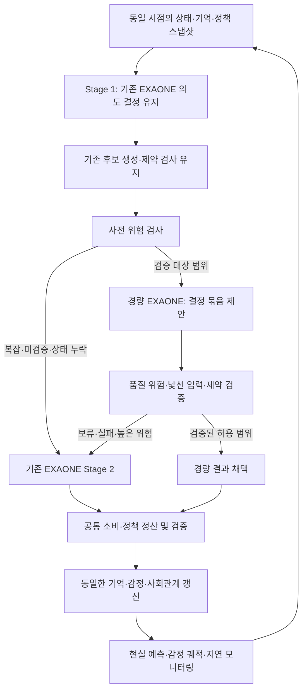

# 예측·감정 품질을 보존하는 시뮬레이션 가속 설계

작성일: 2026-09-22. 상태: 개발용 구현 및 CPU 검증 완료. 실제 모델 학습·품질·속도 검증 대기.

구현 진행: 2026-09-22에 [경량 판단 실험 모듈](../scripts/sim/fast_decision/README.md)을 추가했다. 선택지 직접 점수 추출, 기록·병행 실행, 데이터 분리, LoRA 학습, 교사 비교·확률 보정 도구를 구현했다. GPU는 사용하지 않았다. 실제 EXAONE 학습·독립 장기 실행·현실 예측력 검증·운영 적용은 아직 완료되지 않았다. 아래 문서는 최종 품질 목표와 단계별 도입 기준이다.

## 1. 목적과 성공 조건

목표는 LLM 호출 수 최소화가 아니라, 현실의 소비·방문·정책 반응을 예측하고 감정과 경험에 따른 행동 변화를 분석할 수 있는 시뮬레이션을 더 빠르게 실행하는 것이다.

최적화 목표: **현실 예측 오차와 행동·감정 품질의 사전 정의된 비열등성 조건을 만족하면서 전체 실행 시간을 최소화한다.** 허용 오차는 실험 전에 지표별로 정하며, 측정 후 유리하게 바꾸지 않는다. 현재는 합의된 허용 오차나 달성 속도 수치가 없다.

두 가지 검증을 구분한다.

1. 기존 전체 EXAONE 실행 대비 행동·감정·정책효과 보존 여부.
2. 시간·지역을 분리한 실제 관측 데이터 대비 예측 성능 유지 여부.

기존 모델과 일치하는 것만으로 현실 예측력이 입증되지는 않는다. 현실 감정 관측 자료가 없으면 감정의 내적 일관성만 평가 가능하며, 감정 예측 정확도를 입증했다고 표현하지 않는다. 기존 기준선이 현실을 설명하지 못하면 가속 실험과 별개로 기준선 보정이 필요하다.

## 2. 현재 코드에서 확인한 연결 관계

- `scripts/sim/dawn_context.py`: 페르소나, balance·energy·mood·fatigue, 기억, 약속, 정책, 사회적 맥락을 구성한다.
- `scripts/sim/stage1_intent.py`: 행동 의도, 시퀀스, trigger, 소비 의향 등을 결정한다.
- `scripts/sim/stage2_poi.py`: 후보 장소, 소비액, 만족도, 정책 결제, 선택 근거, 리뷰 추가 조회 등을 처리한다.
- `scripts/sim/run_simulation.py`: 두 Stage 이후 소비성향 모델, 정책지갑 정산·검증을 적용한다. 단계별 시간 계측이 이미 있다.
- `scripts/sim/plan_writer.py`: 방문과 만족도를 기억·장소 친숙도에 반영하고 mood·fatigue 등을 갱신한다. 현재 mood는 이전 mood와 당일 평균 만족도의 EMA를 사용한다.
- `scripts/sim/night_interaction.py`: mood·fatigue·정책 인지 등이 상호작용 선정 점수에 영향을 준다.

따라서 장소 선택 → 경험 만족도 → 기억·감정 → 관계·다음 행동의 순환을 보존해야 한다. 단골 방문도 누적 불만이나 피로를 바꿀 수 있으므로, 단골/신규 또는 trigger 하나만으로 라우팅하지 않는다. 현재 mood·만족도 상태 모형은 텍스트 감정 분석의 검증된 정답과 동일하지 않다.

## 3. 제안 구조

라우터는 중요하지 않은 사람이나 행동을 구분하는 장치가 아니다. **이 입력에서 경량 처리가 전체 시뮬레이션 품질을 훼손할 위험**을 판별한다. 후보 선택의 다양성과 모델의 지식 부족을 분리한다.

## 4. 모델 대체 이전에 적용할 실행 최적화

우선 `t_dawn`, `t_s1`, `t_s2`, `t_write`, 대기시간, 토큰 수, 리뷰 재호출을 측정해 실제 병목을 찾는다.

- 동일 데이터 버전에 대한 불변 POI·정책 정의 조회와 프롬프트 조각을 재사용한다. 개인 상태·지갑·정책 인지는 공용 캐시에 섞지 않는다.
- 동일한 컨텍스트를 만드는 DB 조회 통합·인덱스 개선을 검토한다. 결과 누락이나 조회 시점 변화 여부를 확인한다.
- 독립 에이전트의 요청을 배치하고 동시성을 조절한다. 일 경계 및 공유 정책자원 처리 순서는 보존한다.
- 지원되는 서버에서 prefix/KV cache를 활용하되, 실제 입력과 모델 설정은 동일하게 유지한다.
- 응답·파싱·재시도 실패의 원인을 줄인다. 추론 모드, 정밀도, 후보 축소, 컨텍스트 요약은 품질에 영향을 줄 수 있는 별도 실험으로 취급한다.

결정 결과를 어제와 같다는 이유로 캐시하거나, 감정·기억 갱신을 생략하는 최적화는 하지 않는다. 설명문도 다음 판단·인터뷰에 쓰이면 단순한 출력 비용으로 보고 삭제할 수 없다.

## 5. 경량 판단의 처리 범위

첫 적용 범위는 Stage 2로 제한한다. Stage 1과 Night의 의도·상호작용 처리는 초기 실험에서 유지한다. Stage 2도 하루 여러 거래가 예산·정책지갑으로 연결되어 있으므로, 처음에는 관련 거래 묶음 전체를 하나의 라우팅 단위로 삼는다. 이벤트별 분할은 의존성 검증 후 도입한다.

경량 모델이 장소 ID만 고르고 소비·만족도를 상수로 채우는 방식은 사용하지 않는다. 채택하려면 다음 결과 묶음 전체가 검증되어야 한다.

| 요소 | 보존할 정보 |
|---|---|
| 장소 선택 | 기존 후보 범위, 생활권, 가격, 선호, 반복방문·탐색 경향 |
| 소비 | 개인 예산과 당일 거래 사이 관계, 기존 소비성향 후처리와 호환 |
| 경험 만족도 | 기대·이력·상태·선택 장소에 따른 변동, 낮은 만족도 꼬리 |
| 정책 관련 판단 | 지원금 사용 제안과 공통 정산 규칙, 자격·잔액·사용처 |
| 근거 | 실제 참조한 상태·기억·후보 식별자, 기존 근거 필드와 호환 |
| 검토 필요성 | 리뷰 조회 필요·정보 부족·모순 여부 |

임의의 긍정 감정이나 “평소라서 만족” 같은 이유를 만들어 채우지 않는다. 후속 인터뷰에 출력 출처를 전달하고, 기록에 없는 동기를 사실처럼 설명하지 않도록 한다.

경량 모델은 EXAONE 1.2B 등을 이용한 개발 후보이며 완성된 LG 판단 제품이 아니다. Jev나 외국 모델을 런타임에 추가하는 것은 본 설계의 전제가 아니다. 사용 모델 버전·학습 데이터 출처·대회 허용 범위는 구현 시 확인한다.

## 6. 라우팅 정책

초기에는 다음 상황을 기존 EXAONE으로 직접 보낸다. 각 기준은 결정 전 정보만 사용한다.

- 정책 신규 노출·지급·만료 등으로 선택이나 소비가 달라질 수 있는 상황.
- 지속적인 불만족, 급격한 mood·fatigue 변화, 예산 압박, 중요 기억과 현재 후보의 충돌.
- 새로운 추천·약속·사회적 사건, 리뷰 확인이 필요한 판단.
- 데이터 누락, 검증에 없던 정책·후보 조건, 경량 처리가 검증되지 않은 집단·상황.
- 경량 결과의 제약 위반, 불확실한 경험·소비 예측, 오류·시간 초과.

이후 검증이 충분한 범위만 단계적으로 넓힌다. 모든 정책 상황을 영구적으로 대형 모델에 고정하는 것은 아니지만, 호출을 줄이기 위해 검증을 생략하지 않는다.

라우팅 점수는 정답 확률이라고 주장하지 않는다. 경량 결과의 품질 손실을 별도 검증 데이터로 추정하고 보정한다. 모델이 스스로 출력한 confidence를 그대로 임계값에 쓰지 않는다. 집단·정책 조건별 표본이 부족하면 경량 처리를 보류한다.

비슷하게 매력적인 식당이 여러 곳인 것은 정상적인 행동 다양성일 수 있다. 선택 분포의 평평함만으로 대형 모델을 부르지 않는다. 반대로 높은 선택 점수가 감정·지출 예측의 안전성을 보장하지 않는다. 방문 확률로 사용할 분포는 실제 방문 자료와 별도로 보정한다.

## 7. 데이터와 학습

1. 결정 직전 스냅샷, 후보 전체, 모델·프롬프트 버전, 기준선 출력, 실제 후처리 결과를 수집한다. 미래 만족도나 다음 날 상태는 입력에 넣지 않는다.
2. 정책·소득·지역·방문 이력·감정 변화별로 층화하고 희귀한 불만·행동 전환 사례를 확보한다. 동일 인물과 유사 시나리오의 누출을 막는 그룹 분리와 시간·지역 외삽 평가를 수행한다.
3. 전체 EXAONE 결과는 교사 자료로 이용하되, 실제 소비·방문 자료 및 검토된 감정 자료로 평가한다. 교사의 편향을 현실 정답으로 복제하지 않는다.
4. 먼저 무학습 경량 기준선을 측정한다. 부족하면 제한 출력 미세조정 또는 선택·소비·만족도 예측을 위한 학습 헤드를 실험한다. 이것들은 개발 대안이지 Jev와 동등한 성능을 보장하는 구현이 아니다.
5. 정책 하나, 가격 하나, 피로 수준 하나를 바꾼 대응 사례로 민감도를 평가한다. 특정 변화가 무조건 방문 증가나 긍정 감정을 만들도록 정답을 강제하지 않는다.
6. 확률 보정용 데이터와 최종 평가 데이터를 분리한다. 확신 임계값은 검증에서 고정한 후 최종 평가한다.

## 8. 평가 설계와 채택 조건

### 세 가지 비교 대상

- A: 현재 전체 EXAONE 기준선. 모델·설정·초기 데이터 고정.
- B: 모델 판단을 대체하지 않은 실행 최적화 버전.
- C: B에 검증된 경량 라우팅을 추가한 버전.

기존 기록이 Qwen 기반이면 이를 EXAONE 기준선으로 섞지 않는다. 모든 버전은 동일한 초기 스냅샷과 시나리오를 사용한다. 시드는 가능한 부분에서 대응시키고, 서로 다른 호출 경로가 난수열 전체를 바꾸지 않도록 에이전트·날짜·이벤트별 난수 흐름을 분리한다. 다중 시드 실험으로 변동성을 보고한다.

| 평가 영역 | 지표와 관측 단위 |
|---|---|
| 현실 소비·방문 예측 | 미사용 기간·지역의 집계 매출/방문량 MAE·WAPE, 지역·업종·소득별 오차. 0 분모 별도 처리 |
| 행동 분포 | 단골 유지·전환·신규 방문, 이동거리, 지출 분포·꼬리, 방문 다양성 |
| 감정·경험 | 만족도·mood·fatigue 분포, 자기상관, 부정 경험 누적·회복 기간, 감정 변화 이후 행동 전환 |
| 텍스트 감정 분석 | 독립적으로 주석된 실제 텍스트가 있을 때 macro-F1 등. 생성된 설명을 정답으로 재사용하지 않음 |
| 정책 반응 | 효과 크기·구간, 방향, 지역 파급, 집단별 차이, 무정책 시나리오의 허위 효과 |
| 장기 동학 | 전체 목표 기간 동안 감정·지출·관계·정책사용 오차가 누적되는지 |
| 실행 성능 | 전체 wall time, agents/day, p50·p95 지연, GPU 메모리, 실패·재호출·라우팅 비용 |

최종 판단은 사전 정의된 비열등성 한계와 불확실성 구간으로 한다. 단순히 “유의한 차이가 없었다”는 채택 근거가 아니다. 평균이 유지되어도 특정 집단의 예측이나 부정 감정 꼬리가 훼손되면 해당 범위의 가속을 거부한다. DID가 기존과 같다는 사실만으로 인과적 타당성이 확보되는 것도 아니며, 실제 정책 평가에서는 식별 가정과 관측자료의 한계를 별도로 검토한다.

빠른 경로 비율만으로 속도를 추정하지 않는다. 경량 시도 후 대형 재호출 비용, 배치 효율, DB 병목, 같은 GPU 사용 시 경합을 포함한다. 초기에는 Stage 1·Night를 유지하므로 Stage 2 가속만으로 가능한 전체 속도 향상에 상한이 있다.

## 9. 실험·도입 순서

1. **기준선 측정:** 현실 예측·감정 평가의 가용 자료와 허용 오차를 정의하고 A를 고정한다.
2. **실행 최적화:** B를 평가한다. 동작이 보존되는 최적화부터 채택한다.
3. **병행 기록:** 동일 결정 직전 상태에서 경량 판단을 실행하지만 실제 상태에는 A/B 결과만 반영한다. 두 경로가 공유 DB에 동시에 쓰지 않는다. 이 단계의 추가 연산 비용을 운영 가속 수치로 보고하지 않는다.
4. **독립 분기 실험:** 동일 초기 DB 스냅샷에서 C를 별도로 끝까지 실행한다. 병행 기록만으로는 경량 결정 이후의 누적 오차를 알 수 없다.
5. **제한 적용:** 검증 통과 범위만 활성화하고 빠른 경로에서도 무작위·층화 표본을 감사한다. 변경 가능한 비율은 사전 평가로 정한다.
6. **확대/복귀:** 품질이 유지될 때만 범위를 확대한다. 품질 저하 시 향후 결정은 전체 EXAONE으로 복귀하고, 오염된 이후 상태가 있는 실행은 마지막 유효 체크포인트에서 재실행한다. 단순 모델 교체가 이미 변한 기억·감정을 복구하지는 않는다.

## 10. 제안 구현 단위

아래 파일명은 새로 구현할 제안이며 현재 존재·동작을 의미하지 않는다.

- `decision_snapshot.py`: 결정 전 상태와 의존 데이터의 버전·해시 저장.
- `decision_router.py`: 위험 조건, 검증된 적용 범위, 보류 및 복귀 처리.
- `fast_decision_client.py`: 별도 경량 엔드포인트, 시간 제한, 결과·점수 수집.
- `decision_contract.py`: 기존 Stage 2와 호환되는 전체 결과 묶음 및 검증.
- `shadow_decisions.py`: 상태를 변경하지 않는 병행 비교 기록.
- `evaluate_acceleration.py`: A/B/C의 현실 오차·분포·감정 궤적·전체 지연 평가.

기존 `run_simulation.py`와 `stage2_poi.py`에 선택적 연결점을 두고 기본값은 전체 EXAONE으로 유지한다. 현 클라이언트는 공유 싱글톤이므로 두 모델의 엔드포인트·served model 이름·클라이언트를 명시적으로 분리한다. 공통 회계·기억·감정 갱신을 별도 빠른 경로로 복제하지 않는다.

로그에는 선택 모델, 라우팅 사유, 입력 버전, 보정 버전, 결정 결과, 근거 참조, 지연, fallback, 실험 분기를 기록한다. 라우팅용 위험 점수와 행동 샘플링 확률을 서로 다른 필드로 저장한다.

## 11. 구현 착수 시 확정할 항목

- 보유한 실제 매출·방문·설문·감정 주석 자료의 범위와 사용할 수 없는 부분.
- 기준선 EXAONE 버전·서버 환경·GPU 자원과 목표 실행 기간/인구 규모.
- 예측·감정·정책 지표별 허용 오차와 핵심 집단, 운영상 필요한 속도 개선 수준.

이 항목이 확정되지 않아도 계측·스냅샷·병행 평가 장치는 개발할 수 있다. 다만 현실 예측력 유지와 감정 분석 성능 유지의 달성을 선언하거나 운영 경량 경로를 채택하려면 해당 증거가 필요하다.
