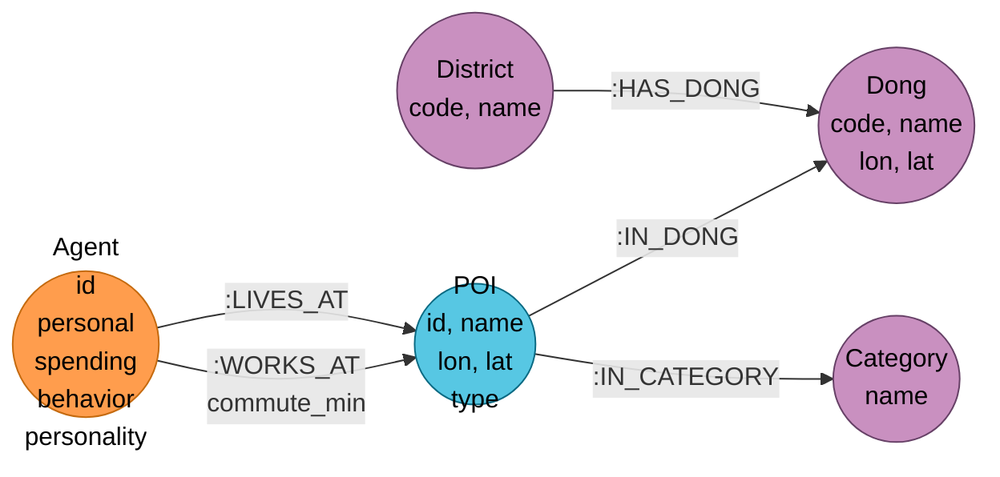

# 🧩 Agent Ontology — Neo4j 그래프 스키마 (에이전트 생성 범위)

> **문서 목적**: 에이전트 페르소나 + 고정 앵커(거주·직장) + 계층 구조까지의 최소 온톨로지. **상호작용·정책·기억·스케줄 생성은 본 문서 범위 밖**.
>
> **입력**: `output/agents/agents_final.json` + POI 3종(거주·직장·상가) + 행정동/카테고리 매핑

---

## 0. TL;DR

- 5개 노드 label: `Agent` · `POI` · `District` · `Dong` · `Category`
- 4개 엣지 type: 계층 3개 (`HAS_DONG` · `IN_DONG` · `IN_CATEGORY`) + 앵커 2개 (`LIVES_AT` · `WORKS_AT`)
- Agent 속성 4 블록: `personal` · `spending` · `behavior` · `personality`
- **카테고리 값역(분류 체계)은 본 문서 범위 밖** — 스케줄 생성 단계에서 확정

---

## 1. 스키마 다이어그램 (타입 뷰)



### 범례

| 색 | 레이블 그룹 |
|---|---|
| 🟠 주황 | `:Agent` |
| 🔵 하늘 | `:POI` |
| 🟣 보라 | 정적 계층 (`:District` · `:Dong` · `:Category`) |

---

## 2. 노드 label 상세

### 2.1 `:Agent` — 에이전트

`agents_final.json` 한 레코드 → `:Agent` 노드 1개. JSON 5개 섹션을 속성 그룹(map)으로 보존하되 자주 쿼리되는 필드는 flat 복제.

#### 2.1.1 정체성
| 속성 | 타입 | 필수 | 설명 |
|---|---|---|---|
| `id` | string | ✅ | `agent_id` 그대로 (1차 키, UNIQUE) |

#### 2.1.2 `personal` — 인구학 (필수 최소)
| 속성 | 타입 | 단위 | 필수 | 설명 |
|---|---|---|---|---|
| `personal.age_group` | enum(7) | — | ✅ | `10대`~`70대이상` |
| `personal.gender` | enum('F','M') | — | ✅ | 성별 |
| `personal.age` | int | 세 | ⭕ | 참고용, 분위는 `age_group`으로 |
| `personal.job` | enum(20) | — | ⭕ | 정규화 후 저장 (§4 매핑) |
| `personal.life_stage` | enum(6) | — | ⭕ | 정규화 후 저장 (§4 매핑) |
| `personal.income_level` | enum(5) | — | ⭕ | `하`·`중하`·`중`·`중상`·`상` |

#### 2.1.3 `spending` — 소비수준·카테고리 (금액 기반)
| 속성 | 타입 | 단위 | 필수 | 설명 |
|---|---|---|---|---|
| `spending.daily_weekday` | int | KRW | ✅ | 평일 일평균 소비액 |
| `spending.daily_weekend` | int | KRW | ✅ | 주말 일평균 소비액 |
| `spending.weekend_weekday_ratio` | float | 배수 | ✅ | 주말/평일 비율 (파생) |
| `spending.top_categories_wd` | list<string>(3) | — | ✅ | 평일 소비 카테고리 Top-3 (순서 = 비율 내림차순, 값역은 스케줄 단계에서 확정) |
| `spending.top_categories_we` | list<string>(3) | — | ✅ | 주말 소비 카테고리 Top-3 |

**참고**: 원본 JSON은 `weekday_spending_level`(1~10)과 `daily_spending_weekday`(KRW) 둘 다 갖지만, 온톨로지는 **금액만** 채택. 분위 1~10은 필요 시 런타임에 percentile로 재계산.

**참고**: 원본 `weekday_top_categories`는 `{A:0.121, B:0.08, ...}` dict. 온톨로지는 Top-3 키만 리스트로 저장(비율 버림). 비율 분석이 필요해지면 추후 `(:Agent)-[:SPENDS_ON {ratio,period}]->(:Category)` 엣지로 확장.

#### 2.1.4 `behavior` — 생활 행태
| 속성 | 타입 | 단위 | 필수 | 설명 |
|---|---|---|---|---|
| `behavior.delivery_days` | int | 회/월 | ✅ | 월간 배달 이용일수 |
| `behavior.shopping_days` | int | 회/월 | ✅ | 월간 쇼핑 일수 |
| `behavior.weekday_move_km` | float | km/일 | ✅ | 평일 일평균 이동거리 |
| `behavior.weekend_move_km` | float | km/일 | ✅ | 주말 일평균 이동거리 |
| `behavior.home_hours_weekday` | float | h/일 | ✅ | 평일 일평균 재택시간 |
| `behavior.home_hours_weekend` | float | h/일 | ✅ | 주말 일평균 재택시간 |
| `behavior.mobility_level` | int 1~10 | — | ✅ | 이동성 분위 |

#### 2.1.5 `personality` — 성향·라이프스타일
| 속성 | 타입 | 필수 | 설명 |
|---|---|---|---|
| `personality.spending_tendency` | enum('절약형','보통','소비형') | ✅ | 소비스타일 |
| `personality.lifestyle_raw` | string | ✅ | 생성된 라이프스타일 서술 원문 (LLM 프롬프트 주입용) |
| `personality.lifestyle_cluster` | enum(~15) | ✅ | 정규화된 클러스터 id (집계·필터용) |

#### 2.1.6 쿼리용 flat 복제 속성 (인덱싱 대상)
Neo4j는 nested map에 인덱스를 붙일 수 없음. 자주 필터·집계되는 필드는 flat 복제:

| 복제 속성 | 원본 | 용도 |
|---|---|---|
| `p_gender`, `p_age_group`, `p_income_level`, `p_life_stage` | `personal.*` | 인구학 집계 |
| `pr_spending_tendency`, `pr_lifestyle_cluster` | `personality.*` | 성향 필터 |
| `s_daily_wd`, `s_daily_we` | `spending.daily_*` | 소비금액 필터 |
| `b_mobility_level` | `behavior.mobility_level` | 이동성 필터 |

### 2.2 `:POI` — 가게·거주·직장

| 속성 | 타입 | 필수 | 설명 |
|---|---|---|---|
| `id` | string | ✅ | `R_*` 거주, `W_*` 직장, `C_*` 상가 (1차 키) |
| `name` | string | ✅ | 표시명 |
| `lon`, `lat` | float | ✅ | WGS84 좌표 |
| `type` | enum('residence','workplace','commerce') | ✅ | — |
| `dong_code` | string | ✅ | 소속 행정동 코드 (redundant with IN_DONG, 쿼리 편의) |

에이전트 생성 범위에서는 **거주·직장 POI만** 적재 필수. 상가(commerce) POI는 스케줄 생성 단계에서 적재.

### 2.3 `:District` · `:Dong`

| 노드 | 속성 | 설명 |
|---|---|---|
| `:District` | `code`(✅) · `name`(✅) | 자치구 25개 |
| `:Dong` | `code`(✅) · `name`(✅) · `lon`(✅) · `lat`(✅) | 행정동 424개, 중심좌표 포함 (NEARBY 산출 기준점) |

### 2.4 `:Category`

에이전트의 `spending.top_categories_wd/we`와 POI의 `:IN_CATEGORY` 대상이 되는 카테고리 노드.

| 노드 | 속성 | 설명 |
|---|---|---|
| `:Category` | `name`(✅) | 카테고리명. **값역(몇 종·어떤 체계인지)은 본 문서 범위 밖 — 스케줄 생성 단계에서 확정** |

본 온톨로지는 노드·엣지 구조만 정의. 2-레벨 hierarchy(대/서브)가 필요해지면 스케줄 단계에서 `:CategoryL1`·`:CategoryL2` 분리 및 `:PARENT` 엣지 추가로 확장.

---

## 3. 엣지 type 상세

### 3.1 계층 엣지 (정적)

| 엣지 | 방향 | 속성 | cardinality |
|---|---|---|---|
| `:HAS_DONG` | `District → Dong` | — | 1 : N (District당 ~17 Dong) |
| `:IN_DONG` | `POI → Dong` | — | N : 1 (POI당 정확히 1 Dong) |
| `:IN_CATEGORY` | `POI → Category` | — | N : 1 (commerce POI에 한정) |

### 3.2 앵커 엣지

| 엣지 | 방향 | 속성 | cardinality |
|---|---|---|---|
| `:LIVES_AT` | `Agent → POI(type=residence)` | — | Agent당 정확히 1 |
| `:WORKS_AT` | `Agent → POI(type=workplace)` | `commute_min:int` | Agent당 0~1 |

---

## 4. Enum 값역

| Enum | 값 |
|---|---|
| `POI.type` | `residence`, `workplace`, `commerce` |
| `personal.gender` | `F`, `M` |
| `personal.age_group` | `10대`, `20대`, `30대`, `40대`, `50대`, `60대`, `70대이상` |
| `personal.income_level` | `하`, `중하`, `중`, `중상`, `상` |
| `personal.life_stage` | `학생`, `사회초년생`, `자녀양육`, `자녀독립`, `은퇴준비`, `은퇴` |
| `personal.job` | IT·금융·교육·의료·공공·제조·서비스·판매·건설·운송·문화예술·연구·법률·농림수산·자영업·프리랜서·주부·학생·무직·기타 (20종) |
| `personality.spending_tendency` | `절약형`, `보통`, `소비형` |
| `personality.lifestyle_cluster` | 10~15종 (클러스터링 결과 별표) |
| `behavior.mobility_level` | `1`~`10` (int) |
| `Category.name` | **본 문서 범위 밖 — 스케줄 생성 단계에서 확정** |

**주의**: 현재 `agents_final.json`의 `job`(5,817 unique) / `life_stage`(수백) / `lifestyle`(12,063 unique)는 **정규화 전 free-text**. 적재 전 위 enum으로 매핑 필수 (§7). 카테고리는 본 문서 범위 밖.

---

## 5. Agent ↔ POI 연결 로직

`schedule_generation_plan.md §6.1 ③`의 "거주·직장 POI 1회 할당" 구체 절차.

### 5.1 입력
- `output/agents/agents_final.json` — 각 agent는 `residence.dong_code`와 `workplace.dong_code`만 보유 (동 수준)
- **D5 거주 POI** — 공동주택 단지정보 (dong_code · lon · lat · 세대수)
- **D6 직장 POI** — 건축물대장 (dong_code · lon · lat · 용도 · 연면적)
- `data/mapping/mapping_building_to_category.json` (D13d)

### 5.2 거주 POI 할당 (`:LIVES_AT`)

```
for agent in agents:
    dong = agent.residence.dong_code
    candidates = residence_pois[dong]              -- 해당 동의 모든 공동주택
    if empty:
        fallback = nearest_residence_poi(dong)     -- 동 중심좌표 기준 최근접 건물
        candidates = [fallback]
    chosen = weighted_random(candidates, weight='세대수')
    MERGE (:POI {id: chosen.id, type:'residence', ...})
    MERGE (:POI)-[:IN_DONG]->(:Dong {code: dong})
    MERGE (:Agent {id: agent.id})-[:LIVES_AT]->(:POI {id: chosen.id})
```

**원칙**:
- 세대수 가중 랜덤 — 큰 단지에 더 많은 에이전트 배정 (인구밀도 반영)
- 같은 건물 중복 허용 — 한 아파트에 여러 에이전트 거주 가능 (정상)
- 매칭 실패 시 **동 중심좌표 최근접 1건**으로 fallback (공동주택 공실 동 대응)

### 5.3 직장 POI 할당 (`:WORKS_AT`)

```
for agent in agents:
    if agent.personal.life_stage in {'은퇴','학생','주부'} or agent.workplace is null:
        continue                                    -- :WORKS_AT 생성 안 함
    
    dong = agent.workplace.dong_code
    job = agent.personal.job
    building_cat = job_to_building_category[job]    -- D13d 매핑
    candidates = workplace_pois[dong] filtered by 용도=building_cat
    if empty:
        candidates = workplace_pois[dong]           -- 용도 필터 제거
    if empty:
        fallback = nearest_workplace_poi(dong, building_cat)
        candidates = [fallback]
    chosen = weighted_random(candidates, weight='연면적')
    MERGE (:POI {id: chosen.id, type:'workplace', ...})
    MERGE (:Agent)-[:WORKS_AT {commute_min: agent.workplace.commute_min}]->(:POI)
```

**원칙**:
- 직업 → 건물용도 매핑 후 필터 (IT 개발자 → 업무시설, 교사 → 교육연구시설)
- 연면적 가중 — 대형 오피스에 더 많은 직장인 배정
- 무직·주부·은퇴·학생은 `:WORKS_AT` 생성 안 함 (cardinality 0)
- 직업 매핑 실패 시 용도 필터 없이 재시도, 그래도 실패 시 nearest fallback

### 5.4 `commute_min=0` 처리
현재 JSON의 28.5%가 `commute_min=0`. 분석 결과 대부분은 무직·주부·은퇴·학생이 더미로 `workplace.dong_code`를 받은 경우. 처리:
- **규칙 1**: `life_stage ∈ {은퇴, 학생, 주부}` → `:WORKS_AT` 생성 안 함
- **규칙 2**: 규칙 1 외의 `commute_min=0` → "집 근무" 해석, 거주 POI와 동일 POI에 `:WORKS_AT {commute_min:0}`
- **규칙 3**: `commute_min>0` 일반 직장인 → §5.3 정규 절차

### 5.5 검증 쿼리

```cypher
-- LIVES_AT 누락
MATCH (a:Agent) WHERE NOT (a)-[:LIVES_AT]->() RETURN count(a);

-- LIVES_AT 중복
MATCH (a:Agent)-[r:LIVES_AT]->() WITH a, count(r) AS n WHERE n>1 RETURN a.id, n;

-- 거주 POI의 dong과 agent의 residence.dong 일치 여부
MATCH (a:Agent)-[:LIVES_AT]->(p:POI)-[:IN_DONG]->(d:Dong)
WHERE a.residence_dong_code <> d.code
RETURN a.id, a.residence_dong_code, d.code LIMIT 10;

-- 무직군에 WORKS_AT 오생성 검출
MATCH (a:Agent)-[:WORKS_AT]->() WHERE a.p_life_stage IN ['은퇴','학생','주부']
RETURN count(a);
```

---

## 6. Cypher DDL

### 6.1 Unique constraints
```cypher
CREATE CONSTRAINT agent_id    FOR (a:Agent)      REQUIRE a.id IS UNIQUE;
CREATE CONSTRAINT poi_id      FOR (p:POI)        REQUIRE p.id IS UNIQUE;
CREATE CONSTRAINT district_c  FOR (d:District)   REQUIRE d.code IS UNIQUE;
CREATE CONSTRAINT dong_code   FOR (d:Dong)       REQUIRE d.code IS UNIQUE;
CREATE CONSTRAINT cat_name    FOR (c:Category)   REQUIRE c.name IS UNIQUE;
```

### 6.2 Node property indexes
```cypher
CREATE INDEX poi_type         FOR (p:POI)   ON (p.type);
CREATE INDEX poi_dong         FOR (p:POI)   ON (p.dong_code);
CREATE INDEX agent_gender     FOR (a:Agent) ON (a.p_gender);
CREATE INDEX agent_age_group  FOR (a:Agent) ON (a.p_age_group);
CREATE INDEX agent_income     FOR (a:Agent) ON (a.p_income_level);
CREATE INDEX agent_life_stage FOR (a:Agent) ON (a.p_life_stage);
CREATE INDEX agent_tendency   FOR (a:Agent) ON (a.pr_spending_tendency);
CREATE INDEX agent_lifestyle  FOR (a:Agent) ON (a.pr_lifestyle_cluster);
```

---

## 7. 적재 전 선행 작업

| # | 작업 | 산출물 |
|---|---|---|
| 1 | 스키마 오염 11건 복구 (section 풀린 레코드 재포장) | 정제된 JSON |
| 2 | `job` 5,817 → 20종 enum 매핑 | `mapping_job.json` |
| 3 | `life_stage` 수백 → 6종 enum 매핑 | `mapping_life_stage.json` |
| 4 | `lifestyle` 12,063 → ~15종 클러스터 (+ 원문 보존) | `mapping_lifestyle.json` |
| 5 | 평일/주말 top_categories → Top-3 리스트 추출 (값역 매핑은 스케줄 단계) | 정제된 JSON |
| 6 | POI 2종 확보 (거주·직장) | parquet |
| 7 | Agent ↔ POI 할당 (§5) | `:LIVES_AT`/`:WORKS_AT` 엣지 |
| 8 | DDL 실행 (§6) | constraint·index |
| 9 | 배치 `UNWIND` MERGE 적재 | 그래프 |

---

## 8. 미해결 / 추후 결정

| 항목 | 현재 상태 | 결정 시점 |
|---|---|---|
| `lifestyle_cluster` 개수·명칭 | ~15 가정 | 클러스터링 작업 시 |
| `mapping_job_to_building_category` 테이블 | 미작성 (D13d) | §5.3 할당 전 |
| 거주 POI 가중치 (세대수 vs 연면적) | 세대수 가정 | POI 데이터 확보 후 |
| flat 복제 속성 prefix 규칙 (`p_`/`pr_`/`s_`/`b_`) | 제안(§2.1.6) | 적재 스크립트 작성 전 |
| `commute_min=0` 집 근무 허용 여부 | §5.4 규칙2 제안 | 데이터 품질 확인 후 |

---

## 9. 관련 문서

| 문서 | 범위 |
|---|---|
| [`schedule_generation_plan.md`](./schedule_generation_plan/schedule_generation_plan.md) | 이후 단계 — 상호작용·스케줄 생성 (본 문서 밖) |
| [`data.md`](./schedule_generation_plan/data.md) | D1~D13 데이터셋 목록, POI 3종 확보 현황 |
| `generate_agents.py` | 에이전트 JSON 생성 파이프라인 |
| `validate_agents.py` | 원본 통계 정합성 검증 |
