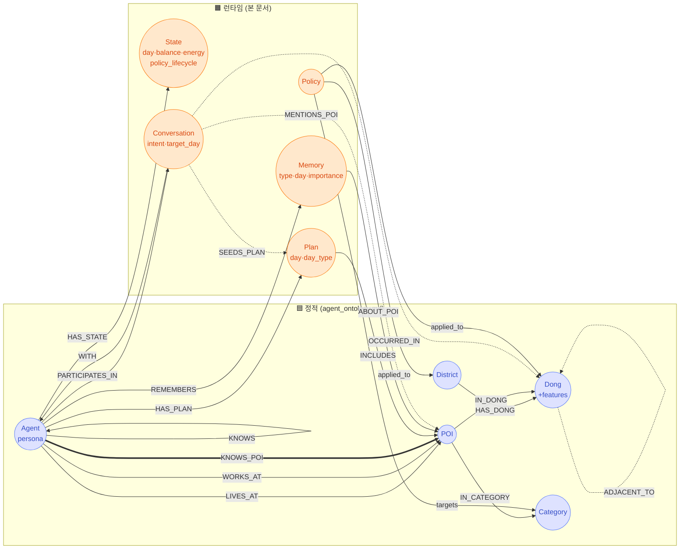

# 🧩 Runtime Ontology — Neo4j 그래프 스키마

> **문서 목적**: 정적 그래프([agent_ontology.md](./agent_ontology.md) — Agent·POI·District·Dong·Category) 위에 시뮬레이션 런타임 데이터를 얹어, **LLM이 그래프 traversal로 일관된 행동 결정을 내리도록** 연결을 정식화한다.
>
> **설계 원칙**:
> - **저장소**: Neo4j 단일. PostgreSQL/SQLite 없음. 외부 캐시(Redis L3, vLLM APC)는 인프라.
> - **매일 새로 생성되는 데이터는 두 가지뿐**: `:Conversation` (약속·이슈·추천·기타) + `:Memory` (5종 type). 나머지(POI·Policy·State·Plan)는 기존 노드/엣지 갱신 또는 적재.
> - **LLM은 그래프를 직접 탐색하지 않음** — 컨텍스트 빌더가 7종 병렬 Cypher로 사전 조회해 프롬프트에 주입. 본 문서의 엣지는 **빌더 쿼리 친화적**으로 설계.

---

## 0. TL;DR

### 런타임 노드 5종

| 노드 | 목적 | 카디널리티 (60K·60일) |
|---|---|---|
| `:State` | 잔액·에너지·mood·fatigue·정책 라이프사이클 시계열 | 60K × 60 = 3.6M |
| `:Plan` | Day t 계획 = Daily Log (Episode 노드 없음) | 60K × 60 = 3.6M |
| `:Memory` | 단일 라벨, `type` 속성으로 4종 구분 (visited·rumor·sns·policy) | 매일 ~700K append (Day 0 시드 없음 — initial은 KNOWS_POI 엣지로 표현) |
| `:Conversation` | Night 상호작용 결과 (intent 분류) | 매일 ~60K (1인 1만남 가정) |
| `:Policy` | 정책 카탈로그 + Scope 결과 | 정책 발표 시 |

### 신규 엣지

| 엣지 | 방향 | 의미 |
|---|---|---|
| `:HAS_STATE {day}` | Agent → State | 시계열, in-place 덮어쓰기 안 함 |
| `:HAS_PLAN {day}` | Agent → Plan | 시계열 |
| `:INCLUDES {order, time, duration, intent, category, anchor, with_agents?}` | Plan → POI | Stage 1·2 산출 통합. **Episode 노드 회피** |
| `:REMEMBERS {day}` | Agent → Memory | 시계열, type 필터는 Memory 속성 |
| `:ABOUT_POI` / `:ABOUT_AGENT` | Memory → POI/Agent | Memory가 가리키는 대상 |
| `:PARTICIPATES_IN` | Agent → Conversation | 양쪽 참가자 모두 갖음 |
| `:WITH` | Conversation → Agent | 대화 상대 (PARTICIPATES_IN의 비대칭 보조) |
| `:OCCURRED_IN` | Conversation → Dong | `intent='이슈'`만 |
| `:MENTIONS_POI` | Conversation → POI | `intent ∈ {추천, 약속}` |
| `:SEEDS_PLAN` | Conversation → Plan | `intent='약속'` 익일 Plan에 연결 (Dawn 후처리) |
| `:KNOWS {strength, relation}` | Agent → Agent | 지인 풀 |
| `:KNOWS_POI {since, source, visit_count, avg_satisfaction, last_visit, affinity}` | Agent → POI | **Agent의 인지 + 평가 메타**. 엣지 속성이 Stage 2 LLM 프롬프트에 노출됨. **candidate 모집단은 아님** (모집단은 Stage 1 행정동·카테고리 매칭 전체 POI) |
| `:NEARBY` | Agent ↔ Agent | **보류** — 정의 미정 |
| `:applied_to` | Policy → Dong/District | 지역 (lowercase 다이어그램 표기) |
| `:targets` | Policy → Category | 업종 |

---

## 1. 스키마 한눈에



**굵은 엣지 (KNOWS_POI)**: Agent의 사전 인지 풀. Stage 2 candidate의 모집단.

---

## 2. 노드 5종 상세

### 2.1 `:State` — 일별 시계열 누적 상태

```cypher
(:State {
  id: "A12345_2026-05-07",            // agent_id + day, UNIQUE
  agent_id: "12345",
  day: date("2026-05-07"),
  balance: 1532000,                    // 잔액 (KRW)
  energy: 0.78,                        // 0~1 (낮 활동 후 잔여 활력)
  yesterday_satisfaction: 0.72,        // 직전일 평균 만족도
  month_spent: 452000,
  mood: 0.62,                          // 0~1 — 누적 감정 상태 (Night 상호작용 알고리즘 입력)
  fatigue: 0.35,                       // 0~1 — 누적 피로도 (Night 알고리즘 입력)
  policy_lifecycle: {                  // S0~S5 (정책 ID별)
    "P001": {
      stage: "S2", score: 0.72,
      baseline: 0.18,
      first_seen: "2026-05-07",
      coupon_balance: 70000
    }
  }
})
```

**mood / fatigue 갱신 규칙 (Night Phase 3 (4) State CREATE 시):**

```python
# EMA 기반, prev = day:t-1 State
mood_t = 0.7 * prev.mood + 0.3 * yesterday_satisfaction
fatigue_t = clip(
    0.5 * prev.fatigue                           # 어제분 회복 효과 50%
    + 0.05 * len(today_includes)                 # 이벤트 수 (피로)
    + (0.2 if low_satisfaction_today else 0)     # 나쁜 경험
    - (0.1 if home_hours_today >= 8 else 0),     # 휴식
    0.0, 1.0
)
```

**용도**:
- Night Phase 2 Urgency 계산 — mood가 극단(<0.3 또는 >0.7)이면 표출 욕구 ↑, fatigue 높으면 대화 욕구 ↓
- Dawn ② 컨텍스트 빌더가 어제 State 읽을 때 함께 노출 (LLM Stage 1에 주입 가능, 선택)

- **시계열 누적**: Agent당 60일이면 60개. `(:Agent)-[:HAS_STATE {day}]->(:State)`.
- **in-place overwrite 안 함** — Memory 분석·정책 효과 회귀에 시계열 필요.
- Dawn ②가 `day:t-1` 노드를 컨텍스트로 읽음.

### 2.2 `:Plan` — Day t 계획 = Daily Log

```cypher
(:Plan {
  id: "A12345_2026-05-07",
  agent_id: "12345",
  day: date("2026-05-07"),
  day_type: "weekday",                 // weekday|weekend|holiday
  generated_at: datetime(),
  llm_tokens_in: 1850,
  llm_tokens_out: 280
})
```

**시간대별 이벤트 = INCLUDES 엣지 속성** (Episode 노드 없음):

```cypher
(:Plan)-[:INCLUDES {
  order: 3,                            // 0-base
  time: time("12:20"),
  duration: duration({minutes: 50}),
  intent: "점심",
  category: "식사",                    // Stage 1 산출 보존
  sub_category: "한식",                // Stage 1 산출 보존
  anchor: "workplace",                 // residence|workplace|zone:<dong>
  with_agents: ["67890"],              // 약속 동행자
  actual_satisfaction: null            // 낮 실행 후 사후 UPDATE
}]->(:POI)
```

- **`category`·`anchor`를 엣지 속성에 보존**: Stage 1의 의도가 분석·디버깅·정책 효과 측정에 필요. LLM은 보지 않고 KPI 분석에서만 사용.
- **`actual_satisfaction`**: 낮 시뮬 진행 중 사후 UPDATE. 결과 데이터를 별도 노드로 분리하지 않음.

### 2.3 `:Memory` — 단일 노드 + type 속성

5종 분리 라벨(`:VisitMemory`, `:RumorMemory` 등) 폐기. **단일 `:Memory` + `type` 속성**.

> **`type:'initial'` 폐기**: Day 0 사전 인지는 `:KNOWS_POI` 엣지의 `source='initial'`/`since`/`affinity` 속성만으로 표현. initial Memory 노드는 KNOWS_POI 엣지의 중복일 뿐(모두 같은 day·같은 importance·동일 summary)이고 시계열 가치도 없어 redundant. type은 `visited|rumor|sns|policy` 4종만 사용.

```cypher
(:Memory {
  id: "mem_<uuid>",
  type: "visited",                     // visited|rumor|sns|policy
  day: date("2026-05-06"),
  importance: 1.8,
  summary: "을지로골목(한식) 방문, 만족도 0.8",
  satisfaction: 0.8,                   // type=visited만
  channel: null,                       // type=sns: instagram/tiktok
  source_policy_id: null               // type=policy
})

(:Agent)-[:REMEMBERS {day}]->(:Memory)
(:Memory)-[:ABOUT_POI]->(:POI)         // 대부분의 경우
(:Memory)-[:ABOUT_AGENT]->(:Agent)    // type=rumor 발신자
```

**왜 단일 라벨인가**:
- Dawn ③ Top-N Cypher가 단일 엣지로 깔끔 (`importance × exp(-days/14)` 정렬)
- type 필터는 `WHERE m.type IN ['visited','rumor']`로 충분
- 5종 분리 시 노드 ID·인덱스만 5배

**Memory와 KNOWS_POI 관계 — 역할 분담**:

- `:Memory` = **시계열 raw 기록** (각 사건마다 별도 노드)
- `:KNOWS_POI` = **집계 캐시 + LLM 노출 메타** (Agent-POI당 1개 엣지, 사건 발생 시 in-place 갱신)

```cypher
(:Agent)-[:KNOWS_POI {
  since: date,                         // 최초 인지일
  source: "initial"|"visited"|"rumor"|"sns"|"policy"|"appointment",
  visit_count: 3,                      // type=visited Memory 누적 카운트
  avg_satisfaction: 0.72,              // visit_count > 0일 때 의미
  last_visit: date("2026-05-06"),      // type=visited 마지막 날짜
  affinity: 0.68                       // 0~1, LLM에 보일 종합 점수 (기억+추천+SNS)
}]->(:POI)
```

**누가 무엇을 만드나**:
- Day 0 사전 인지 → `:KNOWS_POI{source:'initial', affinity:0.5}` MERGE만 (Memory 노드 없음)
- 첫 추천·SNS·정책 노출 (Memory{type:'rumor'|'sns'|'policy'} CREATE) → `:KNOWS_POI` MERGE (source 기록)
- 재방문 (Memory{type:'visited'} CREATE) → `:KNOWS_POI` 속성 갱신 (visit_count++, avg_satisfaction 재계산, last_visit 업데이트)
- 추천·SNS 재노출 → Memory 새로 CREATE + KNOWS_POI.affinity 보강 (in-place)

**왜 분리하나**:
- Dawn ③ Memory Top-N은 시계열 정렬 필요 → 별도 Memory 노드
- Dawn ⑦/Stage 2 candidate는 **집계된 평가**만 필요 → KNOWS_POI 엣지 속성 1회 조회로 충분
- Memory를 every-step JOIN하면 Cypher가 무거워짐. 집계는 KNOWS_POI에 캐시.

### 2.4 `:Conversation` — Night Phase 결과

Night LLM이 의도 분류 후 생성. 매일 새로 만들어지는 두 종류 중 하나.

```cypher
(:Conversation {
  id: "conv_<uuid>",
  day: date("2026-05-06"),             // 발생일
  intent: "약속",                      // 약속|이슈|추천|기타
  summary: "내일 19시 홍대 호프 약속",
  target_day: date("2026-05-07"),      // intent=약속만 (Dawn ④ 입력)
  meeting_poi_id: "C_551092",          // intent=약속의 장소 (S1 강제 핀)
  mentioned_poi_ids: ["C_551092"],     // intent=추천의 거론 POI
  issue_topic: null                    // intent=이슈 (e.g. "강남 임대료")
})

(:Agent)-[:PARTICIPATES_IN]->(:Conversation)
(:Conversation)-[:WITH]->(:Agent)
(:Conversation)-[:OCCURRED_IN]->(:Dong)        // intent=이슈
(:Conversation)-[:MENTIONS_POI]->(:POI)        // intent ∈ {추천, 약속}
(:Conversation)-[:SEEDS_PLAN]->(:Plan)         // intent=약속, Dawn 후처리
```

**intent 4종 분기 (Night LLM 출력)**:

| intent | 그래프 효과 |
|---|---|
| `약속` | target_day=t+N으로 미래 plan에 강제 진입. Stage 1 시간·POI 고정 |
| `이슈` | OCCURRED_IN으로 Dong 연결. Dawn ⑤ 활성 이슈 쿼리에 노출 |
| `추천` | MENTIONS_POI + 상대 Agent의 KNOWS_POI에 MERGE (`source:'rumor'`) + Memory 생성 |
| `기타` | 친밀도 보강(`:KNOWS.strength` ++). 그래프 외 효과 적음 |

### 2.5 `:Policy` — 정책 카탈로그

```cypher
(:Policy {
  id: "P001",
  name: "강남구 소비쿠폰 10만원",
  benefit_rate: 0.30,
  cap_per_agent: 100000,
  announce_date: date("2026-05-07"),
  effective_from: date("2026-05-08"),
  effective_until: date("2026-05-31"),
  raw_json_ref: "/data/policies/P001.json",
  extracted_at: datetime()
})

(:Policy)-[:applied_to]->(:Dong)              // 지역 (Scope 분석 결과)
(:Policy)-[:applied_to]->(:District)
(:Policy)-[:targets]->(:Category)             // 업종 (lowercase 표기 그대로)
```

- 정책 파일 유입 → Watchdog → LangChain LLM 추출 → Pydantic 검증 → 위 Cypher
- Policy 노드 생성 후 Signal Sender가 영향 동 ID 산출 → Redis L3 summary dirty/DEL → Celery 재생성

---

## 3. 정적 vs 매일 새로 생성되는 데이터

사용자 강조: **새로 input되는 데이터는 약속(Conversation)과 기억(Memory)이 전부**. 나머지는 정적 노드.

| 분류 | 노드/엣지 | 변동성 |
|---|---|---|
| **정적** (1회 적재 후 불변) | `:District`/`:Dong`/`:Category`/`:POI`, 계층 엣지(`HAS_DONG`/`IN_DONG`/`IN_CATEGORY`/`ADJACENT_TO`) | 60일 불변 |
| **준정적** (초기 + 드물게 보강) | `:Agent` (persona), `:LIVES_AT`/`:WORKS_AT`, `:KNOWS` | 시뮬 시작 시 1회 |
| **이벤트 기반** (정책 발표 시) | `:Policy`, `:applied_to`, `:targets` | 정책 등록 시점 |
| **매일 새로** | **`:Conversation` + 의도 엣지들**, **`:Memory` + REMEMBERS/ABOUT_*** | 자정 Night Phase 3 |
| **매일 갱신** | `:State`, `:Plan`, `:HAS_STATE`, `:HAS_PLAN`, `:INCLUDES`, `:KNOWS_POI` 평가 메타 (visit_count·avg_satisfaction·affinity) | Dawn + Night |

매일 새로 만들어지는 Conversation·Memory는 KNOWS_POI 보강의 유일한 채널 (Day 0 initial은 별도 Memory 없이 KNOWS_POI 엣지로만 시드):
- Memory{type:'rumor'} 생성 → KNOWS_POI{source:'rumor'} MERGE
- Memory{type:'sns'} 생성 → KNOWS_POI{source:'sns'} MERGE
- Memory{type:'policy'} 생성 → KNOWS_POI{source:'policy'} MERGE
- Memory{type:'visited'} 생성 → 이미 KNOWS_POI에 있음 (재방문)

→ **인지 풀의 자연 확장 메커니즘**.

---

## 4. LLM 행동 패턴에서의 그래프 활용

다이어그램의 Dawn 2-Stage가 그래프를 어떻게 traversal하는지 명시. LLM은 그래프를 직접 보지 않고, **컨텍스트 빌더가 7종 병렬 Cypher로 사전 조회한 결과만** 본다.

### 4.1 Dawn ① ~ ⑦ — Cypher 컨텍스트 수집

| # | 쿼리 | 그래프 traversal | LLM 활용 |
|---|---|---|---|
| ① | 페르소나 | `(Agent)` 속성 + `LIVES_AT`·`WORKS_AT` → POI · Dong | 성향·소비분위·거주/직장 → 행동 성향 baseline |
| ② | 어제 State | `(Agent)-[:HAS_STATE {day:t-1}]->(State)` | 잔액·에너지·정책 라이프사이클 → 오늘 가능 범위 |
| ③ | Memory Top-N | `(Agent)-[:REMEMBERS]->(:Memory) WHERE day ≥ t-30` 정렬 | 30일 누적 만족도 → 단골/회피/탐색 결정 |
| ④ | 약속 큐 | `(Agent)-[:PARTICIPATES_IN]->(:Conversation {intent:'약속', target_day:t})` | **Stage 1 시간·POI 고정** |
| ⑤ | 활성 정책/이슈 | `(Agent)-[:LIVES_AT|WORKS_AT]->()-[:IN_DONG]->(Dong)<-[:applied_to|OCCURRED_IN]-(Policy or Conv)` | 거주/직장 영향 정책+이슈 → 행동 조정 |
| ⑥ | 지인 풀 | `(Agent)-[:KNOWS]->(:Agent)` | 약속 후보·추천 통로 |
| ⑦ | KNOWS_POI 카테고리별 거리순 | `(Agent)-[:KNOWS_POI]->(:POI)-[:IN_CATEGORY]->(:Category)` + 거주/직장 좌표 거리 | **Stage 2 candidate 모집단** |

### 4.2 Stage 1 — 행정동 + 카테고리 + anchor 선택

**입력**:
- 페르소나 (①) — 캐시
- 카테고리 어휘 — 캐시
- 어제 State (②) + Memory Top-N (③) — 매일 교체
- 약속 큐 (④) — 매일 교체
- 활성 정책/이슈 (⑤) — 매일 교체
- 지인 풀 (⑥) — 거의 정적

**출력** (시간순):
```json
[
  {"time":"08:10","anchor":"residence","intent":"기상"},
  {"time":"08:50","anchor":"residence","category":"편의점","intent":"출근길 음료"},
  {"time":"09:10","anchor":"workplace","intent":"출근"},
  {"time":"12:20","anchor":"workplace","category":"식사","sub_category":"한식","intent":"점심"},
  {"time":"19:00","anchor":"zone:1144055","category":"주점","sub_category":"호프",
   "pinned_poi":"C_551092","with_agents":["67890"],"intent":"친구약속"}
]
```

- **약속이 있으면**: anchor=zone:<dong> + pinned_poi=meeting_poi_id가 **강제 박힘**. LLM은 약속 시간 주변 일정만 조정.
- **POI 결정은 Stage 2에 위임**: pinned_poi가 있는 이벤트만 Stage 2 우회.

### 4.3 Stage 2 — 행정동·카테고리 매칭 POI 전체에서 세부 선택

**Stage 1 출력 → Stage 2 candidate 추출**:

candidate **모집단 = (Stage 1 행정동) ∩ (Stage 1 카테고리) POI 전체**. KNOWS_POI에 한정하지 않음. KNOWS_POI 엣지는 candidate 중 **agent가 인지·평가하는 POI에 대한 메타**로만 작용.

```cypher
// Stage 1의 (anchor·dong, category) 조합별로 행정동·카테고리 매칭 POI 전체
UNWIND $stage1_events AS ev
WITH ev, CASE
  WHEN ev.anchor = 'residence' THEN [(a:Agent {id:$aid})-[:LIVES_AT]->(:POI)-[:IN_DONG]->(d) | d.code][0]
  WHEN ev.anchor = 'workplace' THEN [(a:Agent {id:$aid})-[:WORKS_AT]->(:POI)-[:IN_DONG]->(d) | d.code][0]
  ELSE split(ev.anchor, ':')[1]
END AS target_dong

MATCH (p:POI)-[:IN_DONG]->(d:Dong {code: target_dong})
MATCH (p)-[:IN_CATEGORY]->(c:Category {name: ev.category})

// KNOWS_POI 엣지가 있으면 평가 메타 부속, 없으면 첫방문 후보
OPTIONAL MATCH (a:Agent {id:$aid})-[kp:KNOWS_POI]->(p)

// 거리 (anchor 기준 근접순 cut-off)
OPTIONAL MATCH (a)-[:LIVES_AT|WORKS_AT]->(anchor_poi:POI)
WHERE (ev.anchor='residence' AND (a)-[:LIVES_AT]->(anchor_poi))
   OR (ev.anchor='workplace' AND (a)-[:WORKS_AT]->(anchor_poi))
   OR (ev.anchor STARTS WITH 'zone:')
WITH ev, p, kp, anchor_poi,
     CASE WHEN anchor_poi IS NOT NULL
          THEN point.distance(point({longitude:p.lon,latitude:p.lat}),
                              point({longitude:anchor_poi.lon,latitude:anchor_poi.lat}))/1000.0
          ELSE 0 END AS km

ORDER BY (kp IS NOT NULL) DESC, km ASC      // 아는 곳 우선, 거리 보조
WITH ev, collect({
  poi_id: p.id, name: p.name, km: km,
  known: (kp IS NOT NULL),                  // KNOWS_POI 엣지 존재 여부
  visit_count: coalesce(kp.visit_count, 0),
  avg_satisfaction: kp.avg_satisfaction,
  affinity: coalesce(kp.affinity, 0.0),
  last_visit: kp.last_visit
})[..30] AS candidates
RETURN ev.order AS order, ev.category AS category, candidates
```

**LLM이 받는 candidate**:
```
event 4 (식사·한식·workplace, 행정동 11680515) candidates:
  C_194832 김밥천국 역삼점 | 1.2km | 방문3회 만족0.65 affinity0.71 (재방문)
  C_028371 봉피양 역삼본점 | 0.5km | 방문1회 만족0.85 affinity0.78 (재방문)
  C_551082 한솥도시락       | 0.4km | (첫방문)
  C_771239 본죽 역삼점     | 0.6km | (첫방문)
  ...
```

LLM이 첫방문 vs 재방문 둘 사이 선택. KNOWS_POI 메타가 있는 곳은 "단골" 신호로, 없는 곳은 "탐색" 신호로 작용.

**Stage 2 출력**: `[{order, poi_id}]` — pinned_poi가 있는 이벤트는 우회.

**병합**: Stage 1 + Stage 2 → 최종 `:Plan-[:INCLUDES]->:POI` CREATE. **첫방문 POI는 Night Phase 3에서 KNOWS_POI MERGE** (§5.3 참조).

### 4.4 검증 정책 (다이어그램 ①·②·③)

| # | 규칙 | 그래프 검사 |
|---|---|---|
| ① 약속 모두 포함 | `Conversation{intent:'약속', target_day:t}`의 meeting_poi가 Plan INCLUDES에 모두 들어감 | Cypher count 비교 |
| ② poi_id ∈ Stage 2 candidate 풀 | Plan의 모든 poi_id가 (Stage 1 행정동) ∩ (Stage 1 카테고리) POI 전체 안. 즉 `(:POI {id:$pid})-[:IN_DONG]->(:Dong)`이 Stage 1의 target_dong과 일치하고 `[:IN_CATEGORY]->(:Category)`가 Stage 1의 카테고리와 일치. **예외**: anchor=residence/workplace는 거주·직장 POI 그대로, 약속 이벤트는 `Conversation.meeting_poi_id` 그대로 | Stage 2 후보 풀에 미포함된 poi_id 검출 |
| ③ 시간 충돌 없음 | INCLUDES.time 단조 증가, 이벤트 간 20분, 운영시간 위반 없음 | Pydantic 후처리 |

실패 시 최대 2회 재시도 (temp 0.7 → 0.9).

---

## 5. Night 적재 패턴

매일 자정 3 Phase:

### Phase 1: 낮 로그 수집

낮 시뮬 진행 중 매 Tick의 결과(만족도·실제 방문)는 **in-memory Python dict**에 누적. 외부 저장소(Redis/Neo4j 임시 노드) 사용하지 않음 — 자정 Night Phase 3 `(0)` 단계에서 Memory commit + KNOWS_POI 갱신 후 버퍼 폐기. **장애 시 어제 데이터는 손실 가능** (POC 허용 트레이드).

낮 중 즉시 반영해야 할 데이터(만족도 사후)는 INCLUDES 엣지 속성 UPDATE:
```cypher
MATCH (p:Plan {id: $pid})-[i:INCLUDES {order: $ord}]->(:POI)
SET i.actual_satisfaction = $sat
```

### Phase 2: 상대 선정 + LLM 의도 분류

**점수 = α·Exposure + β·Relationship + γ·Urgency** (Cypher 산출 → Python 정렬):

```cypher
UNWIND $aids AS aid
MATCH (a:Agent {id: aid})

// Exposure: 오늘 같은 POI 동시간 방문
OPTIONAL MATCH (a)-[:HAS_PLAN {day:$today}]->(:Plan)-[i1:INCLUDES]->(poi:POI)
              <-[i2:INCLUDES]-(:Plan)<-[:HAS_PLAN {day:$today}]-(b:Agent)
WHERE a <> b AND abs(duration.inSeconds(i1.time, i2.time).seconds) <= 1800

// Relationship: KNOWS strength
OPTIONAL MATCH (a)-[k:KNOWS]->(b)

// Urgency: b가 어제 이슈 발생 동에 있었는가
OPTIONAL MATCH (b)-[:HAS_PLAN {day:$today}]->(:Plan)-[:INCLUDES]->(:POI)-[:IN_DONG]->(d:Dong)
              <-[:OCCURRED_IN]-(:Conversation {intent:'이슈', day:$yesterday})

RETURN a.id, b.id,
       count(DISTINCT poi) AS expo,
       coalesce(k.strength, 0) AS rel,
       count(DISTINCT d) AS urg
```

**상대 선정**: 점수 상위 **1명** (점수 정규화 후 `total ≥ 0.4` 임계값 통과 시만, 미달은 skip). 60K Agent → 일일 LLM 호출 상한 60K, 임계값 cutoff로 실제 호출은 그보다 적음.

> 임계값 0.4는 baseline. POC에서 만남 발생률(예: 30~50%) 측정 후 조정.

**LLM 입력**: A·B 페르소나 + A·B의 오늘 Plan (INCLUDES 풀러 traversal).
**LLM 출력**: `{intent, summary, target_day?, meeting_poi?, mentioned_pois?, issue_topic?}`

### Night Phase 2 상세 — 3축 점수 산출 Cypher

`InteractionScore(A,B) = 0.4·Exposure + 0.3·Relationship + 0.3·Urgency`

#### Exposure: 오늘 같은 시간·동 체류 overlap (INCLUDES.duration 기반)

```cypher
// A·B의 오늘 Plan을 풀어 INCLUDES 엣지 시간 구간 overlap 계산
UNWIND $aids AS aid
MATCH (a:Agent {id:aid})-[:HAS_PLAN {day:$today}]->(:Plan)
      -[ia:INCLUDES]->(p:POI)-[:IN_DONG]->(d:Dong)
              <-[:IN_DONG]-(p2:POI)<-[ib:INCLUDES]-(:Plan)
              <-[:HAS_PLAN {day:$today}]-(b:Agent)
WHERE a <> b
WITH a, b, ia, ib,
     // 시간 구간 overlap (분)
     CASE WHEN ia.time IS NOT NULL AND ib.time IS NOT NULL THEN
       apoc.coll.max([0,
         duration.inSeconds(
           CASE WHEN ia.time + ia.duration < ib.time + ib.duration
                THEN ia.time + ia.duration ELSE ib.time + ib.duration END,
           CASE WHEN ia.time > ib.time THEN ia.time ELSE ib.time END
         ).seconds / 60
       ])
     ELSE 0 END AS overlap_min
WHERE overlap_min > 0
WITH a.id AS aid, b.id AS bid,
     count(*) AS co_visits,
     sum(overlap_min) AS total_overlap_min
RETURN aid, bid,
       toFloat(co_visits) / 5.0 AS freq_score,        // max 5회 → 1.0
       toFloat(total_overlap_min) / 120.0 AS dur_score // max 2시간 → 1.0
```

이후 Python: `exposure = min(0.6 * freq_score + 0.4 * dur_score, 1.0)`. SNS 디지털 보정(`Agent.sns_activity`)은 co_visits 0 페어에 후처리 부여.

#### Relationship: 기존 KNOWS + 누적 Conversation 카운트

```cypher
UNWIND $pairs AS p
OPTIONAL MATCH (a:Agent {id:p[0]})-[k:KNOWS]->(b:Agent {id:p[1]})
OPTIONAL MATCH (a)-[:PARTICIPATES_IN]->(c:Conversation)<-[:PARTICIPATES_IN]-(b)
WITH p, k.strength AS base, k.relation AS rel, count(c) AS past_count
RETURN p[0] AS aid, p[1] AS bid,
       coalesce(base, 0.0) AS base_relation,
       toFloat(past_count) / 10.0 AS intimacy   // 10회 → 1.0
```

이후 Python: `relationship = min(0.5 * base + 0.5 * intimacy, 1.0)`. `interaction_history` 별도 dict 불필요 — `:Conversation` count로 즉시 추출.

#### Urgency: 어제 State + 정책/SNS 인지 비대칭

```cypher
UNWIND $pairs AS p
MATCH (a:Agent {id:p[0]})-[:HAS_STATE {day:$yesterday}]->(sa:State)
MATCH (b:Agent {id:p[1]})-[:HAS_STATE {day:$yesterday}]->(sb:State)

// 정책 인지 비대칭: a.policy_state에 있고 b에 없는 정책
WITH p, a, b, sa, sb,
     [k IN keys(a.policy_state) WHERE coalesce(a.policy_state[k].score,0) >= 0.3
        AND NOT k IN keys(b.policy_state)] AS a_only_policy,
     [k IN keys(b.policy_state) WHERE coalesce(b.policy_state[k].score,0) >= 0.3
        AND NOT k IN keys(a.policy_state)] AS b_only_policy

// SNS/Memory 인지 비대칭 (최근 7일)
OPTIONAL MATCH (a)-[:REMEMBERS]->(ma:Memory {type:'sns'})-[:ABOUT_POI]->(poi:POI)
WHERE ma.day >= $today - duration({days:7})
  AND NOT EXISTS { (b)-[:REMEMBERS]->(:Memory {type:'sns'})-[:ABOUT_POI]->(poi) }
WITH p, sa, sb, a_only_policy, b_only_policy, count(DISTINCT poi) AS a_only_sns

RETURN p[0] AS aid, p[1] AS bid,
       sa.mood AS mood_a, sa.fatigue AS fatigue_a,
       sb.mood AS mood_b, sb.fatigue AS fatigue_b,
       size(a_only_policy) AS a_only_policy_n,
       size(b_only_policy) AS b_only_policy_n,
       a_only_sns AS a_only_sns_n
```

이후 Python:
```python
# A→B 방향
urgency_a = (
    (0.5 if a_only_policy_n > 0 else 0.0)
    + min(a_only_policy_n * 0.15, 0.4)
    + min(a_only_sns_n * 0.15, 0.3)
    + (max(0, 0.8 - mood_a) if mood_a < 0.3 else max(0, mood_a - 0.7) * 1.5)
) * (1.0 - fatigue_a * 0.3)
# B→A 동일 식으로 계산 후 urgency = min(max(urgency_a, urgency_b), 1.0)
```

### Day 0 초기 State 시드 (mood/fatigue 부재 문제 해결)

첫날 Dawn 컨텍스트 빌더가 어제 State를 못 찾으므로, Day 0 적재 단계에서 모든 Agent에게 시드 State 생성:

```cypher
UNWIND $agents AS aid
MATCH (a:Agent {id:aid})
CREATE (s:State {
  id: aid + "_2026-05-01",
  agent_id: aid,
  day: date("2026-05-01"),
  balance: 1500000,        // 페르소나 소득 분위에 따라 차등 가능
  energy: 0.8,
  yesterday_satisfaction: 0.5,
  mood: 0.5,               // 중립 시드
  fatigue: 0.3,            // 낮은 피로
  month_spent: 0,
  policy_lifecycle: {}
})
CREATE (a)-[:HAS_STATE {day:date("2026-05-01")}]->(s)
```

스크립트: `scripts/neo4j_load/08_initial_state.py`

### Phase 3: 그래프 적재

**(0) 어제 Plan 방문 결과 → Memory{type:'visited'} + KNOWS_POI 갱신** (Phase 2 LLM 분류 전에 실행되어도 됨):

```cypher
// 어제 INCLUDES 엣지를 순회하며 visited 기억 생성 + KNOWS_POI in-place 갱신
UNWIND $yesterday_executions AS ex
MATCH (a:Agent {id:ex.agent_id})-[:HAS_PLAN {day:$yesterday}]->(:Plan)
      -[i:INCLUDES {order:ex.order}]->(p:POI)

// Memory 시계열 노드 신규 CREATE
CREATE (m:Memory {
  id: $mem_id, type:'visited', day:$yesterday,
  importance: ex.importance, summary: ex.summary,
  satisfaction: i.actual_satisfaction
})
CREATE (a)-[:REMEMBERS {day:$yesterday}]->(m)
CREATE (m)-[:ABOUT_POI]->(p)

// KNOWS_POI in-place 갱신 (첫방문이면 신규 MERGE, 재방문이면 집계 업데이트)
MERGE (a)-[kp:KNOWS_POI]->(p)
  ON CREATE SET
    kp.since = $yesterday, kp.source = 'visited',
    kp.visit_count = 1,
    kp.avg_satisfaction = i.actual_satisfaction,
    kp.last_visit = $yesterday,
    kp.affinity = 0.3 + 0.4 * i.actual_satisfaction
  ON MATCH SET
    kp.visit_count = kp.visit_count + 1,
    kp.avg_satisfaction = (kp.avg_satisfaction * (kp.visit_count) + i.actual_satisfaction)
                         / (kp.visit_count + 1),
    kp.last_visit = $yesterday,
    kp.affinity = (kp.affinity * 0.7) + (i.actual_satisfaction * 0.3)
```

**(1) Conversation 노드 + 양쪽 PARTICIPATES_IN**:

```cypher
CREATE (c:Conversation {id:$cid, day:$today, intent:$intent, summary:$summary,
                        target_day:$target_day, meeting_poi_id:$meeting_poi})
MATCH (a:Agent {id:$aid_a}), (b:Agent {id:$aid_b})
CREATE (a)-[:PARTICIPATES_IN]->(c), (b)-[:PARTICIPATES_IN]->(c)
CREATE (c)-[:WITH]->(b)

// 2. intent 분기
FOREACH (_ IN CASE WHEN $intent='이슈' THEN [1] ELSE [] END |
  MATCH (d:Dong {code:$issue_dong})
  CREATE (c)-[:OCCURRED_IN]->(d)
)
FOREACH (pid IN CASE WHEN $intent='추천' THEN $mentioned_pois ELSE [] END |
  MATCH (poi:POI {id:pid})
  CREATE (c)-[:MENTIONS_POI]->(poi)
  MERGE (b)-[kp:KNOWS_POI]->(poi)
    ON CREATE SET kp.since=$today, kp.source='rumor',
                  kp.visit_count=0, kp.affinity=0.5      // 추천 신규: 중립+α
    ON MATCH  SET kp.affinity = kp.affinity + (1.0 - kp.affinity) * 0.15  // 재추천: 보강
)
FOREACH (_ IN CASE WHEN $intent='약속' THEN [1] ELSE [] END |
  MATCH (poi:POI {id:$meeting_poi})
  CREATE (c)-[:MENTIONS_POI]->(poi)
  MERGE (a)-[ka:KNOWS_POI]->(poi)
    ON CREATE SET ka.since=$today, ka.source='appointment', ka.visit_count=0, ka.affinity=0.4
  MERGE (b)-[kb:KNOWS_POI]->(poi)
    ON CREATE SET kb.since=$today, kb.source='appointment', kb.visit_count=0, kb.affinity=0.4
)

// 3. Memory 노드 (양쪽에 생성)
CREATE (m_a:Memory {id:$mid_a, type:'rumor', day:$today,
                    importance:$imp_a, summary:$summary_a})
CREATE (a)-[:REMEMBERS {day:$today}]->(m_a)
FOREACH (pid IN $a_about_pois |
  MATCH (poi:POI {id:pid}) CREATE (m_a)-[:ABOUT_POI]->(poi)
)
CREATE (m_a)-[:ABOUT_AGENT]->(b)
// (b 쪽도 동일)

// 4. State 오늘분 CREATE (잔액·에너지·mood·fatigue·policy_lifecycle 갱신)
CREATE (s:State {id:$sid_a, agent_id:$aid_a, day:$today,
                 balance:$bal_a, energy:$en_a,
                 yesterday_satisfaction:$sat_a,
                 mood:$mood_a, fatigue:$fatigue_a,
                 policy_lifecycle:$lc_a})
CREATE (a)-[:HAS_STATE {day:$today}]->(s)
// mood_t = 0.7 * prev.mood + 0.3 * yesterday_satisfaction
// fatigue_t = clip(0.5 * prev.fatigue + 0.05 * len(today_includes) ± boosts, 0, 1)
```

### Night → Dawn 약속 인계

다음날 Dawn ④가 `Conversation {intent:'약속', target_day:t}`를 모두 수집. 약속이 있는 에이전트는 Stage 1에서 해당 이벤트가 pinned로 들어감. Plan 생성 후 Dawn 후처리:

```cypher
UNWIND $appointment_conv_ids AS cid
MATCH (c:Conversation {id:cid}), (p:Plan {id:$plan_id})
CREATE (c)-[:SEEDS_PLAN]->(p)
```

---

## 6. 외부 캐시 (그래프 외부)

| 레이어 | 키 | 용도 |
|---|---|---|
| Redis | `dong:<code>:summary` | L3 동별 환경 요약 (정책+이슈+계절·핫스팟). 같은 동 에이전트 공유 |
| Redis | `dong:<code>:summary:dirty` | Signal Sender가 set, Celery가 재생성 후 unset |
| vLLM APC | persona prefix hash | Stage 1·2 system 프롬프트 prefix 재사용 |

그래프는 Cypher 사전 조회만 담당. 캐시 무효화는 정책 Phase 3에서 Signal Sender → 영향 행정동 ID 산출 → Redis dirty/DEL → Celery로 LLM 재요약.

---

## 7. 인덱스·제약

```cypher
-- UNIQUE
CREATE CONSTRAINT state_id      FOR (s:State)        REQUIRE s.id IS UNIQUE;
CREATE CONSTRAINT plan_id       FOR (p:Plan)         REQUIRE p.id IS UNIQUE;
CREATE CONSTRAINT memory_id     FOR (m:Memory)       REQUIRE m.id IS UNIQUE;
CREATE CONSTRAINT conv_id       FOR (c:Conversation) REQUIRE c.id IS UNIQUE;
CREATE CONSTRAINT policy_id     FOR (p:Policy)       REQUIRE p.id IS UNIQUE;
CREATE CONSTRAINT category_name FOR (c:Category)     REQUIRE c.name IS UNIQUE;

-- 노드 속성
CREATE INDEX state_agent_day   FOR (s:State)        ON (s.agent_id, s.day);
CREATE INDEX plan_agent_day    FOR (p:Plan)         ON (p.agent_id, p.day);
CREATE INDEX memory_day_type   FOR (m:Memory)       ON (m.day, m.type);
CREATE INDEX conv_target_day   FOR (c:Conversation) ON (c.target_day, c.intent);
CREATE INDEX conv_intent_day   FOR (c:Conversation) ON (c.intent, c.day);
CREATE INDEX policy_effective  FOR (p:Policy)       ON (p.effective_from, p.effective_until);

-- 관계 속성 (Dawn 7종 Cypher 성능)
CREATE INDEX rel_has_state_day FOR ()-[r:HAS_STATE]-() ON (r.day);
CREATE INDEX rel_has_plan_day  FOR ()-[r:HAS_PLAN]-()  ON (r.day);
CREATE INDEX rel_remembers_day FOR ()-[r:REMEMBERS]-() ON (r.day);
CREATE INDEX rel_includes      FOR ()-[r:INCLUDES]-()  ON (r.order);
```

---

## 8. 미해결 / POC 후 결정

| 항목 | 현재 결정 | 결정 시점 |
|---|---|---|
| `:NEARBY` (Agent↔Agent) 정의·속성 | **보류** — 사용자 추후 명세 | 명세 도착 시 |
| `:Category` 단일 vs 2-레벨(L1/L2) | 단일 채택, 어휘 확정 시 분리 가능 | `categories.yaml` 확정 |
| `:KNOWS_POI` 카디널리티 cap | 무제한 누적 | 디스크 압박 시 affinity 하위 cap 검토 |
| `:KNOWS_POI.affinity` 갱신 공식 | 첫방문=0.3+0.4·sat / 재방문=0.7·prev+0.3·sat / 재추천=prev+0.15·(1-prev) | POC 행동 다양성 측정 후 조정 |
| `:State` 60일 이후 archive | 그대로 누적 유지 | 디스크 측정 후 cold storage 분리 |
| Memory `importance` 산식 | type별 가중치 (visited=1.0~3.0, rumor=0.5~1.5, sns=0.3~1.0, policy=0.5~1.5, initial=1.0) | POC에서 실측 |
| Night 점수 가중치 α/β/γ | 동등(1/3) baseline | POC 만남 다양성 측정 후 |
| Night 만남 임계값 | total_score ≥ 0.4 | POC 만남 발생률 측정 후 |
| Daily Activity Buffer | in-memory Python dict (장애 시 어제 손실 허용) | 안정성 요구 시 Redis로 승격 |
| Stage 1 anchor의 4번째 옵션 (`delivery`) | 미도입 | 배달 모델 추가 시 |

---

## 9. 관련 문서

| 문서 | 범위 |
|---|---|
| [`agent_ontology.md`](./agent_ontology.md) | 정적 페르소나 + 거주/직장 앵커 + 계층 (본 문서 전제) |
| [`schedule_generation_plan.md`](./schedule_generation_plan.md) | 도메인 배경 + 카테고리 어휘 |
| [`data.md`](./data.md) | 입력 데이터셋 D1~D13 (Day 0 시드 포함) |
| [`generation.md`](./generation.md) | Stage 1·2 Pydantic 스키마 + 검증 규칙 |
| [`prompt.md`](./prompt.md) | 프롬프트 원문 |

---

## 10. Day 0 적재 폴더 구조

Neo4j 1회 벌크 적재를 위해 아래 폴더 구조로 데이터를 준비한다. 모든 파일은 사람이 직접 올리거나(POI·행정구역·카테고리·에이전트), 별도 파이프라인이 생성(정책 자연어 파일). 적재 스크립트(`scripts/neo4j_load/`)는 이 경로를 기준으로 동작한다.

```
data/neo4j_load/
├── admin/
│   ├── KIKcd_H.xlsx               # 행정동 코드/명/중심좌표
│   └── adm_code_mapping.csv       # MOPAS↔NSO 매핑 (10자리↔8자리)
├── categories/
│   └── categories.yaml            # 10대분류 + ~45서브 + 사용자 합의 어휘
├── pois/
│   ├── residence.parquet          # id, name, lon, lat, dong_code
│   ├── workplace.parquet          # id, name, lon, lat, dong_code
│   └── commerce.parquet           # id, name, lon, lat, dong_code, upjong_code
├── mapping/
│   └── mapping_upjong_to_sub.json # 상가업소 업종코드 → (cat, sub)
├── agents/
│   └── agents_final.json          # 60K 페르소나 (현재 위치 그대로)
└── policies/                       # 자연어 정책 파일 (선택, Watchdog 대상)
    └── P001.txt
```

### 각 폴더 → 적재 대상 노드/엣지

| 폴더·파일 | 적재 노드·엣지 | 비고 |
|---|---|---|
| `admin/KIKcd_H.xlsx` + `adm_code_mapping.csv` | `:District` × 25, `:Dong` × ~424, `[:HAS_DONG]`, `[:ADJACENT_TO]` (좌표 계산) | 10자리↔8자리 매핑 통일 필요 |
| `categories/categories.yaml` | `:Category` × ~45 (단일 라벨, L1/L2 분리는 어휘 확정 시) | 본 문서 §0·§8 결정 |
| `pois/residence.parquet` | `:POI {type:'residence'}` + `[:IN_DONG]` | LIVES_AT 균등 랜덤 배정 (POC 채택, §11-A 보강 항목) |
| `pois/workplace.parquet` | `:POI {type:'workplace'}` + `[:IN_DONG]` | WORKS_AT 균등 랜덤, 직업-용도 필터 미적용 (§11-A 보강 항목) |
| `pois/commerce.parquet` | `:POI {type:'commerce'}` + `[:IN_DONG]` + `[:IN_CATEGORY]` | `upjong_code`를 mapping으로 카테고리 변환 |
| `mapping/mapping_upjong_to_sub.json` | commerce POI의 `[:IN_CATEGORY]` 대상 결정 | 적재 시 조인 키 |
| `agents/agents_final.json` | `:Agent` × 60K (persona·spending·behavior·personality + flat 복제) + `[:LIVES_AT]` + `[:WORKS_AT {commute_min}]` | agent_ontology.md §5 알고리즘 (가중치는 균등으로 단순화) |
| `policies/*.txt` | `:Policy` + `[:applied_to]` + `[:targets]` | LangChain LLM 추출 + Pydantic 검증 후 적재. POC 단계에선 수동 JSON으로 대체 가능 |

### 추가 산출물 (적재 스크립트가 생성)

원본 폴더에 없지만 적재 과정에서 만들어지는 데이터:

| 노드/엣지 | 생성 시점 | 입력 |
|---|---|---|
| `[:KNOWS]` (~2M) | 적재 후 소셜 그래프 빌더 | 같은 work_dong 동료 + 같은 home_dong 이웃 (기본 알고리즘) |
| `[:KNOWS_POI {source:'initial', since:DAY_ZERO, affinity:0.5}]` (~4.8M) | 초기 인지 시딩 (Memory 노드 없음) | 거주 동 POI Top-40 + 직장 동 POI Top-30 + 랜드마크 10 |

### 적재 스크립트 매핑

```
scripts/neo4j_load/
├── 00_constraints.cypher          # UNIQUE + INDEX DDL
├── 01_admin.py                    # admin/* → District/Dong/HAS_DONG/ADJACENT_TO
├── 02_categories.py               # categories/* → Category
├── 03_pois.py                     # pois/* + mapping/upjong → POI + IN_DONG + IN_CATEGORY
├── 04_agents.py                   # agents/* → Agent (flat 복제 포함)
├── 05_anchors.py                  # mapping/job + POI → LIVES_AT + WORKS_AT
├── 06_social.py                   # → KNOWS
├── 07_initial_awareness.py        # → KNOWS_POI{source:'initial'} only (Memory 노드 없음)
├── 08_policies.py                 # policies/* → Policy + applied_to + targets
├── 99_validate.py                 # 무결성 검증 (LIVES_AT 누락·고아 노드 등)
└── run_all.py                     # 순차 실행 + 진행률
```

### 적재 후 그래프 상태

| 항목 | 카디널리티 |
|---|---|
| 정적 노드 (District/Dong/Category/POI/Agent) | ~5.5M |
| 정적 엣지 (HAS_DONG/IN_DONG/IN_CATEGORY/ADJACENT_TO/LIVES_AT/WORKS_AT) | ~1.3M |
| 인지·소셜 엣지 (KNOWS/KNOWS_POI) | ~7M |
| 정책 노드 (있다면) | 1~수 개 |
| **Day 0 그래프 총합** | **노드 ~5.5M, 엣지 ~8.3M (~10~13 GB)** |

### 미사용 residence/workplace POI 정책 (`05_anchors.py` cleanup)

**residence/workplace POI는 시뮬 시작 시점에 `:LIVES_AT`/`:WORKS_AT` 확정 후 변하지 않음** — 즉 미사용 POI는 시뮬 내내 미사용. 노드·인덱스 부담을 줄이기 위해 anchor 매칭 직후 cleanup:

```cypher
MATCH (p:POI {type:'residence'}) WHERE NOT ()-[:LIVES_AT]->(p) DETACH DELETE p
MATCH (p:POI {type:'workplace'}) WHERE NOT ()-[:WORKS_AT]->(p) DETACH DELETE p
```

예상 감축:
- residence: 3,146 → 사용분 ~3K (~5% 감축)
- workplace: ~149K → 사용분 ~10K (**~93% 감축**, 13만 노드 제거)
- commerce는 cleanup 대상 아님 — 시뮬 중 LLM이 동적 선택하므로 모두 잔존

→ 이 상태에서 매일 자정 시뮬레이션이 `:State`, `:Plan`, `:Memory{visited|rumor|sns|policy}`, `:Conversation`을 추가 생성한다 (본 문서 §3 표 참조).

---

## 11. 디테일 보강을 위한 선택 데이터

Day 0 적재의 **필수 입력은 §10 폴더 6종(admin·categories·pois·mapping·agents·policies)**이고, 본 절은 그 위에 시뮬 현실성·정책 효과 측정 정밀도를 높일 수 있는 **선택 데이터** 목록. 부재해도 적재·시뮬 자체는 동작 (균등 랜덤 + 카테고리 평균 fallback).

POC 채택 트레이드오프: 본 절 데이터를 확보하기 전엔 §10만으로 진행하고, 데이터 도착 시 노드 속성으로 흡수.

### A. 시뮬 품질 직접 영향 (우선 확보 후보)

| 데이터 | 적용 노드/엣지 | 시뮬 활용 | 부재 시 fallback |
|---|---|---|---|
| **세대수** (residence) | `:POI.households` | `:LIVES_AT` 가중 랜덤 — 큰 단지에 인구밀도 비례 배정 | 균등 랜덤 (현재 채택) |
| **연면적** (workplace) | `:POI.gross_area` | `:WORKS_AT` 가중 랜덤 — 대형 오피스에 직장인 집중 | 균등 랜덤 (현재 채택) |
| **용도** (workplace) + **mapping_job_to_building** | `:POI.building_use` | `:WORKS_AT` 후보 필터 — IT→업무시설, 교사→교육연구시설 | 필터 미적용, 모든 workplace 허용 (현재) |
| **POI 운영시간** (영업 시작·종료) | `:POI.open_hours`, `:POI.close_hours` | Stage 2 시간 규칙 검증 — POI별 실측 영업시간 적용 | `categories.yaml`의 카테고리 기본 운영시간 사용 |
| **POI 가격대** (평균 객단가) | `:POI.price_tier` (1~10 분위) | Stage 2 candidate에서 Agent 소비분위와 매칭 | 카테고리 평균, 분위 매칭 없음 |
| **행정동 인구통계** (성별×연령) | `:Dong.population` (JSON 분포) | Agent 분포 정합성 검증, KPI 가중 보정 | 균등 분포 가정 |
| **POI 평점·리뷰 수** | `:POI.rating`, `:POI.review_count` | Day 0 KNOWS_POI 초기 affinity 가중 (인기 POI 시작점 ↑) | 균등 affinity=0.5 시드 |

### B. 정책 효과 정밀도 강화

| 데이터 | 적용 노드/엣지 | 시뮬 활용 |
|---|---|---|
| **상업용 임대료** (행정동·분기별) | `:Dong.rent_avg` 또는 `:RentSeries` 노드 | 임대료 정책 효과 회귀, 폐업률 예측 |
| **개폐업 이력** (월별) | `:StoreEvent` 별도 노드 | 상권 dynamics, 60일간 신규 입점 모델 |
| **지하철역 + 노선** | `:TransitNode` + `:CONNECTS` | 이동시간 계산 (현재 직선거리 가정) |
| **버스 정류장 + 노선** | 동일 | 동일 |
| **통계청 인구 센서스** | Agent 분포 가중치 | 60K Agent 인구 정합성 보정 |

### C. 장기 확장 (서사성·다양성)

| 데이터 | 시뮬 활용 |
|---|---|
| 기상 (일별 기온·강수) | 비 → 배달 전환, 폭염 → 외출 감소. `:State`에 day_weather 속성 추가 |
| SNS 트렌드 (인스타·틱톡 핫플) | `:SAW_SNS` 캐스케이드 외부 입력 |
| 축제·행사 캘린더 | `:Conversation{intent:'이슈'}` 자동 시드 |
| 학교·학원 위치 | 학생 페르소나 동선 정밀화 |
| 공원·문화시설 | 여가 카테고리 세분화 |
| 의료시설 | 건강 카테고리 세분화 |

### 데이터별 흡수 위치

각 데이터는 본 온톨로지의 기존 노드/엣지에 **속성으로 흡수**한다. 새 노드 라벨 도입이 필요한 경우만 §2에 추가:

| 흡수 대상 | 추가 속성 / 새 노드 |
|---|---|
| `:POI` | households, gross_area, building_use, open_hours, close_hours, price_tier, rating, review_count |
| `:Dong` | population (JSON), rent_avg |
| 새 노드 (B 그룹) | `:StoreEvent`, `:RentSeries`, `:TransitNode`, `:CONNECTS` |
| `:State` | day_weather (C 그룹) |

### POC 진행 순서

1. **현 단계**: §10 6종으로 Day 0 적재 → 7일 POC 시뮬
2. **품질 측정 후 A 그룹 우선 확보** — 검증 통과율·분포 정합성 미달 시 트리거
3. **B 그룹** — 정책 KPI 정밀도 요구 시
4. **C 그룹** — 시뮬 서사성·다양성 단계
