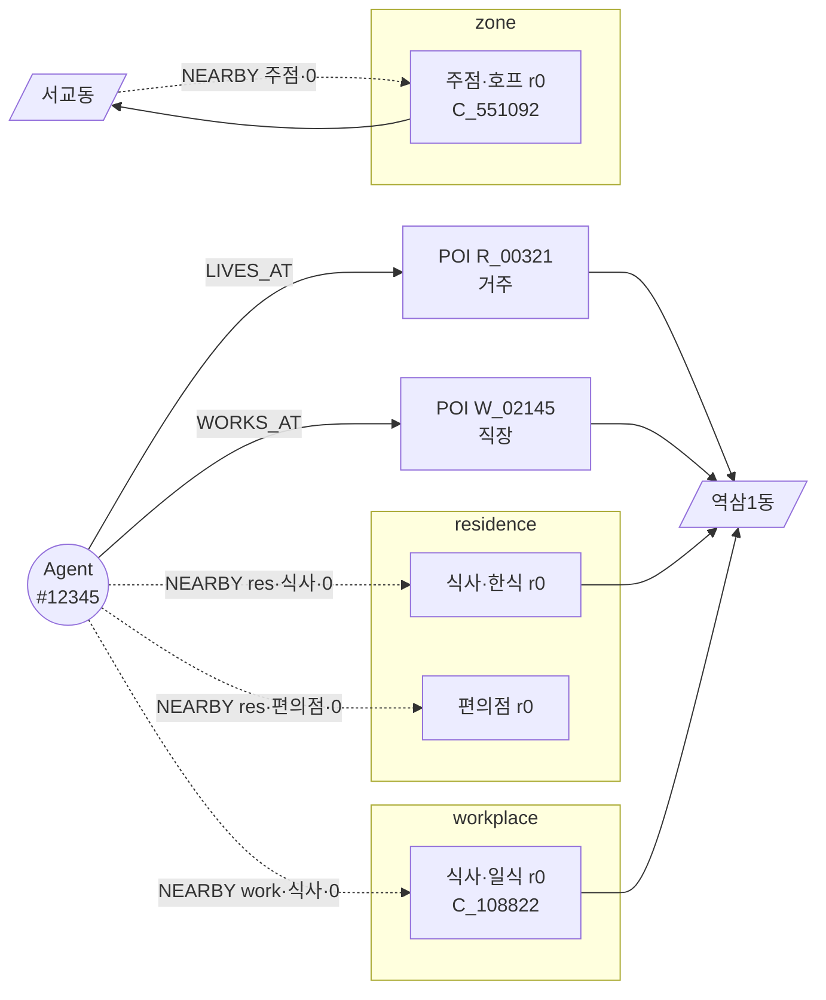

# 🗓️ 에이전트 일일 생활계획표 생성 계획

> **한 줄 요약**: 60,000명 에이전트 각자의 하루 이벤트 시퀀스(집→직장→식당→…→집)를 **매일 자정에 LLM으로 생성**한다. 어제의 기억·인지한 정책·지인 소식이 오늘 행동에 반영되는 것이 본 모듈의 핵심.

---

## 1. 풀려는 문제

상권정책(쿠폰·지원금·홍보)이 시행됐을 때 개별 에이전트의 소비 패턴이 **어떻게 변화하는지**를 관찰하려면, 각 에이전트가 매일 자신의 누적 상태에 맞게 **다른 선택**을 해야 한다.

- 규칙·템플릿 기반은 정책 반응의 다양성·서사성이 부족
- 60일을 한 번에 배치 생성하면 어제-오늘 인과가 끊어짐

→ **LLM으로 매일 한 명씩 하루 계획을 생성**한다. 입력에 "과거 경험(최근 30일) · 인지한 정책 · 지인 소식(최근 14일) · 오늘까지의 running state"를 주입해 시간에 따른 행동 변화를 유도한다.

---

## 2. 구체 예시 — 에이전트 #12345의 하루

**배경**: 30대 개발자, 역삼동 거주·강남파이낸스센터 직장, 어제 친구가 홍대 호프 약속 잡음, 2026-05-07(목).

### 2.1 Stage 1 입력 요약 (개념)
```
[페르소나]        30대 남 · 개발자 · 소비분위 7 · 성격: 사교적
[running state]   월누적지출 452,000 · 전일만족 0.72
                  (P001 수혜중이면 `잔여쿠폰: {P001: 70000}` 추가)
[최근 경험·30일]   5/6 을지로골목(한식, 0.8) · 5/5 스타벅스 역삼(0.6) ·
                  4/28 도쿄하우스(일식, 0.9) · ...  ← importance×recency Top-5
[인지한정책]       P001 강남구쿠폰 · 인지도 0.7 (식사·카페 30%환급)
[지인소식·14일]    5/6 친구@67890 "오늘 홍대 호프" (social_commitment) ·
                  5/2 동료@12003 "역삼 새 맛집 R_194832" (pending)
[intent zone]     zone:홍대(1144055) — 사유: social_commitment
```

### 2.2 Stage 1 출력 (카테고리 시퀀스)
```json
{
  "events": [
    {"time":"08:10","category":"집","anchor":"residence","intent":"기상"},
    {"time":"08:50","category":"편의점","anchor":"residence","intent":"출근길 커피"},
    {"time":"09:10","category":"직장","anchor":"workplace","intent":"출근"},
    {"time":"12:20","category":"식사","sub_category":"일식","anchor":"workplace","intent":"점심 초밥"},
    {"time":"13:10","category":"직장","anchor":"workplace","intent":"업무복귀"},
    {"time":"19:00","category":"주점","sub_category":"호프","anchor":"zone:1144055","pinned_poi":"C_551092","intent":"친구추천 호프집"},
    {"time":"22:30","category":"집","anchor":"residence","intent":"귀가"}
  ]
}
```

### 2.3 시스템 POI 필터 (런타임, Cypher) **[수정됨]**
```
event 2 (편의점·residence)         → (Agent)-[:NEARBY {anchor:'residence',cat:'편의점'}]->(POI) LIMIT 30
event 4 (식사·일식·workplace)       → (Agent)-[:NEARBY {anchor:'workplace',cat:'식사'}]->(POI) WHERE sub='일식' LIMIT 30
event 6 (주점·호프·zone:홍대 ★pinned) → 후보 생성 skip — pinned_poi=C_551092 그대로 확정
```
- pinned_poi가 있는 event는 후보 필터·Stage 2 선택 모두 **우회**. Stage 1이 social/memory context의 POI를 직접 지정한 경우.
- 나머지 event만 Cypher 인덱스 조회. 사전계산 `[:NEARBY]` 엣지 덕에 쿼리당 <1 ms. zone 앵커는 `(:Dong)-[:NEARBY]->(POI)` 엣지(계층 traversal도 병용 가능).

#### `[:NEARBY]`는 어떻게 사전계산됐나 (§6.1 ④ 요약)

```
시뮬레이션 시작 전 1회 실행:

  1. POI ~650K를 대카테고리(10종, §4.1)별로 분할
     → 카테고리마다 POI 좌표 배열을 모아 KDTree 인덱스 구축 (총 ~10개)

  2. (Agent)-[:NEARBY]-> 적재
     각 에이전트의 [:LIVES_AT]/[:WORKS_AT] POI 좌표를
     10개 카테고리 KDTree에 각각 k=30 nearest 질의
     → 거리순 rank 0~29 부여
     → [:NEARBY {anchor:'residence'|'workplace', category, rank}] bulk insert
     규모: 60K × 2앵커 × 10카테고리 × 30 ≈ 3,600만 엣지

  3. (Dong)-[:NEARBY]-> 적재
     각 행정동(:Dong) 중심좌표로 동일 방식 수행
     → [:NEARBY {category, rank}] bulk insert
     규모: 424동 × 10카테고리 × 30 ≈ 127K 엣지

  4. KDTree 폐기 — 좌표·반경 계산은 여기서 종료, 런타임 상주 없음
```

- **왜 1회로 끝나나**: 60일 동안 에이전트 거주·직장과 행정동 중심은 불변 → 앵커와 POI 좌표 관계도 불변이라 재계산 불필요.
- **런타임 쿼리 모양**: category 필터 + rank ≤ 29만 남음. 반경/좌표 계산 0, KDTree 로드 0 → Neo4j 엣지 타입 인덱스로 <1 ms.
- **갱신 트리거**: POI DB 추가/삭제, 에이전트 앵커 재할당(POC에선 없음) 시에만 영향받은 슬라이스만 재빌드.
- **서브카테고리**: `sub_category` 필터(예: 식사→일식)는 POI 노드 속성으로 저장해 Top-30 엣지를 끌어온 뒤 Cypher `WHERE p.sub='일식'`로 2차 필터. 서브 단위 KDTree까지 만들면 엣지 수가 ~4배로 불어나 디스크 낭비.

#### 그래프 시각화 — 에이전트 #12345 관점

실선 = 고정 앵커·계층, 점선 = 사전계산 `[:NEARBY]`. 각 카테고리당 30개 중 rank 0 한 개만 표시.



- `NEARBY res·식사·0` = `[:NEARBY {anchor:'residence', cat:'식사', rank:0}]`. Agent 1명당 600엣지(2앵커×10카테고리×30) 중 3개만 표시.
- `residence`·`workplace` 서브그래프: 각 300엣지, 에이전트마다 개인 소유. `zone` 서브그래프: Dong에서 출발, 에이전트 무관하게 공용(127K).
- `역삼1동`에 여러 POI가 `[:IN_DONG]`으로 모이는 것에 주목 — **POI·Dong 노드는 하나씩**, 엣지만 다타입 공존.

### 2.4 Stage 2 출력 (POI 확정)
```json
{
  "agent_id": 12345,
  "sim_date": "2026-05-07",
  "day_type": "weekday",
  "events": [
    {"time":"08:10","poi_id":"R_00321","place":"래미안푸르지오 3단지","purpose":"집"},
    {"time":"08:50","poi_id":"C_382910","place":"CU 역삼1동점","purpose":"출근길 음료"},
    {"time":"09:10","poi_id":"W_02145","place":"강남파이낸스센터","purpose":"출근"},
    {"time":"12:20","poi_id":"C_108822","place":"스시노아카츠카","purpose":"점심"},
    {"time":"13:10","poi_id":"W_02145","place":"강남파이낸스센터","purpose":"업무복귀"},
    {"time":"19:00","poi_id":"C_551092","place":"생활맥주 홍대점","purpose":"친구와 맥주"},
    {"time":"22:30","poi_id":"R_00321","place":"래미안푸르지오 3단지","purpose":"귀가"}
  ]
}
```

### 2.5 이튿날 영향
- `C_551092 생활맥주 홍대점` → `agent_memory`에 `visited` 이벤트 행 + 만족도
- 친구에게 "괜찮았다" 공유 시 → 친구 agent의 `agent_memory`에 `heard_rumor` 행
- 다음날 컨텍스트 빌더가 이 행들을 읽어 `memory_context`·`social_context`에 반영

---

## 3. 산출물 — 무엇을 내보내는가

에이전트 × 날짜 1건씩 `daily_plans` 테이블에 저장. 규칙:
- 첫·마지막 이벤트 = 거주지
- 평일 + 직장 有 → 09~18시 중 직장 체류 ≥ 4h
- 이벤트 간격 ≥ 20분, 시간 단조 증가
- 모든 `poi_id` ∈ POI DB ∩ (에이전트의 fixed ∪ Stage 2 후보)

JSON 예시는 §2.4 참조. 스키마는 [`generation.md §4`](./generation.md).

---

## 4. 그래프 스키마 — 노드와 엣지 **[수정됨 — 전면 재작성]**

모든 데이터는 **Neo4j 그래프**에 저장한다. 구조화 데이터(POI·에이전트·정책·visit)는 Cypher로 직접 INSERT, **자연어 상호작용**(에이전트간 대화·정책 뉴스)은 Graphiti의 NL→그래프 추출 파이프라인으로 처리한다. LLM은 그래프를 직접 탐색하지 않고(agentic RAG 아님), **컨텍스트 빌더(Python)가 Cypher 벌크 쿼리로 사전 조회**해 프롬프트 블록으로 주입한다.

### 4.0 노드·엣지 한눈에

```
(:District)-[:HAS_DONG]->(:Dong)<-[:IN_DONG]-(:POI)
(:CategoryL1)<-[:PARENT]-(:CategoryL2)<-[:IN_CATEGORY]-(:POI)

(:Agent) -[:LIVES_AT]-> (:POI)                           -- 거주지 앵커
       -[:WORKS_AT]-> (:POI)                             -- 직장 앵커
       -[:NEARBY {anchor, category, rank}]-> (:POI)       -- 사전계산 후보 (Top-30)
       -[:KNOWS {strength}]-> (:Agent)                    -- 소셜 그래프
       -[:VISITED / :HEARD_RUMOR / :SAW_SNS /
         :HEARD_POLICY / :INITIAL_AWARENESS ...]-> (:POI) -- 기억 엣지 5종

(:Dong) -[:NEARBY {category, rank}]-> (:POI)              -- zone 앵커용 사전계산
(:Policy) -[:TARGETS]-> (:District | :Dong | :CategoryL1)
```

| 요소 | 역할 | 규모 | 업데이트 |
|---|---|---|---|
| `:District`/`:Dong`/`:CategoryL1/L2` 노드 + 계층 엣지 | 공간·카테고리 이중 hierarchy | ~수백 노드 | 고정 |
| `:POI` 노드 + `[:IN_DONG]`·`[:IN_CATEGORY]` 엣지 | 가게·거주·직장 원본, 모든 이벤트의 실명 출처 | ~650K | 60일 고정 |
| `:Agent` 노드 (persona·`policy_state` JSON 포함) + `[:LIVES_AT]`·`[:WORKS_AT]` | 60K 에이전트와 고정 앵커 | 60K | persona 고정, policy_state 매일 갱신 |
| **사전계산** `[:NEARBY {anchor, category, rank}]` (Agent→POI, Dong→POI) | Stage 2 후보 O(1) 조회 | ~3,600만 + ~127K | 초기 1회 |
| `[:KNOWS]` 소셜 그래프 + Graphiti 추출 대화 | 오늘 약속·친밀도·지인 소식 | ~1~2M | 이벤트 기반 |
| **기억 5종 엣지** (§4.2) | Agent-POI 이벤트 로그 | Day 0 ~4.8M + 매일 append | 매일 append |
| `:Policy` 노드 + `[:TARGETS]` 엣지 | 정책 카탈로그와 영향 범위 | 1 (POC) | 고정 |

**공간 쿼리 원칙**: 에이전트 고정 앵커(거주·직장)와 행정동 중심은 60일 불변 → Top-30 POI를 초기 1회만 KDTree로 계산해 `[:NEARBY]` 엣지로 저장. **런타임엔 Cypher 인덱스 조회만** (KDTree는 초기 빌드 도구로만 사용, 런타임 상주 없음). zone 앵커는 계층 traversal `(:Dong)<-[:IN_DONG]-(:POI)`로도 조달 가능 — 행정동(1~2 km²)이 이미 도보 생활권.

### 4.1 카테고리 2-레벨 어휘

10 대카테고리 × ~45 서브카테고리.  
대 카테고리: **식사·카페·디저트·주점·편의점·마트·미용·쇼핑·여가·건강**.  
서브 카테고리 예: 식사={한식·중식·일식·양식·분식·패스트푸드·…}, 주점={호프·와인바·…}.

Stage 1 LLM이 `{category:"식사", sub_category:"일식"}`까지 지정 → 시스템이 POI DB에서 해당 조합을 필터해 거리순 Top-30 반환.

### 4.2 기억 엣지 — Agent→POI 관계 5종 **[수정됨]**

각 기억 유형을 **독립된 엣지 타입**으로 분리. Neo4j가 엣지 타입별로 자동 인덱싱하므로 단일 타입 필터·`|`을 통한 통합 쿼리 둘 다 간결.

```cypher
(:Agent)-[:VISITED           {date, satisfaction, importance}]->(:POI)
(:Agent)-[:HEARD_RUMOR       {date, from_agent, importance}]->(:POI)
(:Agent)-[:SAW_SNS           {date, channel, importance}]->(:POI)
(:Agent)-[:HEARD_POLICY      {date, policy_id, importance}]->(:POI)
(:Agent)-[:INITIAL_AWARENESS {date, importance}]->(:POI)
```

| 엣지 타입 | 생성 경로 | 컨텍스트 빌더에서의 활용 |
|---|---|---|
| `:INITIAL_AWARENESS` | Day 0 시딩 | 기본 인지 풀 (거주·직장·경로·원거리 랜드마크) |
| `:VISITED` | 오늘 방문 결과 | `memory_context` 원천 + 만족도 |
| `:HEARD_RUMOR` | 친구 추천 (Graphiti NL 추출 포함 가능) | `social_context` 원천 (14일 pending) |
| `:SAW_SNS` | SNS·광고·뉴스 노출 | `social_context` 부가 채널 |
| `:HEARD_POLICY` | 정책 대상 상점 노출 | `policy_context` 인지도 갱신 |

통합 조회는 `|` 연산자로 간결: `MATCH (a)-[r:HEARD_RUMOR|SAW_SNS]->(p)`.  
30일+ 미접촉 엣지는 자연스럽게 `memory_context` 필터 창 밖으로 벗어남 (별도 삭제·decay 없음).

### 4.3 Intent zones — 오늘의 행선지 **[수정됨]**

"친구랑 홍대"처럼 특정 지역에 갈 이유가 있을 때, Stage 1 프롬프트의 zone 힌트로 주입. LLM이 채택 시 `anchor:"zone:<dong>"` 지정 → **시스템이 `(:Dong)-[:NEARBY {category,rank}]->(:POI)` 사전계산 엣지 또는 `(:Dong)<-[:IN_DONG]-(:POI) WHERE category`의 계층 traversal로 Top-30 공급. 반경 계산 불필요 — 행정동(1~2 km²) 자체가 도보 가능 생활권.**

| 도출 경로 | 트리거 |
|---|---|
| Social commitment | `social_graph` 오늘 약속 |
| Social recommendation | **14일 내** 지인 추천 POI의 zone (미방문 pending 포함) |
| Memory pull | 최근 30일 고만족 원거리 방문지 |
| `consumption_flow` 샘플 | Poisson(λ_평일=0.3, λ_주말=1.5) |
| Policy | 거주·직장동 밖 혜택 지역 |
| Exploration | 5% 우연 |

### 4.4 사회적 전파 흐름 (예)

```
A가 B에게 "홍대 R빵집" 추천 (2026-05-01)
 └─ B의 agent_memory에 (R빵집, heard_rumor, importance=0.6) 이벤트 행 추가
 └─ 이후 14일간 social_context에 "pending 추천"으로 잠재 — 당일 안 가도 유효
 └─ 2026-05-09 (8일 후) B가 Stage 1에서 {디저트/제과점, zone:홍대} 채택
 └─ 시스템이 POI DB에서 (디저트, 제과점) 필터 + 홍대 중심 Top-30 반환 (R빵집 포함)
 └─ 컨텍스트 빌더가 agent_memory 집계 → Stage 2 힌트 "R빵집: 지인추천(8일전)"
 └─ Stage 2 선택 확률↑
```

---

## 5. LLM 호출 상세 — 토큰 예산

에이전트 1명 × 하루 = **2회 호출** (Stage 1 → Stage 2).

### 5.1 Stage 1 — "무엇을 할까"

| 블록 | 내용 | 토큰 | 캐시 |
|---|---|---|---|
| ① 페르소나 | 성별·연령·직업·소비분위·이동분위·성격·거주/직장동 | ~350 | ✅ |
| ② 고정 장소 | 거주지·직장 이름·근무시간 | ~100 | ✅ |
| ③ 참조 통계 | 본인 분위 평일/주말 Top-5 업종, 일평균 이벤트 | ~100 | ✅ |
| ④ 카테고리 어휘 | 10 × ~45 목록 | ~150 | ✅ |
| ⑤ 오늘 날짜 | sim_date·요일·공휴일·급여일 | ~100 | ❌ |
| ⑥ 최근 경험 | **30일 창** · importance×recency Top-5~7 | ≤500 | ❌ |
| ⑦ 인지한 정책 | awareness ≥ 0.3 | ≤200 | ❌ |
| ⑧ 지인 소식 | **14일 창** · pending 추천 포함 Top-3~5 | ≤400 | ❌ |
| ⑨ Intent zone 힌트 | 오늘 zone 후보 | ≤150 | ❌ |
| ⑩ Running state | 월누적지출 · 전일만족도 (정책 수혜 시 잔여쿠폰) | ≤100 | ❌ |
| | **입력 합계** | **~1,950** | |
| | 출력 (category 시퀀스 + 선택적 `pinned_poi`) | ~300 | |

→ POI 후보 **없음**. 순수 의도 결정.  
→ `memory_context`·`social_context`에 등장한 POI를 직접 방문하려는 이벤트는 출력에 `pinned_poi:"<poi_id>"`를 지정할 수 있다. `guided_json`으로 값역을 **해당 에이전트의 컨텍스트 POI enum**으로 제한 → 지어내기 0%.

### 5.2 시스템 POI 필터 (LLM 호출 아님) **[수정됨]**

- **pinned_poi가 있는 event**: 필터·Stage 2 우회 → Stage 1 지정값을 그대로 최종 `poi_id`로 확정.
- **pinned_poi가 없는 event (미결)**: **Cypher 인덱스 조회로 Top-30 수집.**
  - **residence/workplace 앵커: `(Agent)-[:NEARBY {anchor, category}]->(POI)` 사전계산 엣지**
  - **zone 앵커: `(:Dong)-[:NEARBY {category}]->(POI)` 사전계산 또는 계층 traversal**

**쿼리당 <1 ms (Neo4j 엣지 타입 인덱스). 반경 계산·KDTree 런타임 상주 없음 — 공간 필터는 초기 1회 KDTree 빌드로 `[:NEARBY]` 엣지에 사전 인코딩됨.**

### 5.3 Stage 2 — "어디로 갈까"

**pinned_poi 있는 event는 Stage 2에 진입하지 않는다.** Stage 1이 확정한 POI가 그대로 최종 출력에 병합된다. Stage 2는 **미결 event만** 처리.

| 블록 | 내용 | 토큰 | 캐시 |
|---|---|---|---|
| ⓐ 페르소나 + 고정 장소 | Stage 1 ①② 재사용 | ~450 | ✅ |
| ⓑ 미결 이벤트 목록 | Stage 1 출력 중 pinned_poi 없는 항목 | ~200 | ❌ |
| ⓒ Event별 POI Top-30 | 후보 pool (거리순, 미결 이벤트만) | ~1,200 | ❌ |
| | **입력 합계** | **~1,850** | |
| | 출력 (미결 이벤트 POI 확정) | ~250 | |

`guided_json`으로 `poi_id` ∈ Top-30 강제 → 환각 0%. 최종 일정은 **pinned 이벤트 + Stage 2 출력**을 시간순 병합.

> 평균 가정: 하루 7 events 중 1~2개가 pinned (지인 추천 or 단골 재방문). Pin 비율이 높을수록 Stage 2 토큰·지연 감소.

### 5.4 총합

| | 입력 | 출력 |
|---|---|---|
| Stage 1 | ~1,950 | ~300 |
| Stage 2 | ~1,850 | ~250 |
| **합계** | **~3,800 in** | **~550 out** |

Prefix cache 대상: Stage 1 ①②③④ (~700) + Stage 2 ⓐ (~450) = **~1,150 토큰/agent**가 60일 불변.

### 5.5 핵심 원칙

> 에이전트는 **최근 30일 경험 · 최근 14일 소셜 · 오늘까지의 running state · 오늘의 intent zone**을 본다.  
> Stage 1은 **"무엇을·어디로 (관심 POI면 POI까지)"**, Stage 2는 **나머지 "어디로"** 를 결정한다.

1. POI 환각 차단 — pinned_poi는 컨텍스트 POI enum, 미결은 Top-30 enum
2. 토큰 효율 — Stage 1은 POI 미주입, Stage 2는 미결 event + 후보 bucket만
3. 개인화 — 관심 POI(지인추천·단골)는 Stage 1에서 직접 pin, 일상 루틴은 거리순 탐색
4. 지연 반응 가능 — 오늘 들은 추천이 며칠~2주 뒤에 실행되는 패턴 허용

---

## 6. 일일 실행 파이프라인

### 6.1 1회 준비 (전 기간 고정) **[수정됨]**

```
① Neo4j 그래프 구축            District/Dong/CategoryL1/L2 계층 노드 + POI ~650K 노드
                              + [:HAS_DONG]/[:IN_DONG]/[:IN_CATEGORY] 엣지
② 카테고리 매핑               상가업소·SB63·건축물 → (cat, sub) → POI 속성 + 카테고리 노드 연결
③ 거주·직장 POI 1회 할당      60K 에이전트에 [:LIVES_AT]·[:WORKS_AT] 엣지 (전 기간 불변)
④ 공간 Top-30 사전계산         KDTree로 1회 계산 후 [:NEARBY {anchor,category,rank}] 엣지 적재
                              · (:Agent)-[:NEARBY]-> : 60K × 2앵커 × ~10카테고리 ≈ 3,600만
                              · (:Dong)-[:NEARBY]->  : 424 × ~10 ≈ 127K
                              KDTree는 이 단계 이후 폐기(런타임 상주 없음)
⑤ 초기 인지 시딩              [:INITIAL_AWARENESS] 엣지 bulk insert (~80/agent, 총 ~4.8M)
⑥ 정책·소셜 그래프 초기화      :Policy 노드 + [:TARGETS], Agent 간 [:KNOWS] 엣지
                              에이전트 Agent.policy_state JSON 초기값(S0 또는 baseline) 세팅
```

상세: [`data.md`](./data.md)

### 6.2 매일 자정 실행 **[수정됨]**

```
① 전날 이벤트 → [:VISITED {satisfaction, importance}] 엣지 MERGE
② 정책·SNS·지인 캐스케이드 전파 → [:HEARD_RUMOR]·[:SAW_SNS]·[:HEARD_POLICY] 엣지 MERGE
                                    (에이전트간 NL 대화·정책 뉴스는 Graphiti 추출 후 그래프)
③ Agent.policy_state 갱신 (S0~S5 라이프사이클) + 컨텍스트 빌더:
   Cypher 벌크 쿼리로 30일 memory·14일 social·policy_state·zone 힌트 집계
④ Stage 1 프롬프트 조립 → LLM 호출 (category 시퀀스)
⑤ 시스템: 각 event로 Cypher 후보 조회 → Top-30 수집
   - residence/workplace 앵커: (Agent)-[:NEARBY]->(POI)
   - zone 앵커: (Dong)-[:NEARBY]->(POI) 또는 (Dong)<-[:IN_DONG]-(POI) 계층 traversal
⑥ Stage 2 프롬프트 조립 (③의 memory·social 재주입) → LLM 호출 (POI 확정)
⑦ 검증 (규칙 위반 시 최대 3회 재생성) + :DailyPlan 노드 MERGE + 체크포인트
```

**순서 제약**: ①~③이 ④~⑦보다 반드시 먼저 완료돼야 정책 전파가 당일 계획에 반영된다.

상세: [`generation.md`](./generation.md)

---

## 7. 인프라와 비용

| | **Mode A (권장)** | Mode B (fallback) |
|---|---|---|
| 실행 | vLLM (`run_vllm.sh`) | Qwen Turbo API |
| 모델 | Gemma-4-26B-A4B 또는 EXAONE-3.5-7.8B | qwen-turbo |
| 전제 | A100 80GB (공짜 렌탈) | API Key |
| **60K × 60일 비용** | **$0** | ~$700~775 |
| 1일치 처리 | ~3~8 hr (단일 A100) | API rate limit 의존 |

상세: [`infra.md`](./infra.md)

---

## 8. 다음 할 일

우선순위 순:

1. **카테고리 어휘 확정** — `categories.yaml`, 상가업소/SB63/건축물 매핑 3종
2. **POI DB 3종 확보** — 거주(공동주택)·직장(건축물대장)·소비(상가업소)
3. **POI KDTree 로더** — 메모리 적재 + `(cat, sub)` 필터 + `nearest(xy, k)` 유틸
4. **agent_memory 초기 인지 시딩** — Day 0 `initial_awareness` bulk insert
5. **컨텍스트 빌더 + 정책 인지도 엔진** — 30일 memory · 14일 social · running state · zone 힌트 ← 본 프로젝트의 본질
6. **2-Stage 프롬프트 + vLLM + 검증기**

데이터 상세는 [`data.md`](./data.md), 실행 로직은 [`generation.md`](./generation.md).

---

## 상세 문서 맵

| 파일 | 내용 |
|---|---|
| [`data.md`](./data.md) | POI DB, 매핑 테이블, 고정 할당, KDTree, agent_memory 시딩 |
| [`generation.md`](./generation.md) | 자정 루프, 컨텍스트 빌더, 프롬프트 구조, JSON 스키마, 검증 규칙 |
| [`infra.md`](./infra.md) | vLLM/API 세팅, 토큰 예산, 비용 계산, 모델 비교 |
| [`prompt.md`](./prompt.md) | 프롬프트 원문 스니펫 |