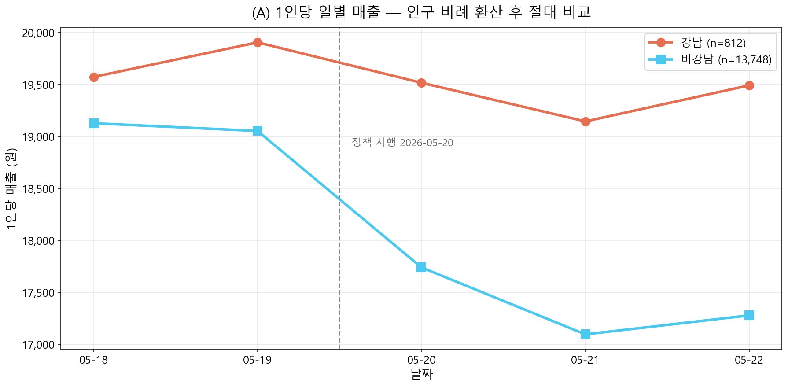
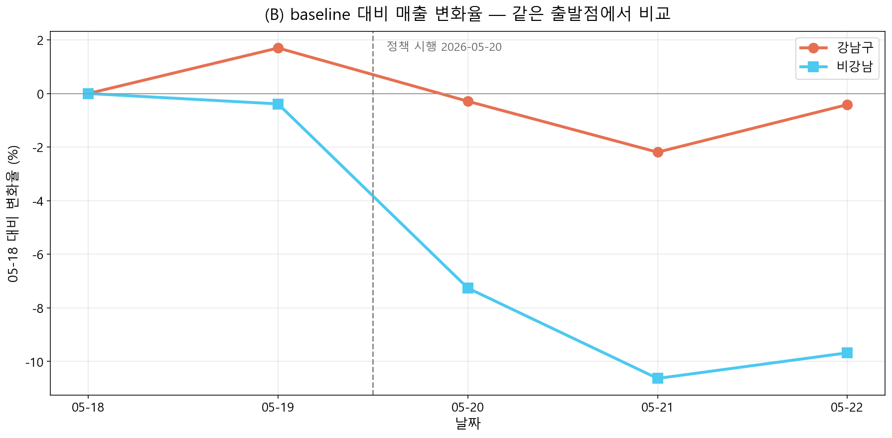
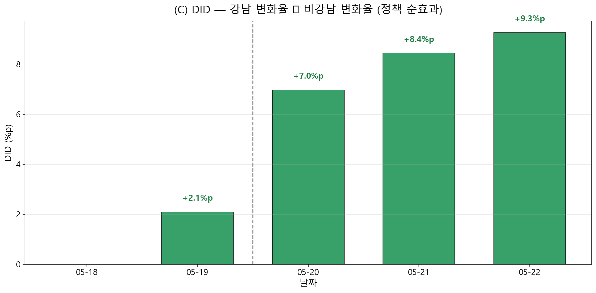
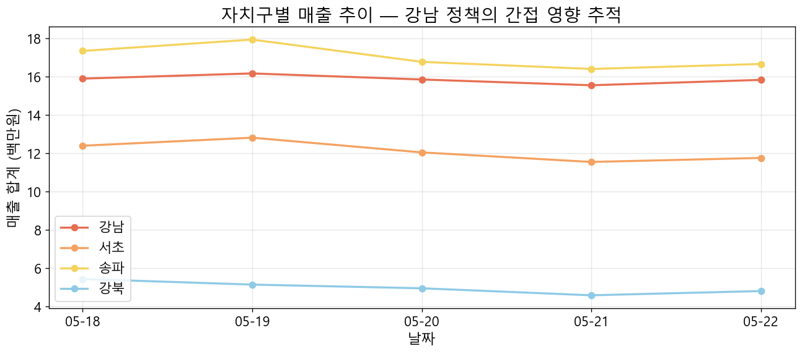
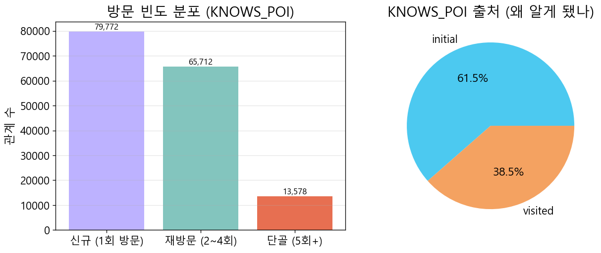

# 서울 상권정책 시뮬레이션 — 최종 보고서

**작성일**: 2026-05-29 14:23 KST

**기간**: 2026-05-18 ~ 2026-05-22 (5일) · **모델**: Qwen3-14B-AWQ · **정책 시행**: 2026-05-20

## 1. 시뮬레이션 조건 요약

| 항목 | 값 |
|---|---:|
| 기간 | 2026-05-18 ~ 2026-05-22 |
| 일수 | 5 |
| 정책_시행일 | 2026-05-20 |
| Agent 수 | 14,881 |
| Plan 수 | 72,714 |
| INCLUDES 엣지 | 646,569 |
| State 수 | 72,714 |
| Memory(visited) | 352,685 |
| Memory(rumor) | 26,309 |
| Conversation 약속 | 116 |
| Conversation 추천 | 20,917 |
| Conversation 이슈 | 4 |
| Conversation 기타 | 30,859 |

## 2. 정책 시행 전 vs 후 매출 추이

### 평균 일간 매출 비교

| 자치구 | 시행 전 | 시행 후 | 변화율 |
|---|---:|---:|---:|
| 강남 (정책 대상) | 16,029,000원 | 15,740,667원 | **-1.8%** |
| 비강남 (대조군) | 262,453,000원 | 238,797,333원 | -9.01% |

**DID (정책 순효과)**: 강남 변화율 − 비강남 변화율 = **+7.21%p**

## 3. 간접 영향 (Spillover) — 강남 vs 인접 자치구

강남구 정책이 인접한 서초·송파에 어떤 파급을 줬는지, 멀리 떨어진 강북과 비교. 인접 자치구의 강남 대비 매출 격차가 좁혀지면 spillover로 해석.

## 4. 소비자 행동·심리 분석

### 4-1. 방문 목적·이동 패턴 — 결정 동기 (trigger) 분포

외출(집·직장 제외)의 결정 동기 분류:

| 동기 | 건수 | 비율 |
|---|---:|---:|
| Top 카테고리 | 133,675 | 47.99% |
| 라이프스타일 | 123,492 | 44.33% |
| 컨디션 | 11,658 | 4.19% |
| 소문 | 4,874 | 1.75% |
| 기타 | 2,528 | 0.91% |
| 정책 | 2,057 | 0.74% |
| 약속 | 270 | 0.1% |

### 4-2. 단골 vs 신규

| 구분 | 관계 수 |
|---|---:|
| 신규 (1회 방문) | 79,772 |
| 재방문 (2~4회) | 65,712 |
| 단골 (5회+) | 13,578 |

전체 KNOWS_POI(방문 경험 있음) 관계 수: **159,062**

### 4-3. 만족도·피드백 — 어떤 동기로 외출했을 때 더 만족했나

| 동기 | 평균 만족도 | 표본 수 |
|---|---:|---:|
| Top 카테고리 | 0.575 | 133,675 |
| 라이프스타일 | 0.563 | 123,492 |
| 소문 | 0.556 | 4,874 |
| 약속 | 0.55 | 270 |
| 기타 | 0.542 | 2,528 |
| 컨디션 | 0.522 | 11,658 |
| 정책 | 0.515 | 2,057 |

## 5. 1대1 인터뷰 — 페르소나별 대표 (positive / negative / neutral)

### 5-positive — 샘플 없음

### 5-negative — 샘플 없음

### 5-neutral — 샘플 없음

## 부록

- 본 보고서는 `scripts/sim/generate_final_report.py`로 자동 생성됨.
- 시뮬 원본 데이터는 Neo4j에 보존 (Plan/State/Memory/Conversation 노드).
- 인터랙티브 시각화: `output/sim/visualization/sim_standalone.html`

---

# 부록 A. 시뮬레이션 데이터 한계 및 해석 주의사항

> 본 보고서의 모든 수치를 해석할 때 반드시 함께 읽어야 할 한계 문서.
> 시뮬 기간: 2026-05-18 ~ 2026-05-22 (5일).
> 정책 시행일: 2026-05-20 ~ 2026-05-22 (P008 강남역-역삼역 보행친화거리, 3일).
> baseline: 2026-05-18·5/19 (정책 미활성). 단, 5/18 은 아래 한계로 인해 **5/19 단일 일자 baseline 권장**.

---

## 1. 시뮬 흐름 변경 — 7일 → 5일로 단축

원안: 2026-05-18 ~ 5/24 (7일). 실제: **2026-05-18 ~ 5/22 (5일)** 로 단축.

- 마감 데드라인(2026-05-29 21:00) 까지 6일 이상 시뮬을 완료할 수 없음. 시뮬 1일 = 약 12시간(본 작업 9.5h + Night Phase 2.5h) 소요.
- 시뮬 v8 (`--start 2026-05-21 --days 4`) 진행 중 5/22 Night Phase 완료 시점(= 5/23 본 작업 시작 신호)에 종료.
- 5/23·5/24 는 시뮬하지 않음. **분석에서 5/23 이후 통째로 제외**.

정책 활성 3일(5/20·5/21·5/22), baseline 2일(5/18·5/19). DID 분석에 충분.

---

## 2. 5/18 — Conversation 데이터 0건

### 무엇이 일어났나
- 원래 시뮬에서 12,477건의 Conversation 정상 생성 (Night Phase 2).
- WSL OOM 추정으로 시뮬 silent kill → resume 시 Night Phase 2 가 재실행되며 12,455건 *중복* 추가 (총 24,932).
- 분석 신뢰성 확보 위해 **Conv 5/18 통째 삭제**.

### 결과
- 5/18 에는 상호작용(약속·추천·이슈·기타) 데이터가 **0건**.
- 5/18 Plan / State / visited Memory (67,806) 는 정상 보존 (CREATE 이지만 done_aids 로 agent 중복 차단).
- 5/18 rumor Memory 5,388 건은 그대로 유지 — *부모 Conv 가 삭제됐지만 자식 rumor 는 1배 정상 수치* (5/19=5,349, 5/20=5,291, 5/21=5,143 와 비슷). "출처 Conv 없는 가십"이지 수치가 부풀려진 것 아님.

### 해석 시 주의
- baseline 1인당 외출·매출 (layered DID) 은 5/18·5/19 평균으로 계산 가능 — Plan·매출 신호 정상.
- 그러나 **trigger=appointment 분포·약속 횟수 같은 Conv 기반 지표는 5/19 단일 일자로만 계산**.
- Conv 기반 지표는 baseline n=1, 정책 활성 n=3. 통계적 유의성보다 효과 크기 위주로 해석.

---

## 3. 5/20 — visited Memory 누락 → **복구 완료 (2026-05-29)**

### 무엇이 일어났나
- visited Memory 는 *Day N 의 dawn 단계*에서 *yesterday=N-1* INCLUDES → `Memory{type:'visited'}` CREATE 로 생성됨 (`plan_writer.py` night_finalize).
- 코드상 시뮬 첫날(`day_idx==0`)은 yesterday visited Memory 생성을 skip.
- v6(5/18 시작)가 5/21 dawn(yesterday=5/20 생성) 도달 전 silent kill, 그 후 v8 가 `--start 2026-05-21`(day_idx=0)로 재시작 → **5/20 visited Memory 가 누락**.

### 복구 (2026-05-29)
- 5/20 Plan/INCLUDES (방문 의도 56,154건 + 매출 6.86억원)는 정상 보존돼 있었음.
- `anchor STARTS WITH 'zone:'`(물리적 외출) INCLUDES 기준으로 **visited Memory 71,529건 재생성** (5/19=66,855·5/21=72,261 와 일관).
- `KNOWS_POI` 5/20 단골화 집계(visit_count·avg_satisfaction·recent_visit_dates·last_visit)도 시간순으로 보정 (`fix_knows_poi_0520.cypher`).

### 잔여 영향 (복구 불가)
- 5/21 dawn 시점엔 5/20 visited Memory 가 *없는 상태*로 LLM 이 컨텍스트를 봤음. 그 컨텍스트로 만든 **5/21 Plan/State 의 reasoning 은 되돌릴 수 없음**.
- 영향: 5/20 첫 방문 POI 를 5/21 LLM 이 "신규"로 인식 → **5/21 의 trigger="새가게_탐색"이 약간 부풀려졌을 가능성**.
- 매출/DID/외출 지표는 영향 없음. 단골 vs 신규 카운트는 복구로 정확해짐.

---

## 4. 5/19 Plan 의 잔여 영향 (영구)

Day 2 (5/19) 처리 시점에 5/18 의 24K 중복 Conv 가 *아직 살아있었음*. Dawn 컨텍스트가 그것을 fetch 해서 LLM 에 노출했고, 일부 reasoning 이 그 영향을 받음.

- 5/19 의 `trigger=appointment` 카운트가 **부풀려졌을 가능성**. 5/20 이후와 비교해 비정상 증가면 본 영향으로 해석.
- 5/19 Plan/State 본 적재는 정상.
- 5/20 dawn 시점엔 이미 5/18 Conv 가 삭제되어 있어 이후 날짜엔 영향 없음.

---

## 5. 5/23·5/24 — 미시뮬 (분석 제외)

5일 단축으로 5/23·5/24 는 시뮬하지 않음. 본 보고서는 5/18~5/22 만 집계. 모든 차트·DID·정밀측정이 `--days 5` 한정.

---

## 6. L2 spillover 측정의 한계와 정밀 측정

### 한계
- `day_health_check.py` 10-D 의 L2 (도보권 거주) 그룹은 *거주지만* 기준으로 분류.
- 그러나 P008 정책의 `POLICY_CYPHER` 는 `LIVES_AT OR WORKS_AT` 둘 다 fetch.
- 즉 **거주 L2 + 직장 L1 (사업 구간)** 인 agent 는 *direct + spillover 혼재* 신호를 받음.

### 정밀 측정 (`L2_PRECISE_5D.md` 참조)
거주 L2 를 직장 위치별 4 case 로 분리:

| Case | 의미 |
|---|---|
| `pure_L2` | 거주 L2 ∩ 직장 비강남(또는 없음) — **진정한 spillover** |
| `mixed_L2_L1work` | 거주 L2 ∩ 직장 L1 — direct + spillover 혼재 |
| `both_walk` | 거주 L2 ∩ 직장 L2 — 양쪽 도보권 |
| `L2_gangnam_other` | 거주 L2 ∩ 직장 강남 비도보권 |

→ **`pure_L2` 의 DID 효과만 "spillover 지표"로 인용**. 그 외는 보조 분석.

---

## 7. 자동 보고서 (`FINAL_REPORT_5D.md`) 수치 해석 가이드

| 항목 | 해석 시 주의 |
|---|---|
| 매출 추이 (직접 영향, L1) | 영향 없음 (Plan/매출 정상). 안정적 신호. |
| 매출 추이 (간접 영향, L2) | §6 정밀 측정 결과(`L2_PRECISE_5D.md`)로 보완 |
| 단골 vs 신규 | 5/20 visited Memory 복구로 **정확** |
| trigger 분포 (5/19) | appointment 부풀림 가능 — 5/20 이후만 보면 안전 |
| trigger 분포 (5/21) | "새가게_탐색" 약간 부풀림 가능 (5/20 회상 부재 잔여 영향) |
| 인터뷰 답변 | 5/18 상호작용 인용 빠짐 (5/19~5/22 로 보완) |

---

## 8. 원인 요약 (재발 방지)

- 시뮬 `resume` 메커니즘이 *day 별 retry agent 있을 때 Night Phase 전체를 재실행* → Conversation/Memory `CREATE` 중복.
- visited Memory 가 `day_idx==0` 에서 skip → 재시작 경계일(5/20)에서 누락.
- **다음 라운드 개선 후보**:
  - Night Phase idempotency (Conv id MERGE 또는 done_<day>_night.json 체크포인트).
  - `--skip-night-if-resume` 옵션.
  - 재시작 시 `--start` 가 첫날이어도 yesterday visited Memory 생성 (이전 시뮬 데이터 있으면).

---

## 9. 보고서에 명시할 단일 문구 (요약)

> 본 시뮬레이션은 2026-05-18 ~ 5/22 (5일) 풀런이며, 실행 중 두 차례 silent kill 이 발생해 5/18 Conversation 이 누락(삭제)되고 5/20 visited Memory 가 누락되었다. 5/20 visited Memory 와 KNOWS_POI 는 사후 복구했으나, 5/18 Conv(0건)와 5/21 trigger 분포의 미세 왜곡은 잔존한다. 두 사고 모두 Plan·매출 등 핵심 지표에는 영향이 없다. P008 spillover 측정 시 거주 L2 + 직장 L1 케이스가 direct 효과를 일부 포함하므로, 진정한 spillover 는 `L2_PRECISE_5D.md` 의 `pure_L2` DID 수치를 기준으로 한다.

---

# 부록 B. L2 spillover 정밀 측정

- 시뮬 기간: 2026-05-18 ~ 2026-05-22 (5일)
- 정책 시행일: 2026-05-20
- baseline 일자: 2026-05-19
- 정책 활성 일자: 2026-05-20, 2026-05-21, 2026-05-22

## 1. 분석 동기

`day_health_check.py` 10-D 의 L2 (도보권 거주) 그룹은 거주지만 보고 분류한다. 그러나 P008 정책의 `POLICY_CYPHER`는 `LIVES_AT OR WORKS_AT` 둘 다 fetch하므로, 거주 L2 + 직장 L1(사업 구간)인 agent는 *direct + spillover 혼재* 신호를 받는다. 이 스크립트는 거주 L2 를 직장 위치별 4 case 로 분리해, *진정한 spillover* 만 추출한다.

## 2. 분모 (거주 L2 agent의 직장 분포)

| Case | 의미 | n |
|---|---|---:|
| **pure_L2** | 거주 L2 ∩ 직장 비강남(또는 직장 없음) — 순수 spillover | 63 |
| **mixed_L2_L1work** | 거주 L2 ∩ 직장 L1 — direct + spillover 혼재 | 42 |
| **both_walk** | 거주 L2 ∩ 직장 L2 — 양쪽 도보권 | 65 |
| **L2_gangnam_other** | 거주 L2 ∩ 직장 강남 비도보권 — spillover (직장 동선 일부 강남) | 20 |
| (Control) | 비강남 거주 | 13,748 |

> 분모는 시뮬 첫날 기준 (agent population은 변하지 않음).

## 3. baseline 일자 평균 1인당 매출 (카페·디저트)

| Case | 1인당 매출 (원) | vs Control |
|---|---:|---:|
| pure_L2 | 1,238 | -30.7% |
| mixed_L2_L1work | 1,857 | +4.0% |
| both_walk | 3,415 | +91.3% |
| L2_gangnam_other | 2,400 | +34.4% |
| Control (비강남 거주) | 1,785 | — |

## 4. 정책 활성 일자 평균 1인당 매출

| Case | 1인당 매출 (원) | vs Control |
|---|---:|---:|
| pure_L2 | 2,444 | +55.1% |
| mixed_L2_L1work | 2,857 | +81.3% |
| both_walk | 4,615 | +192.9% |
| L2_gangnam_other | 3,400 | +115.8% |
| Control | 1,576 | — |

## 5. DID — 정책 효과 (baseline 격차 → 정책 활성 격차)

| Case | baseline 격차 | 정책 활성 격차 | **DID 효과** |
|---|---:|---:|---:|
| pure_L2 | -30.7% | +55.1% | **+85.8%p** |
| mixed_L2_L1work | +4.0% | +81.3% | **+77.3%p** |
| both_walk | +91.3% | +192.9% | **+101.6%p** |
| L2_gangnam_other | +34.4% | +115.8% | **+81.4%p** |

> **pure_L2 의 DID 효과**가 P008 의 진정한 spillover 지표. `day_health_check.py` 의 L2 통합 수치는 이 4 case 의 가중평균으로, mixed_L2_L1work 의 direct 효과가 일부 섞여있다.

