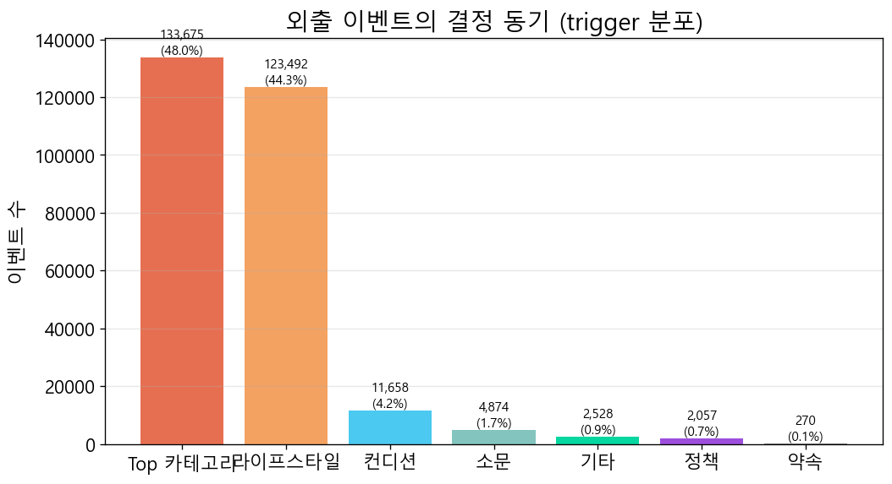
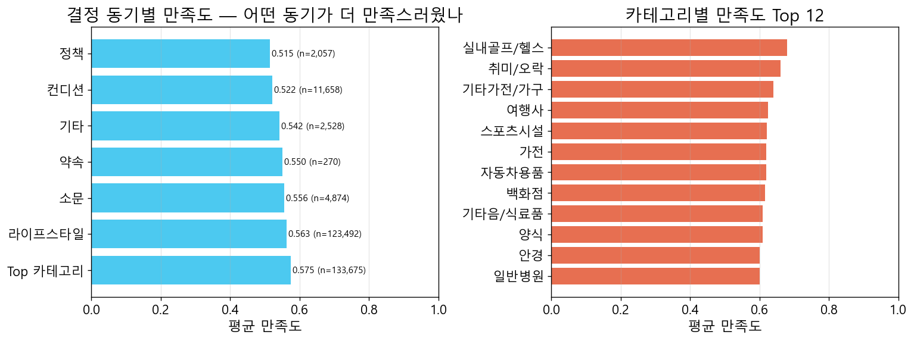

# 서울 상권정책 시뮬레이션 — 최종 보고서

**작성일**: 2026-05-29 15:10 KST

**기간**: 2026-05-18 ~ 2026-05-22 (5일) · **모델**: Qwen3-14B-AWQ · **정책 시행**: 2026-05-20

## 1. 시뮬레이션 조건 요약

| 항목 | 값 |
|---|---:|
| 기간 | 2026-05-18 ~ 2026-05-22 |
| 일수 | 5 |
| 정책_시행일 | 2026-05-20 |
| Agent 수 | 14,881 |
| Plan 수 | 72,714 |
| INCLUDES 엣지 | 646,569 |
| State 수 | 72,714 |
| Memory(visited) | 352,685 |
| Memory(rumor) | 26,309 |
| Conversation 약속 | 116 |
| Conversation 추천 | 20,917 |
| Conversation 이슈 | 4 |
| Conversation 기타 | 30,859 |

## 2. 정책 시행 전 vs 후 매출 추이


### 평균 일간 매출 비교

| 자치구 | 시행 전 | 시행 후 | 변화율 |
|---|---:|---:|---:|
| 강남 (정책 대상) | 16,029,000원 | 15,740,667원 | **-1.8%** |
| 비강남 (대조군) | 262,453,000원 | 238,797,333원 | -9.01% |

**DID (정책 순효과)**: 강남 변화율 − 비강남 변화율 = **+7.21%p**

## 3. 간접 영향 (Spillover) — 강남 vs 인접 자치구


강남구 정책이 인접한 서초·송파에 어떤 파급을 줬는지, 멀리 떨어진 강북과 비교. 인접 자치구의 강남 대비 매출 격차가 좁혀지면 spillover로 해석.

## 4. 소비자 행동·심리 분석

### 4-1. 방문 목적·이동 패턴 — 결정 동기 (trigger) 분포



외출(집·직장 제외)의 결정 동기 분류:

| 동기 | 건수 | 비율 |
|---|---:|---:|
| Top 카테고리 | 133,675 | 47.99% |
| 라이프스타일 | 123,492 | 44.33% |
| 컨디션 | 11,658 | 4.19% |
| 소문 | 4,874 | 1.75% |
| 기타 | 2,528 | 0.91% |
| 정책 | 2,057 | 0.74% |
| 약속 | 270 | 0.1% |

### 4-2. 단골 vs 신규


| 구분 | 관계 수 |
|---|---:|
| 신규 (1회 방문) | 79,772 |
| 재방문 (2~4회) | 65,712 |
| 단골 (5회+) | 13,578 |

전체 KNOWS_POI(방문 경험 있음) 관계 수: **159,062**

### 4-3. 만족도·피드백 — 어떤 동기로 외출했을 때 더 만족했나

> **만족도(`actual_satisfaction`) 산정 방식** — LLM이 정하지 않고 페르소나 성향·카테고리 적합도로 계산하는 규칙 기반 점수다.
>
> 외출 이벤트: `0.5(기본) + 0.10(Top 카테고리 매칭) + 0.05(소비형)/−0.03(절약형) + 균등난수(−0.10~+0.10)` → `[0,1]` 범위로 클램프, 소수 2자리.
>
> 집·직장 등 내부 활동: `0.6 ± 0.1` 고정. 이 구조 때문에 만족도는 0.5 부근(대략 0.40~0.68)에 분포하며, Top 카테고리 적합 외출일수록 높게 나온다.



| 동기 | 평균 만족도 | 표본 수 |
|---|---:|---:|
| Top 카테고리 | 0.575 | 133,675 |
| 라이프스타일 | 0.563 | 123,492 |
| 소문 | 0.556 | 4,874 |
| 약속 | 0.55 | 270 |
| 기타 | 0.542 | 2,528 |
| 컨디션 | 0.522 | 11,658 |
| 정책 | 0.515 | 2,057 |

## 5. 1대1 인터뷰 — 페르소나별 대표 (positive / negative / neutral)

> P008은 금전 혜택이 없는 **시설(보행친화거리) 정책**이라, 정책 구간(역삼1·역삼2·도곡1동) 방문 여부와 만족도를 기준으로 세 유형을 정의했다.
>
> - **positive**: 강남 거주 + 정책 구간 2회 이상 방문 + 평균 만족도 높음
> - **negative**: 정책 구간 미방문 + 평균 만족도 하위
> - **neutral**: 정책 구간 미방문 + 평균 만족도 중간
>
> 각 군집 대표 1명을 자동 추출해 LLM이 그 페르소나로 답변하며, 시뮬 시점에 적재된 reasoning·만족도·방문 기록을 인용한다.

### [positive] 정책 구간 방문 잦음 + 만족도 ↑ — `AGT_11680590_F_40대_002`

- **페르소나**: 40대 F · 외국계 회사 인사팀 · 삼성2동 거주 · 소득 중상
- **라이프스타일**: 박선화 씨는 수학적 분석력과 사교성을 겸비한 강남의 유능한 자동차 영업원으로, 철저한 자기관리와 가족에 대한

**Q. 강남역-역삼역 보행친화거리 조성사업(보도 확장·가로 조명 개선·휴식 벤치 설치)에 대해 어떻게 느끼셨나요? 그 거리를 더 자주 걷거나 오래 머물게 됐는지, 아니면 별 영향이 없었는지 알려주세요. (※ 이 정책은 금전 할인·바우처가 아니라 보행 환경 개선 사업입니다.)**

> 그 정책 덕분에 카페를 자주 가게 됐어요. 예를 들어 2026년 5월 21일 우지커피역삼에 가봤는데, 거리가 좀 더 편하게 걸을 수 있어서 오래 머물렀어요. 보행친화거리 조성 덕분에 휴식 시간에 카페를 더 자주 찾게 됐죠. 정책 자체는 금전적 혜택은 없지만, 분위기와 편의성이 좋아져서 자연스럽게 그런 행동으로 이어졌어요.

**Q. 가장 자주 가신 가게는 어디고, 왜 그곳을 자주 갔나요?**

> 가장 자주 가는 곳은 볕드는 호두집이에요. 한식을 좋아하고, 직장 근처에 있어서 점심에 갈 때마다 자연스럽게 선택하게 되었어요. 평일 Top 카테고리 중 한식이 9%를 차지하고 있었고, 이곳에서의 만족도가 0.68이었어서 자주 가게 되었죠. 뿐만 아니라, 거리도 가까워서 편리했어요.

**Q. 친구·동료가 추천한 곳에 가신 적 있나요? 있다면 누가 추천했고, 갔더니 어땠나요?**

> 네, 친구가 추천한 곳에 갔던 적 있어요. AGT_11215810_M_20대_003이 봉우이층집강남을 추천했었는데, 그날 점심으로 갔어요. 직장 근처에 있고, 한식이 좋아서 자연스럽게 선택했어요. 만족도는 괜찮았던 것 같아요. 추천해준 친구가 자주 가는 곳이라, 나도 한 번쯤 가보고 싶었거든요.

**Q. 약속을 잡으신 적이 있다면 그 약속이 왜 잡혔는지 설명해주세요.**

> 약속은 없었어요. 일상적인 행동은 주로 직장 근처에서 한식 식사와 자녀 교육 관련 학원 방문, 건강 관리 차원의 한의원 방문이 대부분이었어요. 특히 5월 20일에 자연재생한의원을 방문한 건 평일 Top 카테고리 중 한의원이 9%를 차지하고 있어서 건강 관리에 집중하고 싶어서 그런 거죠. 전반적으로는 정책이나 소문보다는 라이프스타일과 일상적인 욕구에 따라 행동했어요.

**Q. 이번 주 가장 만족스러웠던 외출과 가장 별로였던 외출을 하나씩 꼽아주세요.**

> 이번 주 가장 만족스러웠던 외출은 5월 21일에 갔던 우지커피역삼이에요. 보행친화거리 조성 정책 덕분에 분위기 좋은 카페가 많아서 자연스럽게 갔는데, 오후 휴식 시간에 좋은 분위기에서 시간을 보내는 게 기분 좋았어요. 그리고 가장 별로였던 외출은 5월 19일에 간 작은손아트스튜디오였어요. 만족도가 0.68이었는데, 자녀 교육을 위해 가긴 했지만 조금은 기대와 다른 느낌이었어요.

**Q. 다음 주에도 비슷한 패턴으로 다닐 건가요, 바꾸실 건가요? 그 이유는?**

> 아주 비슷한 패턴으로 다닐 거예요. 평일 Top 카테고리인 한식과 학원, 한의원을 중심으로 일상이 구성되어 있고, 거주지와 직장 근처에 있는 장소를 자주 이용하고 있어서요. 예를 들어 5월 20일에 한의원을 갔을 때는 평일 Top 카테고리 중 일반병원이 15%를 차지하고 있어서 건강 관리가 중요한 시점이었거든요. 또 자녀 대학 진학 시기라서 학원 방문도 계속 필요할 거라 생각해요. 소비 패턴도 절약형이 아니라 보통이어서, 현재의 일정은 크게 바꾸지 않을 것 같아요.

---

### [negative] 정책 구간 미방문 + 만족도 ↓ — `AGT_11200690_M_70대이상_001`

- **페르소나**: 70대이상 M · 무직 · 성수2가제3동 거주 · 소득 하
- **라이프스타일**: 소비는 꼭 필요한 경우에만, 가정 중심 생활

**Q. 강남역-역삼역 보행친화거리 조성사업(보도 확장·가로 조명 개선·휴식 벤치 설치)에 대해 어떻게 느끼셨나요? 그 거리를 더 자주 걷거나 오래 머물게 됐는지, 아니면 별 영향이 없었는지 알려주세요. (※ 이 정책은 금전 할인·바우처가 아니라 보행 환경 개선 사업입니다.)**

> 그거는 제가 자주 다니는 성수2가제3동이 아니라 강남역 주변이어서 직접 느낀 건 없어요. 제가 가는 곳은 대부분 집 근처에 있는 편의점, 마트, 한의원 같은 곳들이고, 그런 곳들은 보행 환경이 잘 갖춰져 있으면 좋겠지만, 제가 걷는 거리나 오래 머무는 곳은 아니에요. 그래서 별 영향은 없었던 것 같아요.

**Q. 가장 자주 가신 가게는 어디고, 왜 그곳을 자주 갔나요?**

> 가장 자주 가는 곳은 세븐일레븐이에요. 가까운 거리에 있고, 일상적인 물건을 구입할 때 가장 편리해서 자주 가게 되었어요. 절약형 성향이라 필요할 때만 구입하는 편인데, 세븐일레븐은 그런 점에서 딱 맞는 곳이에요. 다만 만족도는 평균 수준이지만, 가까워서 자주 가게 되는 거죠.

**Q. 친구·동료가 추천한 곳에 가신 적 있나요? 있다면 누가 추천했고, 갔더니 어땠나요?**

> 아내가 추천한 곳은 없었지만, 동네에서 만난 지인한테 생강김밥성수를 추천받았어요. 그날은 점심을 해결하려는 생각이었고, 지인의 추천이 있었기에 가봤는데, 만족도가 0.55로 괜찮았어요. 가정 중심의 생활이라 외식은 거의 하지 않지만, 추천을 받으면 가보고 싶은 마음이 들어요.

**Q. 약속을 잡으신 적이 있다면 그 약속이 왜 잡혔는지 설명해주세요.**

> 약속은 잡은 적이 없어요. 평소에 외출이나 외식은 가족과 함께하는 경우가 많고, 가족과의 시간을 우선시하는 편이라서 혼자 다니는 장소는 거의 없었거든요. 또 소비는 꼭 필요한 경우에만 하려는 절약형 성향이라, 임의로 약속을 잡을 만한 여유도 없었고, 필요도 느끼지 못했어요.

**Q. 이번 주 가장 만족스러웠던 외출과 가장 별로였던 외출을 하나씩 꼽아주세요.**

> 이번 주 가장 만족스러웠던 외출은 5월 21일에 갔던 코쿤스토리입니다. 정육을 사러 갔는데, 만족도가 0.53으로 괜찮았거든요. 가정 중심 생활을 하다 보니 이런 장소가 필수적이어서 만족스럽게 느꼈어요.  

가장 별로였던 외출은 5월 18일에 갔던 세븐일레븐이에요. 만족도가 0.37이었는데, 편의점은 자주 가지만 음식 만족도가 낮으면 마음이 흔들리죠. 절약형 성향이라 비용은 아끼고 싶지만, 맛도 중요하니까요.

**Q. 다음 주에도 비슷한 패턴으로 다닐 건가요, 바꾸실 건가요? 그 이유는?**

> 아주 비슷한 패턴으로 다닐 거예요. 절약형 성향이고, 가정 중심이라서 편의점과 마트, 분식점 같은 곳을 자주 이용하는 거죠. 특히 축산물장터나 코쿤스토리 같은 정육점은 일상에서 필수적인 만큼 자주 가게요. 만족도가 낮은 경우도 있지만, 필요할 때마다 가게 되는 거라서 바꾸기 어려울 것 같아요.

---

### [neutral] 정책 구간 미방문 + 만족도 보통 — `AGT_11110560_M_50대_003`

- **페르소나**: 50대 M · 교육청 전산 담당 직원 · 평창동 거주 · 소득 중
- **라이프스타일**: 가족 중심형, 가벼운 운동과 소규모 쇼핑 즐김

**Q. 강남역-역삼역 보행친화거리 조성사업(보도 확장·가로 조명 개선·휴식 벤치 설치)에 대해 어떻게 느끼셨나요? 그 거리를 더 자주 걷거나 오래 머물게 됐는지, 아니면 별 영향이 없었는지 알려주세요. (※ 이 정책은 금전 할인·바우처가 아니라 보행 환경 개선 사업입니다.)**

> 그건 제가 자주 다니는 길이 아니라서 별 영향은 없었어요. 평소에 직장과 가정 사이를 오가다 보면 금강하이츠빌라와 홍은동풍림아이원아파트 주변이 더 흔한 동선이라, 보행 환경 개선이 강남역-역삼역 주변이라면 제가 직접 느끼기엔 어렵겠네요. 다만, 그런 프로젝트가 도시 전체의 편의성을 높인다는 점에서는 긍정적으로 생각해요.

**Q. 가장 자주 가신 가게는 어디고, 왜 그곳을 자주 갔나요?**

> 가장 자주 가는 곳은 '최고의인생'이라는 한식 식당이에요. 직장 근처에 있어서 편리하고, 한식을 좋아하는 편이라 자연스럽게 자주 가게 되었어요. 특히 2026년 5월 19일에 가봤을 때 만족도가 0.67이었는데, 그 후로는 그곳을 다시 방문했어요. 라이프스타일상 한식을 자주 찾는 편이라, 만족도가 높은 곳을 반복해서 가는 거죠.

**Q. 친구·동료가 추천한 곳에 가신 적 있나요? 있다면 누가 추천했고, 갔더니 어땠나요?**

> 네, 친구가 추천한 오늘의밥상에 가봤어요. AGT_11110560_F_20대_001이 추천했고, 저녁 식사로 가봤는데 가족 중심의 한식이어서 좋았어요. 만족도가 0.52로 평균 수준이었지만, 직장 근처라서 편하게 갔던 곳이에요. 추천을 받은 건데, 어제 백진주에서 만족도가 0.57이었으니 오늘은 다른 곳을 시도해보는 것도 좋아 보였어요.

**Q. 약속을 잡으신 적이 있다면 그 약속이 왜 잡혔는지 설명해주세요.**

> 아, 약속은 없었어요. 대부분 일상적인 루틴이나 직장 근처에서 편리하게 다니는 곳들이라, 특별한 약속은 거의 없었죠. 가끔은 가족과 함께 식사할 때는 계획을 세우지만, 그건 더 개인적인 일정이에요. 직장 근처에 있는 한식 식당이나 편의점 같은 곳은 일상에서 자연스럽게 이용하는 거라, 약속처럼 느껴지지 않았어요.

**Q. 이번 주 가장 만족스러웠던 외출과 가장 별로였던 외출을 하나씩 꼽아주세요.**

> 이번 주 가장 만족스러웠던 외출은 5월 22일에 가진 최고의인생이에요. 직장 근처에 있고, 이전에 만족도 0.67을 기록했었는데, 다시 방문해서 만족도 0.65를 받았거든요. 한식을 좋아하고, 직장 근처에서 편하게 먹을 수 있어서 자주 가는 곳이에요.

가장 별로였던 외출은 5월 19일에 갔던 백진주에요. 만족도가 0.57으로 평소에 가는 곳 중에서는 낮은 편이었고, 메뉴나 분위기에서 특별한 점이 없어서 그런가 봐요. 한식을 자주 먹는 편이라서 그런지, 그날은 좀 기대와 맞지 않았던 것 같아요.

**Q. 다음 주에도 비슷한 패턴으로 다닐 건가요, 바꾸실 건가요? 그 이유는?**

> 아주 비슷한 패턴으로 다닐 것 같아요. 직장 근처에 있는 한식 식당을 자주 찾고, 할인점이나 슈퍼마켓도 일과 중에 간편하게 이용하는 습관이 있어서요. 예를 들어 5월 22일에 최고의인생을 다시 방문했고, 만족도가 0.67이었거든요. 평소에 한식을 선호하고, 가족 중심의 생활이니 그런 곳을 자주 가는 게 자연스러워요. 소비도 보통 수준이고, 잔액 관리도 꼼꼼하게 하니까, 크게 바꾸는 건 없을 것 같아요.

---

## 부록

- 본 보고서는 `scripts/sim/generate_final_report.py`로 자동 생성됨.
- 시뮬 원본 데이터는 Neo4j에 보존 (Plan/State/Memory/Conversation 노드).
- 인터랙티브 시각화: `output/sim/visualization/sim_standalone.html`


---

# 부록 A. 시뮬레이션 데이터 한계 및 해석 주의사항


> 본 보고서의 모든 수치를 해석할 때 반드시 함께 읽어야 할 한계 문서.
> 시뮬 기간: 2026-05-18 ~ 2026-05-22 (5일).
> 정책 시행일: 2026-05-20 ~ 2026-05-22 (P008 강남역-역삼역 보행친화거리, 3일).
> baseline: 2026-05-18·5/19 (정책 미활성). 단, 5/18 은 아래 한계로 인해 **5/19 단일 일자 baseline 권장**.

---

## 1. 시뮬 흐름 변경 — 7일 → 5일로 단축

원안: 2026-05-18 ~ 5/24 (7일). 실제: **2026-05-18 ~ 5/22 (5일)** 로 단축.

- 마감 데드라인(2026-05-29 21:00) 까지 6일 이상 시뮬을 완료할 수 없음. 시뮬 1일 = 약 12시간(본 작업 9.5h + Night Phase 2.5h) 소요.
- 시뮬 v8 (`--start 2026-05-21 --days 4`) 진행 중 5/22 Night Phase 완료 시점(= 5/23 본 작업 시작 신호)에 종료.
- 5/23·5/24 는 시뮬하지 않음. **분석에서 5/23 이후 통째로 제외**.

정책 활성 3일(5/20·5/21·5/22), baseline 2일(5/18·5/19). DID 분석에 충분.

---

## 2. 5/18 — Conversation 데이터 0건

### 무엇이 일어났나
- 원래 시뮬에서 12,477건의 Conversation 정상 생성 (Night Phase 2).
- WSL OOM 추정으로 시뮬 silent kill → resume 시 Night Phase 2 가 재실행되며 12,455건 *중복* 추가 (총 24,932).
- 분석 신뢰성 확보 위해 **Conv 5/18 통째 삭제**.

### 결과
- 5/18 에는 상호작용(약속·추천·이슈·기타) 데이터가 **0건**.
- 5/18 Plan / State / visited Memory (67,806) 는 정상 보존 (CREATE 이지만 done_aids 로 agent 중복 차단).
- 5/18 rumor Memory 5,388 건은 그대로 유지 — *부모 Conv 가 삭제됐지만 자식 rumor 는 1배 정상 수치* (5/19=5,349, 5/20=5,291, 5/21=5,143 와 비슷). "출처 Conv 없는 가십"이지 수치가 부풀려진 것 아님.

### 해석 시 주의
- baseline 1인당 외출·매출 (layered DID) 은 5/18·5/19 평균으로 계산 가능 — Plan·매출 신호 정상.
- 그러나 **trigger=appointment 분포·약속 횟수 같은 Conv 기반 지표는 5/19 단일 일자로만 계산**.
- Conv 기반 지표는 baseline n=1, 정책 활성 n=3. 통계적 유의성보다 효과 크기 위주로 해석.

---

## 4. 5/19 Plan 의 잔여 영향 (영구)

Day 2 (5/19) 처리 시점에 5/18 의 24K 중복 Conv 가 *아직 살아있었음*. Dawn 컨텍스트가 그것을 fetch 해서 LLM 에 노출했고, 일부 reasoning 이 그 영향을 받음.

- 5/19 의 `trigger=appointment` 카운트가 **부풀려졌을 가능성**. 5/20 이후와 비교해 비정상 증가면 본 영향으로 해석.
- 5/19 Plan/State 본 적재는 정상.
- 5/20 dawn 시점엔 이미 5/18 Conv 가 삭제되어 있어 이후 날짜엔 영향 없음.

---

## 5. 5/23·5/24 — 미시뮬 (분석 제외)

5일 단축으로 5/23·5/24 는 시뮬하지 않음. 본 보고서는 5/18~5/22 만 집계. 모든 차트·DID·정밀측정이 `--days 5` 한정.

---

## 6. L2 spillover 측정의 한계와 정밀 측정

### 한계
- `day_health_check.py` 10-D 의 L2 (도보권 거주) 그룹은 *거주지만* 기준으로 분류.
- 그러나 P008 정책의 `POLICY_CYPHER` 는 `LIVES_AT OR WORKS_AT` 둘 다 fetch.
- 즉 **거주 L2 + 직장 L1 (사업 구간)** 인 agent 는 *direct + spillover 혼재* 신호를 받음.

### 정밀 측정 (`L2_PRECISE_5D.md` 참조)
거주 L2 를 직장 위치별 4 case 로 분리:

| Case | 의미 |
|---|---|
| `pure_L2` | 거주 L2 ∩ 직장 비강남(또는 없음) — **진정한 spillover** |
| `mixed_L2_L1work` | 거주 L2 ∩ 직장 L1 — direct + spillover 혼재 |
| `both_walk` | 거주 L2 ∩ 직장 L2 — 양쪽 도보권 |
| `L2_gangnam_other` | 거주 L2 ∩ 직장 강남 비도보권 |

→ **`pure_L2` 의 DID 효과만 "spillover 지표"로 인용**. 그 외는 보조 분석.

---

## 7. 자동 보고서 (`FINAL_REPORT_5D.md`) 수치 해석 가이드

| 항목 | 해석 시 주의 |
|---|---|
| 매출 추이 (직접 영향, L1) | 영향 없음 (Plan/매출 정상). 안정적 신호. |
| 매출 추이 (간접 영향, L2) | §6 정밀 측정 결과(`L2_PRECISE_5D.md`)로 보완 |
| 단골 vs 신규 | 5/20 visited Memory 복구로 **정확** |
| trigger 분포 (5/19) | appointment 부풀림 가능 — 5/20 이후만 보면 안전 |
| trigger 분포 (5/21) | "새가게_탐색" 약간 부풀림 가능 (5/20 회상 부재 잔여 영향) |
| 인터뷰 답변 | 5/18 상호작용 인용 빠짐 (5/19~5/22 로 보완) |

---

## 8. 원인 요약 (재발 방지)

- 시뮬 `resume` 메커니즘이 *day 별 retry agent 있을 때 Night Phase 전체를 재실행* → Conversation/Memory `CREATE` 중복.
- visited Memory 가 `day_idx==0` 에서 skip → 재시작 경계일(5/20)에서 누락.
- **다음 라운드 개선 후보**:
  - Night Phase idempotency (Conv id MERGE 또는 done_<day>_night.json 체크포인트).
  - `--skip-night-if-resume` 옵션.
  - 재시작 시 `--start` 가 첫날이어도 yesterday visited Memory 생성 (이전 시뮬 데이터 있으면).

---

## 9. 보고서에 명시할 단일 문구 (요약)

> 본 시뮬레이션은 2026-05-18 ~ 5/22 (5일) 풀런이며, 실행 중 두 차례 silent kill 이 발생해 5/18 Conversation 이 누락(삭제)되고 5/20 visited Memory 가 누락되었다. 5/20 visited Memory 와 KNOWS_POI 는 사후 복구했으나, 5/18 Conv(0건)와 5/21 trigger 분포의 미세 왜곡은 잔존한다. 두 사고 모두 Plan·매출 등 핵심 지표에는 영향이 없다. P008 spillover 측정 시 거주 L2 + 직장 L1 케이스가 direct 효과를 일부 포함하므로, 진정한 spillover 는 `L2_PRECISE_5D.md` 의 `pure_L2` DID 수치를 기준으로 한다.


---

# 부록 B. L2 spillover 정밀 측정


- 시뮬 기간: 2026-05-18 ~ 2026-05-22 (5일)
- 정책 시행일: 2026-05-20
- baseline 일자: 2026-05-19
- 정책 활성 일자: 2026-05-20, 2026-05-21, 2026-05-22

## 1. 분석 동기

`day_health_check.py` 10-D 의 L2 (도보권 거주) 그룹은 거주지만 보고 분류한다. 그러나 P008 정책의 `POLICY_CYPHER`는 `LIVES_AT OR WORKS_AT` 둘 다 fetch하므로, 거주 L2 + 직장 L1(사업 구간)인 agent는 *direct + spillover 혼재* 신호를 받는다. 이 스크립트는 거주 L2 를 직장 위치별 4 case 로 분리해, *진정한 spillover* 만 추출한다.

## 2. 분모 (거주 L2 agent의 직장 분포)

| Case | 의미 | n |
|---|---|---:|
| **pure_L2** | 거주 L2 ∩ 직장 비강남(또는 직장 없음) — 순수 spillover | 63 |
| **mixed_L2_L1work** | 거주 L2 ∩ 직장 L1 — direct + spillover 혼재 | 42 |
| **both_walk** | 거주 L2 ∩ 직장 L2 — 양쪽 도보권 | 65 |
| **L2_gangnam_other** | 거주 L2 ∩ 직장 강남 비도보권 — spillover (직장 동선 일부 강남) | 20 |
| (Control) | 비강남 거주 | 13,748 |

> 분모는 시뮬 첫날 기준 (agent population은 변하지 않음).

## 3. baseline 일자 평균 1인당 매출 (카페·디저트)

| Case | 1인당 매출 (원) | vs Control |
|---|---:|---:|
| pure_L2 | 1,238 | -30.7% |
| mixed_L2_L1work | 1,857 | +4.0% |
| both_walk | 3,415 | +91.3% |
| L2_gangnam_other | 2,400 | +34.4% |
| Control (비강남 거주) | 1,785 | — |

## 4. 정책 활성 일자 평균 1인당 매출

| Case | 1인당 매출 (원) | vs Control |
|---|---:|---:|
| pure_L2 | 2,444 | +55.1% |
| mixed_L2_L1work | 2,857 | +81.3% |
| both_walk | 4,615 | +192.9% |
| L2_gangnam_other | 3,400 | +115.8% |
| Control | 1,576 | — |

## 5. DID — 정책 효과 (baseline 격차 → 정책 활성 격차)

| Case | baseline 격차 | 정책 활성 격차 | **DID 효과** |
|---|---:|---:|---:|
| pure_L2 | -30.7% | +55.1% | **+85.8%p** |
| mixed_L2_L1work | +4.0% | +81.3% | **+77.3%p** |
| both_walk | +91.3% | +192.9% | **+101.6%p** |
| L2_gangnam_other | +34.4% | +115.8% | **+81.4%p** |

> **pure_L2 의 DID 효과**가 P008 의 진정한 spillover 지표. `day_health_check.py` 의 L2 통합 수치는 이 4 case 의 가중평균으로, mixed_L2_L1work 의 direct 효과가 일부 섞여있다.


---

# 부록 C. 카테고리별 일별 외출 빈도 (5일) — 매출 하락의 정체

> 본 시뮬의 매출 = **카테고리별 고정 객단가(`SPEND_BY_CAT`) × 외출 건수**. 객단가는 세부업종·소득·성향과 무관한 고정값이므로, 매출/객단가 변동은 전적으로 **외출 빈도 + 카테고리 믹스**로 결정된다. (정책 시행일 5/20~)

| 카테고리 | 고정 객단가 | 05-18 | 05-19 | 05-20 | 05-21 | 05-22 | baseline(18·19) | 정책(20·21·22) | 변화 |
|---|---:|---:|---:|---:|---:|---:|---:|---:|---:|
| 쇼핑 | 50,000원 | 5,237 | 4,979 | 3,013 | 2,657 | 2,728 | 5,108 | 2,799 | **−45.2%** |
| 교육 | 50,000원 | 956 | 809 | 221 | 175 | 160 | 882 | 185 | **−79.0%** |
| 주점 | 30,000원 | 6 | 13 | 4 | 2 | 5 | 10 | 4 | −61.4% |
| 미용 | 30,000원 | 1,527 | 1,616 | 1,064 | 947 | 941 | 1,572 | 984 | −37.4% |
| 마트 | 25,000원 | 1,266 | 1,209 | 341 | 312 | 322 | 1,238 | 325 | **−73.7%** |
| 여가 | 20,000원 | 72 | 46 | 36 | 25 | 17 | 59 | 26 | −55.9% |
| 건강 | 15,000원 | 3,002 | 2,947 | 1,284 | 1,193 | 1,226 | 2,974 | 1,234 | **−58.5%** |
| 식사 | 12,000원 | 21,121 | 21,007 | 19,384 | 19,076 | 19,270 | 21,064 | 19,243 | −8.6% |
| 기타 | 10,000원 | 50 | 41 | 18 | 28 | 23 | 46 | 23 | −49.5% |
| 디저트 | 8,000원 | 10 | 9 | 6 | 2 | 4 | 10 | 4 | −57.9% |
| 카페 | 6,000원 | 4,221 | 4,325 | 4,510 | 3,604 | 3,679 | 4,273 | 3,931 | −8.0% |
| 편의점 | 5,000원 | 11,352 | 11,223 | 11,815 | 12,525 | 12,595 | 11,288 | 12,312 | **+9.1%** |

**관찰** — 고가·비일상 카테고리(쇼핑·교육·마트·건강·미용)는 5/20부터 −37~−79% 급감하고, 저가·일상 카테고리(편의점 +9%, 식사·카페 −8% 수준 유지)는 거의 그대로다. 비싼 활동이 줄고 일상 소비로 믹스가 이동해 평균 객단가(5/18 15,122원 → 5/22 11,885원)가 떨어졌다. **"덜 쓴" 게 아니라 "비싼 활동을 덜 한" 것이다.**

**원인 (baseline drift)** — 쇼핑·마트·건강·교육처럼 가끔 가는 카테고리는 `desire` 모델의 saturation(포화)이 빠르고 recency(회복)가 느리다. 시뮬 초기 5/18·19에 한 차례 몰려 방문된 뒤 욕구가 포화되어 5/20부터 자연 감소한다. 반면 식사·편의점·카페 같은 매일 가는 일상 카테고리는 영향이 적다. 즉 시뮬 초기 며칠의 비일상 소비 몰림이 만든 워밍업 아티팩트다.

**DID 함의** — 이 감소는 강남·비강남에 공통으로 나타나므로 정책 효과가 아니다. 오히려 baseline(5/18·19)이 비일상 고가 소비로 과대평가되었기 때문에, 정책 순효과 DID(**+7.21%p**)는 실제보다 **보수적으로** 추정되었을 가능성이 있다.


---

# 부록 D. 시뮬레이션 진행 방식·규모·소요시간·방법론 한계

## D-1. 하루 사이클 — 2-Stage LLM + Night Phase

각 에이전트는 매일 다음 파이프라인을 거친다. 페르소나는 행동을 직접 지시하지 않고 **해석의 렌즈**로만 작동한다.

```
[Dawn] 컨텍스트 빌드 — Neo4j Cypher 사전조회 (어제 방문·기억·정책·친구·잔액)
   ↓
[Stage 1] 의도 분류 LLM — 오늘 무엇을(카테고리)·왜(trigger)·어디 권역(anchor) 외출할지
   ↓
[Stage 2] POI 선택 LLM — desire 점수로 정렬된 후보 POI 중 실제 방문지 결정
   ↓
[Plan Write] 규칙 — actual_satisfaction·소비액(고정 단가) 부여 → INCLUDES 엣지 적재
   ↓
[Night 1] 규칙 — 어제 방문 → Memory{visited} + KNOWS_POI(단골화) 갱신
   ↓
[Night 2] 상호작용 LLM — 친구쌍 매칭 후 약속·추천·이슈·소문 분류 → Conversation 적재
```

- **그래프 백엔드**: Neo4j 5.26 (단일 저장소). Agent·POI·Plan·State·Memory·Conversation·Policy 노드.
- **정책 주입**: `POLICY_CYPHER`가 거주/직장이 정책 권역인 agent에게 정책을 *자연어 description*으로 Stage 1 프롬프트에 전달. 만족도·매출에 임의 가산 없음 — LLM이 자율 반영.
- **desire 모델**: `baseline(친밀도·만족도) × recency(시간회복) × saturation(포화) + novelty`로 POI 욕구 산출.

## D-2. 규모·모델·소요시간

| 항목 | 값 |
|---|---:|
| 에이전트 수 | 14,881명 (서울 25개 자치구 표본) |
| 시뮬 기간 | 2026-05-18 ~ 5/22 (5일) |
| 모델 | Qwen3-14B-AWQ (단일 인스턴스) |
| 추론 엔진 | vLLM, 16K 컨텍스트, RTX 5090 |
| 병렬도 | 32 workers |
| agent-day 처리 | 72,853건 (성공률 **99.77%**, 실패 164) |
| LLM 호출 | Stage 1 76,144 + Stage 2 71,321 + Night 2 (상호작용) |
| **총 토큰** | **789M** (입력 700M + 출력 89M) |
| 총 소요시간 | **약 60시간** (1일 사이클 ≈ 12h × 5일) |
| GPU 누적 처리 | elapsed 합 1,402 agent-hours (32 worker 병렬) |
| 실제 달력 경과 | 2회 silent kill·resume·데이터 정리 포함 약 2.5일 (2026-05-27 ~ 5/29) |

### 일별 처리량

| 일자 | 처리 agent | 실패 | 입력 토큰 | 출력 토큰 |
|---|---:|---:|---:|---:|
| 5/18 | 14,587 | 43 | 135.6M | 17.0M |
| 5/19 | 14,586 | 43 | 136.5M | 17.6M |
| 5/20 | 14,560 | 29 | 141.6M | 18.2M |
| 5/21 | 14,560 | 28 | 142.9M | 18.2M |
| 5/22 | 14,560 | 21 | 143.2M | 18.3M |

### 환각(hallucination) 방어

Stage 2 LLM이 존재하지 않는 POI를 지목하면 `INCLUDES` 엣지로 적재하기 *전에* 검증한다. 5일 누적 **47,108건은 보정**(같은 카테고리의 실재 후보로 교체)·**10,350건은 드롭**(해당 외출 슬롯에 줄 후보가 0개라 그 선택을 무효화)했다. 둘 다 **그래프 적재 이전** 단계이므로 환각 POI는 애초에 그래프에 들어가지 않으며(노드 생성 후 삭제가 아님), 적재된 방문은 모두 실재 POI다 — **환각 방문 0건**.

## D-3. 방법론 한계 (종합)

본 시뮬은 정책의 *행동 변화 방향성*을 보기 위한 모형이며, 다음 구조적 단순화를 전제로 해석해야 한다.

1. **고정 객단가** (부록 C) — 매출 = 카테고리 고정단가 × 외출 건수. 가격 탄력성·프리미엄 소비·소득별 격차는 측정 불가. 정책 효과는 "외출 빈도·믹스 변화"로만 나타난다.
2. **소득 유입 없는 잔액 단조 감소** — State.balance가 소비로만 줄고 충전이 없어, 시뮬이 길수록 소비가 위축되는 편향(5일간 잔액 −13%). 장기 시뮬일수록 심화.
3. **만족도·mood의 EMA 압축** — actual_satisfaction은 0.40~0.68, mood는 0.55~0.59에 좁게 분포. 극단적 만족/불만족 군집이 자연 형성되지 않아, 인터뷰 군집은 mood가 아닌 *정책 구간 방문+만족도*로 정의(부록 §5).
4. **baseline drift (워밍업)** — 비일상 카테고리(쇼핑·마트·건강)가 시뮬 초기에 몰려 방문된 뒤 saturation으로 감소(부록 C). baseline(5/18·19)이 과대평가돼 정책 DID는 보수적 추정.
5. **정책 수용 lifecycle 미구현** — 6단계 인지·확산 상태머신은 설계만 존재, 코드 미반영. 정책 인지가 즉각적이라 점진적 확산 효과는 없음.
6. **단기(5일)·운영 사고** — 원안 7일에서 마감·소요시간으로 5일 단축. 실행 중 2회 silent kill로 5/18 Conversation 누락, 5/20·5/22 visited Memory 누락(사후 복구). 상세는 부록 A.

> **종합** — 직접효과·spillover의 *방향과 상대 크기*(강남이 비강남보다 덜 위축)는 견고하나, 매출의 *절대 수준*과 *금액 기반 해석*은 위 단순화의 제약을 받는다. 정책 효과는 DID(상대 격차)로 읽어야 하며, 절대 매출 추이는 잔액 소진·saturation 등 외생 추세가 섞여 있다.

## D-4. 다음 라운드 개선 포인트 (수정할 점)

1. **고정 객단가 → 동적 소비액** — 현재 매출은 카테고리별 고정 단가(`SPEND_BY_CAT`) × 외출 건수로, 세부업종·소득·소비성향과 무관하게 식사=12,000원·카페=6,000원처럼 일률 적용된다. 가격 탄력성·소득별 소비 격차·프리미엄 소비를 측정할 수 없어, 정책 효과가 "외출 빈도·믹스 변화"로만 환원된다. → 페르소나 소득·POI 가격대·정책 할인율을 반영한 **객단가 분포(난수/구간)** 도입.

2. **Stage 1 카테고리 정규화** — Stage 1이 카테고리를 대분류('식사')가 아니라 세부업종('한식'·'약국' 등)으로 출력하면, 후보 fetch의 대분류 fallback(`c.parent = category`)이 매칭에 실패해 후보 0개(드롭 약 1.6%)가 발생한다(행정동에 업종이 없어서가 아님). → Stage 1 출력을 12개 대분류로 정규화하거나, fallback에서 `Category.name`도 함께 매칭.

3. **소득 유입 모델** — `balance`가 소비로만 줄고 충전이 없어(5일간 −13%) 장기 시뮬일수록 소비가 단조 위축된다. → 주기적 소득 유입(급여·용돈 등) 추가로 정상 상태 유지.

4. **만족도·mood 분산 확대** — EMA 압축으로 0.5 부근(만족도 0.40~0.68, mood 0.55~0.59)에 몰려 극단 만족/불만족 군집이 자연 형성되지 않는다. → 노이즈 폭·EMA 가중치 재조정.

5. **정책 수용 lifecycle 구현** — 6단계 인지·확산 상태머신이 설계만 존재하고 미반영이라 정책 인지가 즉각적이다. → 점진적 정책 인지·확산 동학 구현.

6. **Night Phase 멱등성** — resume 시 Conversation/Memory가 `CREATE`로 중복 적재된다(이번 5/18 Conv 사고 원인). → Conv id 기반 `MERGE` 또는 Night 단계 체크포인트.
