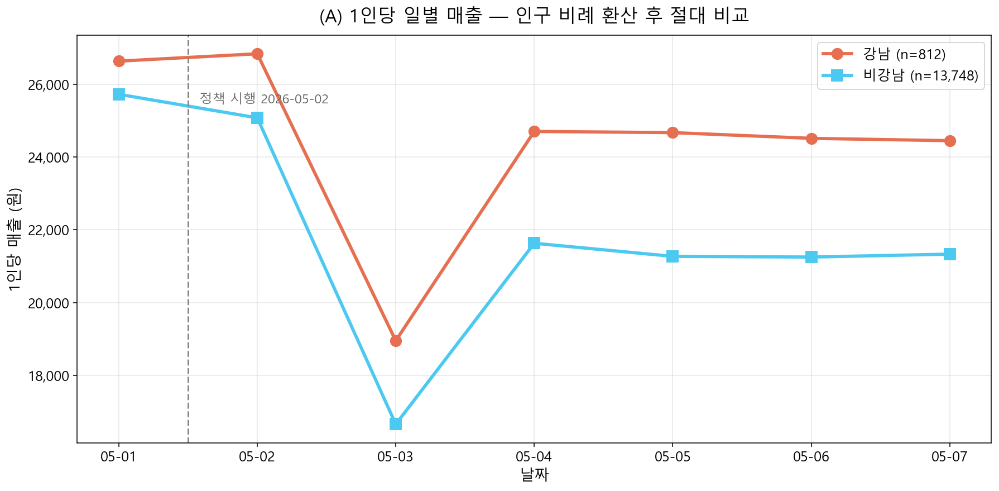
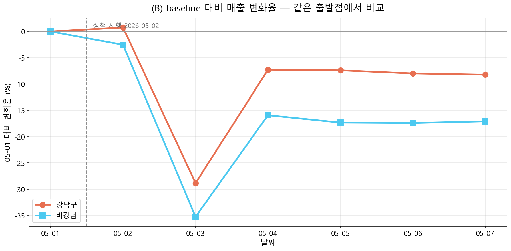
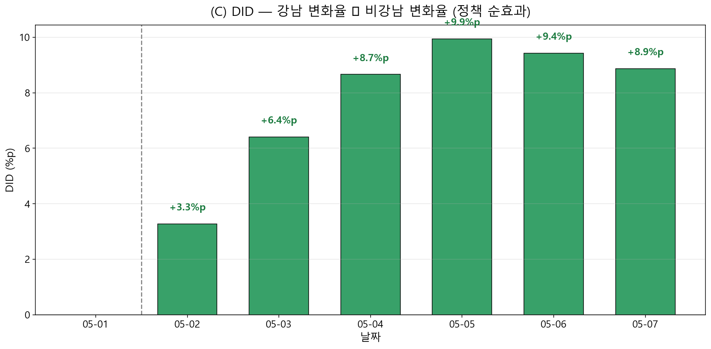
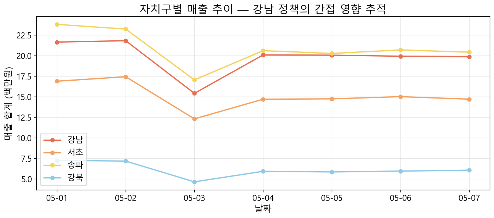
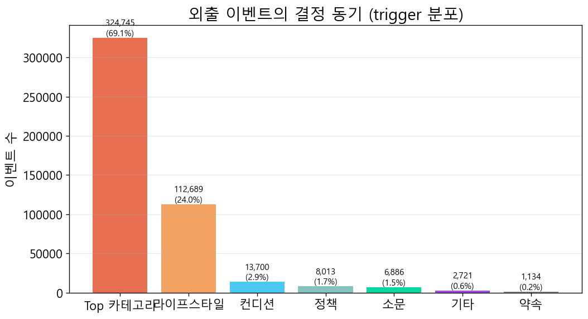
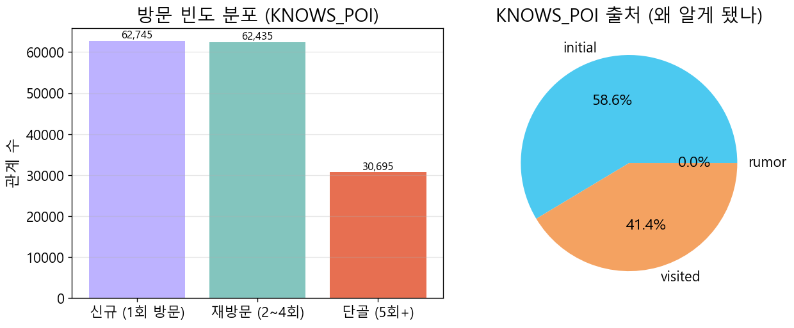
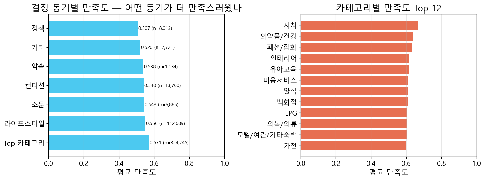

# 서울 상권정책 시뮬레이션 — 최종 보고서

**작성일**: 2026-05-24 00:25 KST

**기간**: 2026-05-01 ~ 2026-05-07 (7일) · **모델**: Qwen3-14B-AWQ · **정책 시행**: 2026-05-02

## 1. 시뮬레이션 조건 요약

| 항목 | 값 |
|---|---:|
| 기간 | 2026-05-01 ~ 2026-05-07 |
| 일수 | 7 |
| 정책_시행일 | 2026-05-02 |
| Agent 수 | 14,881 |
| Plan 수 | 101,708 |
| INCLUDES 엣지 | 842,011 |
| State 수 | 116,586 |
| Memory(visited) | 444,914 |
| Memory(rumor) | 51,275 |
| Conversation 약속 | 349 |
| Conversation 추천 | 58,553 |
| Conversation 이슈 | 1 |
| Conversation 기타 | 46,256 |

## 2. 정책 시행 전 vs 후 매출 추이

### 평균 일간 매출 비교

| 자치구 | 시행 전 | 시행 후 | 변화율 |
|---|---:|---:|---:|
| 강남 (정책 대상) | 21,630,000원 | 19,506,000원 | **-9.82%** |
| 비강남 (대조군) | 353,682,000원 | 291,490,000원 | -17.58% |

**DID (정책 순효과)**: 강남 변화율 − 비강남 변화율 = **+7.76%p**

## 3. 간접 영향 (Spillover) — 강남 vs 인접 자치구

강남구 정책이 인접한 서초·송파에 어떤 파급을 줬는지, 멀리 떨어진 강북과 비교. 인접 자치구의 강남 대비 매출 격차가 좁혀지면 spillover로 해석.

## 4. 소비자 행동·심리 분석

### 4-1. 방문 목적·이동 패턴 — 결정 동기 (trigger) 분포

외출(집·직장 제외)의 결정 동기 분류:

| 동기 | 건수 | 비율 |
|---|---:|---:|
| Top 카테고리 | 324,745 | 69.11% |
| 라이프스타일 | 112,689 | 23.98% |
| 컨디션 | 13,700 | 2.92% |
| 정책 | 8,013 | 1.71% |
| 소문 | 6,886 | 1.47% |
| 기타 | 2,721 | 0.58% |
| 약속 | 1,134 | 0.24% |

### 4-2. 단골 vs 신규

| 구분 | 관계 수 |
|---|---:|
| 신규 (1회 방문) | 62,745 |
| 재방문 (2~4회) | 62,435 |
| 단골 (5회+) | 30,695 |

전체 KNOWS_POI(방문 경험 있음) 관계 수: **155,875**

### 4-3. 만족도·피드백 — 어떤 동기로 외출했을 때 더 만족했나

| 동기 | 평균 만족도 | 표본 수 |
|---|---:|---:|
| Top 카테고리 | 0.571 | 324,745 |
| 라이프스타일 | 0.55 | 112,689 |
| 소문 | 0.543 | 6,886 |
| 컨디션 | 0.54 | 13,700 |
| 약속 | 0.538 | 1,134 |
| 기타 | 0.52 | 2,721 |
| 정책 | 0.507 | 8,013 |

## 5. 1대1 인터뷰 — 페르소나별 대표 (positive / negative / neutral)

### [positive] 정책 적극 활용 + 만족도 ↑ — `AGT_11215840_F_30대_003`

- **페르소나**: 30대 F · 디자이너 · 자양제3동 거주 · 소득 중
- **라이프스타일**: 직장 생활과 자기 개발 중심

**Q. 정책(강남구 카페·디저트 바우처)에 대해 어떻게 느끼셨나요? 직접 사용하셨다면 왜 사용했고, 안 쓰셨다면 왜 안 쓰셨는지 알려주세요.**

> 강남구 카페·디저트 바우처는 꽤 유용하게 사용했어요. policy_id 2026-05-04-123456으로, 잔액이 50,000원 남았을 때 카페를 자주 방문했거든요. 라이프스타일이 직장 생활과 자기 개발 중심이라, 퇴근 후 카페에서 시간을 보내는 게 좋아요. 30% 환급이 있어서 비용 부담도 덜었고, 바른커피 같은 단골 카페를 자주 가는 것도 도움이 됐어요. 만족도도 괜찮아서 계속 쓰고 싶어요.

**Q. 가장 자주 가신 가게는 어디고, 왜 그곳을 자주 갔나요?**

> 가장 자주 가는 곳은 GS25 자양우성점이에요. 평일 Top 카테고리에 편의점이 30% 포함되어 있고, 거주 동 근처에 위치해 있어서 가까운 곳에서 간편하게 물건을 사고 싶었거든요. 라이프스타일이 실속형이라 단골로 자주 가는 거 같아요. 만족도도 괜찮고, 잔액도 남기면서 쓸 수 있어서 부담스럽지 않아요.

**Q. 친구·동료가 추천한 곳에 가신 적 있나요? 있다면 누가 추천했고, 갔더니 어땠나요?**

> 친구가 추천한 곳에 가봤어요. AGT_11650610_M_40대_003이 '옛날농장'을 추천했었는데, 그날 만족도가 0.64로 꽤 괜찮았거든요. 직장 근처에 있어서 편리했고, 한식을 좋아하는 편이라 잘 맞는 곳이었어요. 추천해준 친구가 자주 가는 곳이라고 하길래, 나도 한 번 가보고 싶었거든요.

**Q. 약속을 잡으신 적이 있다면 그 약속이 왜 잡혔는지 설명해주세요.**

> 아직 약속을 잡은 적은 없어요. 평소에는 일과 자기 개발에 집중하다 보니 외부 사람들과의 약속을 잡는 일이 거의 없었거든요. 가끔 카페에서 동료들과 팀원들과 만나는 날이 있지만, 그건 업무 관련이지 개인적인 약속은 거의 없었어요.

**Q. 이번 주 가장 만족스러웠던 외출과 가장 별로였던 외출을 하나씩 꼽아주세요.**

> 이번 주 가장 만족스러웠던 외출은 5월 7일 저녁에 옛날농장에서 한식으로 식사한 거예요. 평일 Top 카테고리에 한식 3% 포함이라 점심과 저녁 모두 방문했고, 만족도가 0.64로 높았거든요. 단골이기도 해서 익숙하고 편한 곳이라 좋아요.

가장 별로였던 외출은 5월 5일 오후에 타코벨더강남에서 양식으로 식사한 거예요. 그날은 random으로 선택한 곳이었고, 만족도가 0.58으로 평균 이하라 조금 아쉬웠어요. 다른 후보가 없어서 선택했지만, 그날 좀 피곤해서 맛이 별로 느껴졌던 것 같아요.

**Q. 다음 주에도 비슷한 패턴으로 다닐 건가요, 바꾸실 건가요? 그 이유는?**

> 아마도 비슷한 패턴으로 다닐 것 같아요. 평일 Top 카테고리에 백화점, 할인점, 한식이 포함되어 있고, 거주지와 직장 근처에 있는 단골 가게를 자주 방문하기 때문이에요. 특히 GS25 자양우성점이나 옛날농장 같은 곳은 만족도도 괜찮고, 거리도 가까워서 계속 가는 게 편하거든요. 소비 성향도 보통이라, 큰 변화는 없을 것 같아요.

---

### 5-negative — 샘플 없음

### 5-neutral — 샘플 없음

## 부록

- 본 보고서는 `scripts/sim/generate_final_report.py`로 자동 생성됨.
- 시뮬 원본 데이터는 Neo4j에 보존 (Plan/State/Memory/Conversation 노드).
- 인터랙티브 시각화: `output/sim/visualization/sim_standalone.html`
