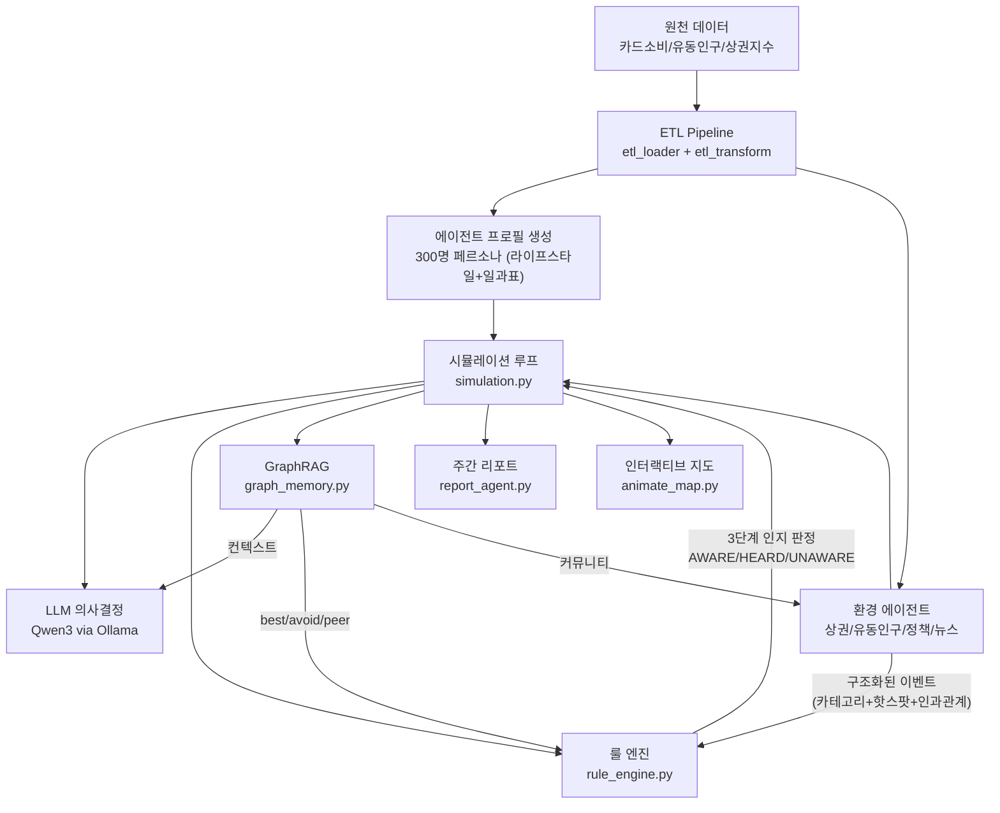

# 시스템 아키텍처 및 시뮬레이션 엔진

## 1. 프로젝트 목표

서울시 빅데이터(카드소비, KT 유동인구, 상권발달지수)를 기반으로 **소비자 에이전트**를 생성하고,
LLM(Qwen3) + 룰 엔진 + GraphRAG를 결합한 **하이브리드 ABM(Agent-Based Model)** 시뮬레이션을 수행합니다.

### 핵심 특징

1. **데이터 기반 에이전트**: 실제 카드소비 패턴에서 추출한 세그먼트별 페르소나
2. **LLM 의사결정**: Qwen3가 에이전트별 주간 소비 전략을 생성
3. **GraphRAG 메모리**: 에피소딕 메모리 + 소셜 네트워크 + 지식그래프
4. **소비자 행동 기반 상권 변화**: 방문 빈도/소비금액이 개폐업을 결정
5. **LLM 뉴스 에이전트**: 시뮬레이션 상태를 분석하여 뉴스 추론/생성

### 기술 스택

| 구분 | 기술 |
|------|------|
| 언어 | Python 3.11 |
| LLM | Ollama + Qwen3:30b |
| 그래프 | NetworkX (로컬) |
| 커뮤니티 | Louvain (python-louvain) |
| 데이터 | Pandas, NumPy |
| 좌표 | Pyproj (EPSG:5186 ↔ WGS84) |
| 시각화 | Leaflet.js (HTML 애니메이션) |

### 실행 방법

```powershell
cd "g:\내 드라이브\Kw\PROJECT_PROPOSAL\src"

# LLM 모드 (Ollama localhost:11434 필요)
python simulation.py --agents 300 --weeks 24

# 규칙 기반 (Ollama 불필요)
python simulation.py --no-llm --agents 100 --weeks 4
```

| 옵션 | 기본값 | 설명 |
|---|---|---|
| `--agents` | 300 | 에이전트 수 |
| `--weeks` | 24 | 시뮬레이션 주 수 |
| `--no-llm` | False | LLM 비활성화 (룰 기반만) |
| `--no-scenario` | False | 데모 시나리오 비활성화 |
| `--seed` | 42 | 랜덤 시드 |
| `--snapshot-interval` | 7 | N일마다 스냅샷 저장 |

### 출력

| 출력물 | 경로 |
|--------|------|
| 주간 리포트 (JSON) | `output/reports/week_XX.json` |
| 주간 리포트 (Markdown) | `output/reports/week_XX.md` |
| 지도 애니메이션 | `output/simulation_animation.html` |
| GraphRAG 데이터 | `output/knowledge_graph.graphml` 외 |

---

## 2. 전체 아키텍처



## 3. 소스 파일 구조

```
src/
├── config.py              # 경로, 데이터 모드 설정
├── etl_loader.py          # CSV 로딩 + 컬럼 정규화
├── etl_transform.py       # 세그먼트/OD/시간패턴/에이전트+페르소나 생성
├── simulation.py          # 시뮬레이션 메인 루프
├── rule_engine.py         # 일간 소비행동 생성 (3단계 인지 + 라이프스타일)
├── llm_client.py          # Ollama API 호출
├── graph_memory.py        # GraphRAG (KG + Episodic + Social + RAG)
├── environment_agents.py  # 환경 에이전트 4종 + 20 핫스팟 + 인과적 뉴스
├── report_agent.py        # 주간 리포트 + 인터뷰 생성
├── geo_utils.py           # 좌표 변환/그리드 매핑
├── animate_map.py         # Leaflet.js 인터랙티브 지도 (히트맵/대시보드/클릭)
├── visualize_map.py       # 초기 지도 시각화
└── generate_synthetic.py  # 합성 데이터 생성
```

---

## 4. Hybrid D 시뮬레이션 엔진

### 4-1. 왜 Hybrid D인가

| 방식 | 문제점 |
|---|---|
| A. 매 라운드 LLM 호출 | API 비용 폭발 (300명 × 168일 = 50,400회) |
| B. 순수 룰 기반 | 예측 가능한 패턴만 생성, 창발적 행동 불가 |
| C. LLM 주간 + 일간 단순 반복 | 월~금 동일 행동 → 비현실적 |

```
Qwen3 (주 1회)                  룰 엔진 (일 단위)
┌─────────────┐                ┌──────────────────────┐
│ 전략적 판단   │──── 지침 ────▶│ 일상 행동 생성         │
│ - 지역 전환?  │               │ - 업종 선택            │
│ - 온라인 전환? │               │ - 시간대 선택          │
│ - 탐색?      │               │ - 소비금액 결정         │
│ - 추천?      │               │ - 좌표 이동            │
└─────────────┘                └──────────────────────┘
```

### 4-2. 시뮬레이션 루프 (1주 = 1라운드)

```
매 주:
  Phase 1: 환경 에이전트 업데이트
    PolicyAgent → DistrictAgent → PopulationAgent → NewsAgent(자율 생성)
    → 인과적 뉴스 (시뮬레이션 상태 → 확률 조정 → 이벤트 생성)
    → 구조화 이벤트 딕셔너리 (category, hotspot, spending_boost, target_demo)

  Phase 2: LLM 주간 의사결정 (에이전트별)
    GraphRAG 컨텍스트 + 환경 요약 → Qwen3 → 소비 전략 JSON

  초기화: _news_awareness 리셋 (새 주 = 새 뉴스)

  Phase 3: 일간 행동 생성 (7일)
    매일:
      1. mood/fatigue 업데이트
      2. 이벤트별 3단계 인지 판정 (_agent_awareness_level)
         AWARE → 풀 boost + 핫스팟 이동
         HEARD → boost × 0.4, 이동 없음
         UNAWARE → 영향 없음
      3. 수치 보정 (_get_event_modifiers)
      4. 업종 선택 (lifestyle보너스 + GraphRAG + 이벤트 업종 교체)
      5. 위치 결정 (핫스팟 > 추천 > LLM > 기본룰)
      6. 좌표 이동 (target_lat/lng 우선)
      7. 뉴스 소셜 전파 (AWARE→이웃 HEARD)

  Phase 4: 주간 집계
    소비자 활동 → DistrictAgent 전달 → stress/demand 누적

  Phase 5: 주간 리포트 (인터뷰 + 커뮤니티 분석)
```

### 4-3. LLM 주간 결정 — 5가지 액션

| 액션 | 설명 | 룰 엔진 영향 |
|---|---|---|
| `유지` | 현재 소비지 유지 | preferred/avoid industries 전달 |
| `전환` | 다른 행정동으로 이동 | target_dong으로 좌표 이동 |
| `온라인전환` | 온라인 소비 비율 증가 | online_ratio만큼 외출 확률 ↓ |
| `신규탐색` | 새 업종/지역 시도 | explore_industry 강제 선택 |
| `추천` | 다른 에이전트에게 추천 | peer_recommendations에 추가 |

LLM 출력 JSON:
```json
{
    "action": "유지",
    "params": {
        "preferred_industries": ["한식", "카페", "일식"],
        "avoid_industries": ["패스트푸드"],
        "budget_adjustment": 1.0,
        "online_ratio": 0.0,
        "target_dong": null
    },
    "reasoning": "상권 안정적, 만족도 높음."
}
```

### 4-4. 룰 기반 일간 행동 엔진

세그먼트별 패턴 (4종 × 3요일유형):

| 세그먼트 | 평일 | 금요일 | 주말 |
|---|---|---|---|
| commuter | 점심 85%, 카페 40%, 저녁 25% | 저녁 55% (예산 ×1.3) | 집 근처 식사 60% |
| resident | 식사 50%, 장보기 30%, 카페 20% | 동일 | 식사 70%, 쇼핑 35% |
| weekend_visitor | 거의 비활동 (10%) | 비활동 | 식사 80%, 카페 60%, 쇼핑 50% |
| evening_visitor | 저녁 60%, 주류 25% | 저녁 75%, 주류 40% | 저녁 75%, 엔터테인먼트 35% |

업종 선택 가중치 시스템:

| 요소 | 가중치 |
|------|--------|
| 어제 먹은 업종 | ×0.5 |
| 3일 연속 | ×0.05 |
| 최근 안 먹은 업종 | ×1.3 |
| LLM 선호 업종 | ×1.3 |
| 라이프스타일 보너스 | ×1.3~2.0 |
| 동료 추천 | ×1.5 |
| GraphRAG best | ×(1.2 + 0.5×loyalty) |
| GraphRAG avoid | ×0.15 |
| GraphRAG peer | ×(1.3 + 0.6×sat×trend) |
| 폐업 업종 | ×0.05 |
| 신규 입점 | ×(1.0 + 0.5×trend) |

### 4-5. daily_memory — 자연스러운 일상 변동

```python
daily_memory = {
    "recent_industries": [       # 최근 7일 소비 이력
        {"day": 5, "industry": "한식", "dong": "11140550", "satisfaction": 0.8},
    ],
    "consecutive_same": {"한식": 1, "카페": 0},  # 업종별 연속 일수
    "exploration_log": [         # 탐색 결과 기록
        {"day": 2, "industry": "태국식", "result": "good"},
    ],
    "peer_recommendations": [    # 동료 추천
        {"from": "consumer_089", "industry": "일식", "day": 0},
    ],
    "mood": 0.6,                 # 0~1, 외출/소비 의향
    "fatigue": 0.3,              # 0~1, 간편식/배달 선호도
}
```

자연스러운 행동 예시:
```
consumer_042 (commuter, 30대 남성)

월: 점심 한식 12시 15,000원  │ mood:0.50 fatigue:0.33
화: 점심 일식 12시 18,000원  │ (어제 한식→일식)
수: 점심 카페 12시  8,000원  │ fatigue↑ → 간단히
   저녁 회식 19시 45,000원  │ (동료 추천)
목: 점심 중식 12시 12,000원  │ (3일 한식/일식/카페→중식 보너스)
금: 점심 한식 12시 14,000원  │ mood↑ (불금)
   저녁 치킨 19시 35,000원  │ (금요일 패턴)
토: 브런치  11시 22,000원  │ fatigue↓ (주말 회복)
일: 재택                   │
```

### 4-6. 성능 벤치마크

| 구성 | 시간 |
|---|---|
| 룰 기반만 — 300명 × 4주 | ~2.1초 |
| 룰 기반만 — 300명 × 24주 | ~13초 |
| LLM 포함 — 300명 × 24주 | ~2시간 (Qwen3 로컬) |
| 대회 시연 — 500명 × 30일 | ~12분 |

### 4-7. 데모 시나리오

```python
DEMO_SCENARIO = [
    {"week":  4, "type": "news",       "description": "강남역 맛집 골목 TV 특집 방영"},
    {"week":  8, "type": "policy",     "description": "서울시 소상공인 5천원 할인 쿠폰 배포"},
    {"week": 12, "type": "pop_change", "value": "+15%"},
    {"week": 12, "type": "news",       "description": "을지로 핫플레이스 SNS 바이럴"},
    {"week": 16, "type": "policy",     "description": "없음"},
    {"week": 20, "type": "news",       "description": "성수동 대규모 복합 상업시설 오픈"},
]
```

---

## 5. 에이전트 세그먼트 및 라이프스타일

### 세그먼트 4종

| 세그먼트 | 설명 | 행동 패턴 |
|----------|------|-----------|
| commuter | 출퇴근 직장인 | 평일 점심/카페, 주말 외식 |
| resident | 지역 거주민 | 근거리 식사/장보기 |
| evening_visitor | 저녁/야간 방문자 | 저녁 외식/술집 |
| weekend_visitor | 주말 방문객 | 주말 외식/쇼핑/오락 |

### 라이프스타일 8종

| 라이프스타일 | 대표 업종 보너스 |
|------------|----------------|
| 카페러버 | 카페 ×2.0, 디저트 ×2.0 |
| 미식가 | 일식 ×1.5, 한식 ×1.3 |
| 가성비추구 | 패스트푸드 ×1.5, 분식 ×1.5 |
| 건강지향 | 슈퍼마켓 ×1.5, 한식 ×1.3 |
| 쇼핑중독 | 패션잡화 ×2.0, 전자제품 ×1.5 |
| 문화예술 | 문화여가 ×2.0, 카페 ×1.3 |
| 집순이 | 편의점 ×1.5, 슈퍼마켓 ×1.3 |
| 야식파 | 치킨 ×1.8, 주류 ×1.5 |

---

## 6. 인터랙티브 지도 시스템

### 기능
- **에이전트 클릭**: 프로필(세그먼트/라이프스타일/연령), 소비(업종/금액/시간), 만족도 바, 이벤트 트리거
- **히트맵 2종**: 밀집도(에이전트 분포) / 소비금액(지출 강도)
- **실시간 대시보드**: TOP 8 업종 막대 차트, 라이프스타일 분포
- **색상 모드 4종**: 세그먼트 / 라이프스타일 / 소비수준 / 만족도
- **이벤트 배너**: 주간 뉴스 헤드라인 표시

### 스냅샷 데이터
프레임마다 에이전트별: 좌표, 세그먼트, 라이프스타일, 연령, 마지막 소비 업종/금액/만족도/시간대/트리거

세그먼트별 색상:
- commuter (출퇴근 직장인): 파랑 `#3388ff`
- weekend_visitor (주말 방문객): 초록 `#33cc33`
- resident (지역 거주민): 주황 `#ff8800`
- evening_visitor (저녁/야간 방문): 보라 `#cc33ff`
