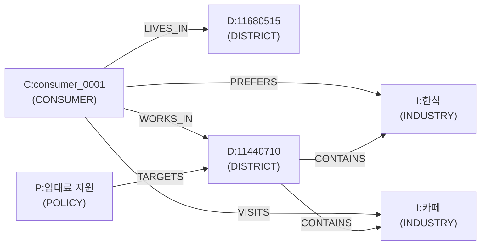

# 에이전트 시스템 · GraphRAG · LLM 통합

## 1. GraphRAG 개요

GraphRAG는 3개의 독립 그래프 + 1개의 검색 레이어로 구성됩니다:

| 컴포넌트 | 구현 | 역할 |
|----------|------|------|
| **KnowledgeGraph** | `nx.DiGraph` | 상권-업종-소비자-정책 관계 |
| **EpisodicMemory** | `defaultdict(list)` | 에이전트별 행동 이력 전체 보존 |
| **SocialNetwork** | `nx.Graph` | 에이전트 간 사회적 관계 + 커뮤니티 |
| **RAGRetriever** | 조합 검색 | LLM 프롬프트용 컨텍스트 추출 |

---

## 2. KnowledgeGraph — 지식그래프

### 노드 타입

| 타입 | ID 형식 | 속성 |
|------|---------|------|
| `DISTRICT` | `D:{행정동코드8자리}` | dong_code, district_type (HH/HL/LH/LL) |
| `INDUSTRY` | `I:{업종명}` | name (한식, 치킨, 카페 등) |
| `CONSUMER` | `C:{agent_id}` | segment, gender, age_group, trend_sensitivity, loyalty |
| `POLICY` | `P:{정책명}` | name, start_week |

### 엣지 타입

| 엣지 | 방향 | 설명 | 동적 속성 |
|------|------|------|-----------|
| `CONTAINS` | DISTRICT → INDUSTRY | 행정동에 업종 점포가 있음 | store_count |
| `LIVES_IN` | CONSUMER → DISTRICT | 거주지 | — |
| `WORKS_IN` | CONSUMER → DISTRICT | 근무지 | — |
| `PREFERS` | CONSUMER → INDUSTRY | 초기 선호 업종 | visit_count, last_satisfaction |
| `VISITS` | CONSUMER → DISTRICT/INDUSTRY | 시뮬레이션 중 방문 기록 | visit_count, last_satisfaction, last_week |
| `TARGETS` | POLICY → DISTRICT | 정책 대상 지역 | — |

### 관계 다이어그램



### 동적 업데이트

- **`record_visit()`**: 에이전트가 소비할 때마다 VISITS 엣지 가중치 증가
- **`update_store_count()`**: DistrictAgent 개폐업 시 CONTAINS 엣지의 store_count 업데이트
- **`add_policy()`**: PolicyAgent가 새 정책 시행 시 POLICY 노드 + TARGETS 엣지 추가

---

## 3. EpisodicMemory — 에피소딕 메모리

### 에피소드 스키마

```python
{
    "week": 3,
    "day": 2,
    "type": "외출_소비",
    "industry": "한식",
    "dong": "11680515",
    "amount": 15000,
    "satisfaction": 0.72,
    "triggered_by": ["뉴스:봄맞이 카페 투어", "뉴스탐색:카페"],
}
```

### 검색 API

| 메서드 | 설명 |
|--------|------|
| `get_recent(agent_id, n_weeks)` | 최근 N주 에피소드 |
| `get_best_experiences(agent_id, top_n)` | 만족도 TOP N |
| `get_worst_experiences(agent_id, top_n)` | 만족도 최하위 N |
| `get_industry_history(agent_id, industry)` | 특정 업종 방문 이력 |
| `get_dong_history(agent_id, dong)` | 특정 행정동 방문 이력 |
| `get_exploration_history(agent_id)` | 새 업종/장소 탐색 이력 |
| `summary(agent_id)` | 요약 통계 (총 지출, 평균 만족도, 방문 업종 수 등) |

### Rule Engine 연동

`get_rule_context(agent_id, week)` → `choose_industry()`에 전달:
- **best_industries**: 만족도 높은 업종 → 재방문 보너스 (loyalty 연동)
- **avoid_industries**: 만족도 낮은 업종 → 페널티 (×0.15)
- **peer_recommendations**: 동료 추천 업종 → 소셜 boost

---

## 4. SocialNetwork — 소셜 네트워크

### 엣지 타입

| 타입 | 조건 | weight |
|------|------|--------|
| `COLLEAGUE` | 같은 근무 행정동 | 0.6 |
| `NEIGHBOR` | 같은 거주 행정동 | 0.4 |

### 커뮤니티 탐지

- **Louvain 알고리즘** (`python-louvain`)으로 자동 그룹화
- 시뮬레이션 초기 1회 실행
- 커뮤니티별 소비 패턴 → 리포트에 출력 + LLM 해석

### 추천 전파

```
propagate_recommendations(memory, week, rng):
  각 에이전트의 최근 만족도 높은 경험을 이웃에게 전파
  → 받는 에이전트의 peer_recommendations에 추가
  → choose_industry()에서 가중치 반영
```

---

## 5. 데이터 영속화

시뮬레이션 종료 시 `output/` 폴더에 자동 저장:

| 파일 | 포맷 | 내용 |
|------|------|------|
| `knowledge_graph.graphml` | GraphML | 지식그래프 전체 |
| `social_network.graphml` | GraphML | 소셜 네트워크 |
| `episodic_memory.json` | JSON | 에이전트별 에피소드 |
| `communities.json` | JSON | 커뮤니티 매핑 |
| `recommendations.json` | JSON | 추천 데이터 |

---

## 6. 환경 에이전트 4종

### DistrictAgent — 상권 에이전트

**역할**: 업종별 점포 관리, 개폐업 판정

**소비자 행동 기반 상권 변화**:
- 점포당 방문 < 5회/주 → **stress** 누적 → threshold(4.0) 초과 시 폐업
- 점포당 방문 > 10회/주 → **demand** 누적 → threshold(3.0) 초과 시 입점
- 주당 최대 0~2건 (현실적 속도)

### PopulationAgent — 유동인구 에이전트

**역할**: 시간대/요일별 유동인구 계수 관리
- 정책 효과 반영 (`POPULATION_BOOST`)
- 자연 변동 (±2%/주)

### PolicyAgent — 정책 에이전트

**역할**: 정책 생명주기 관리 (PENDING → ACTIVE → ENDED)

정책 효과 유형:
- `임대료 지원` → DistrictAgent에 임대료 감면
- `소비 쿠폰` → 소비 에이전트 지출 부스트
- `도시 재생` → PopulationAgent 유동인구 증가

### NewsAgent — 뉴스 에이전트 (인과적 자율 생성)

> **하드코딩된 시나리오 뉴스 없음** — 매 주 시뮬레이션 상태 + LLM 기반으로 생성

**2단계 뉴스 생성**:
1. **LLM 모드** (1순위): 시뮬레이션 상태 + 핫스팟/행정동 정보 → Qwen3 → 인과적 뉴스 JSON
2. **규칙 기반** (2순위): 시뮬레이션 상태로 확률 조정 후 랜덤 생성

**8개 이벤트 카테고리** (상태 기반 확률):

| 카테고리 | 설명 | 기본 확률 | 상태 영향 |
|---------|------|----------|----------|
| SEASONAL | 계절/명절 | 50% | 고정 |
| SNS_VIRAL | 인스타/틱톡 바이럴 | 30% | 고정 |
| FOOD_TREND | 음식 트렌드 | 20% | 고정 |
| ENTERTAINMENT | 콘서트/축제 | 15% | 고정 |
| REAL_ESTATE | 상가 매매가 변동 | 10~25% | 입점 많으면 확률↑ |
| SUBSIDY | 소상공인 지원금 | 8~30% | 폐업 많으면 확률↑ |
| REDEVELOPMENT | 재개발/도시재생 | 정책 연동 | — |
| POLICY_ANNOUNCE | 정책 공지 | 정책 연동 | — |

**20개 서울 핫스팟 POI** (이벤트 타겟 위치):
성수 카페거리, 을지로 노가리골목, 홍대 걷고싶은거리, 익선동 한옥거리, 잠실 롯데타워, 강남역 먹자골목, 가로수길, 여의도 IFC, 이태원 경리단길, 코엑스 삼성역 등

**구조화된 이벤트 딕셔너리**:
```python
{
    "headline": "성수동 '맛집' 틱톡 챌린지 확산",
    "category": "SNS_VIRAL",
    "target_area": "11200",
    "hotspot": {"name": "성수_카페거리", "lat": 37.5446, "lng": 127.0567},
    "affected_industries": ["카페", "베이커리"],
    "spending_boost": 1.15,
    "population_boost": 1.3,
    "target_demo": ["20_29세", "30_39세"],
}
```

---

## 7. 소비자 에이전트 프로필 생성

ETL에서 `(행정동 × 성별 × 연령대)` 세그먼트 프로토타입 생성 → 개별 에이전트 샘플링

| 속성 | 출처 |
|------|------|
| segment | KT 유동인구 주중/주말 비율 + 피크 시간 + 나이 |
| monthly_spending | 건당 평균소비 × 월 방문횟수 × 정규분포 노이즈 |
| loyalty | 나이 기반 (60대+ 높음) |
| trend_sensitivity | 나이 기반 (20대 높음) |
| price_sensitivity | 나이 기반 (30~40대 높음) |
| **lifestyle** | 연령/성별 기반 확률 분포 (8종) |
| **daily_schedule** | 세그먼트별 일과표 (wake_up, commute, lunch 등) |
| **interests** | 라이프스타일 기반 + 랜덤 (최대 6개) |
| **sns_activity** | 연령 기반 (20대 0.75, 50대 0.2) |
| **persona_description** | LLM 프롬프트용 1줄 한국어 설명 |

---

## 8. 뉴스 인지 모델 (3단계)

모든 에이전트가 뉴스를 보는 것이 아님. 확률적 3단계 인지 + 소셜 전파.

### 인지 수준

| 수준 | 이름 | 반응 | 이동 |
|------|------|------|------|
| 2 | **AWARE** (직접 인지) | 풀 boost | 핫스팟으로 이동 |
| 1 | **HEARD** (입소문) | boost × 0.4 | 이동 안함 |
| 0 | **UNAWARE** (모름) | 영향 없음 | — |

### 인지 확률 (카테고리별)

| 카테고리 | AWARE 기본 확률 | 영향 요소 |
|---------|---------------|-----------|
| SNS_VIRAL | sns_activity × 0.7 | SNS 활동도 |
| ENTERTAINMENT | 0.5 (관심사 매칭) | 관심사 |
| FOOD_TREND | max(trend × 0.5, sns × 0.4) | 트렌드 민감도 |
| REAL_ESTATE | price_sensitivity × 0.4 | 가격 민감도 |
| SEASONAL | 0.60 | 많은 사람이 체감 |
| SUBSIDY | 0.35 | — |

- target_demo 비대상 연령: 확률 × 0.2
- HEARD 전환: AWARE 실패 시, `social_influence_weight × 0.3` 확률

### 소셜 전파

- **시점**: 매일 실행 (하루 단위)
- **방향**: AWARE 에이전트 → 모든 이웃
- **확률**: `social_influence_weight × 0.15`
- **결과**: UNAWARE → HEARD (직접 인지로 승격은 안됨)
- **초기화**: 매주 시작 시 리셋

### 인지 수준별 행동 차등

| 항목 | AWARE | HEARD |
|------|-------|-------|
| spending_boost | 풀 적용 | (boost - 1.0) × 0.4 |
| explore_boost | 풀 적용 | × 0.3 |
| location_pull | 핫스팟 좌표 제공 | None |

---

## 9. 리포트 에이전트

### 주간 리포트 구성

1. **개요**: 총 소비, 에이전트수, 소비 행동 건수
2. **세그먼트별 분석**: 평균 소비/만족도, TOP 업종, 행동 분포
3. **전후 비교**: 소비/만족도 델타, 행동 패턴 변화
4. **에이전트 인터뷰**: LLM 페르소나 기반 (4개 톤 × 5개 만족구간)
5. **커뮤니티 분석**: 소셜 네트워크 그룹별 통계 + LLM 해석

### 인터뷰 시스템

- **LLM 모드**: 에이전트 프로필 + 행동 데이터 → 1인칭 자연어 답변 (최대 12명/주)
- **폴백 모드**: 톤(casual/polite/mature/elderly) × 만족도(5구간) = 60개 문장 세트

---

## 10. LLM 통합 (Ollama)

### 설정

| 항목 | 값 |
|------|------|
| URL | `http://localhost:11434/api/generate` |
| 모델 | `qwen3:30b` |
| 환경변수 | `OLLAMA_URL`, `MODEL_NAME` |

### LLM 호출 포인트 4종

| 호출 | 시점 | 입력 | 출력 |
|------|------|------|------|
| 주간 의사결정 | 매주 Phase 2, 에이전트별 1회 | 프로필 + 지난주 요약 + GraphRAG + 환경 | 액션 JSON |
| 뉴스 생성 | 매주 Phase 1, 1회 | 커뮤니티 트렌드 + 상권 변화 + 계절 | 헤드라인 배열 |
| 인터뷰 생성 | 매주 Phase 5, 선발 에이전트별 1회 | 프로필 + 행동 + 이벤트 | 1인칭 한국어 (2~4문장) |
| 커뮤니티 해석 | 매주 Phase 5, 1회 일괄 | 상위 5개 커뮤니티 통계 | `{"커뮤니티ID": "해석"}` |

### no-llm 모드 폴백

| 기능 | LLM 모드 | no-llm 폴백 |
|------|----------|-------------|
| 주간 의사결정 | Qwen3 JSON | `_fallback_decision()` (유지 전략) |
| 뉴스 | LLM 추론 | 규칙 기반 감지 + 계절 이벤트 |
| 인터뷰 | LLM 생성 | `_persona_interview()` (60개 문장 세트) |
| 커뮤니티 해석 | LLM 분석 | 통계만 표시 |
