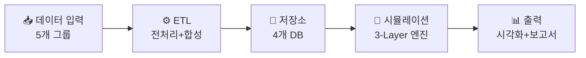
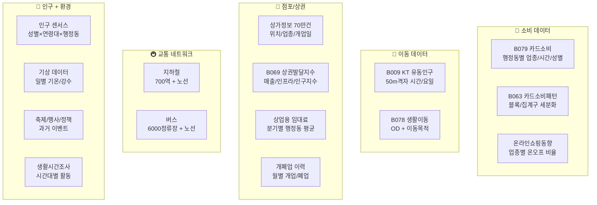
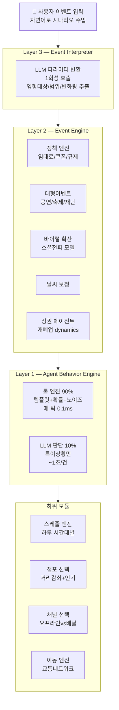
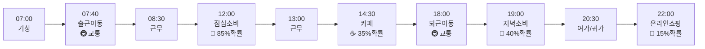
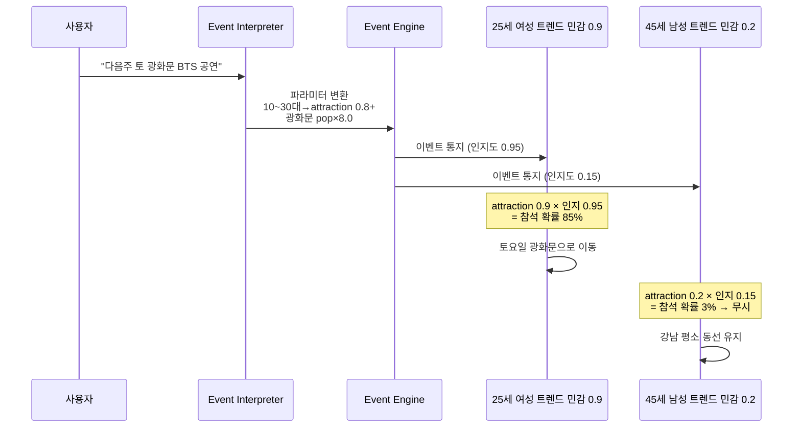
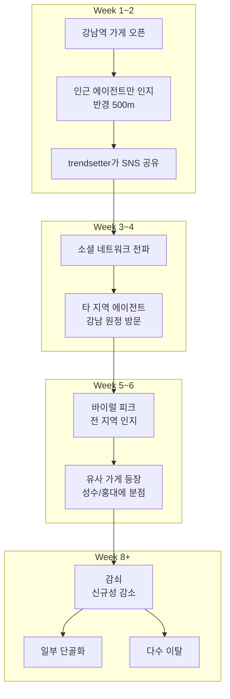
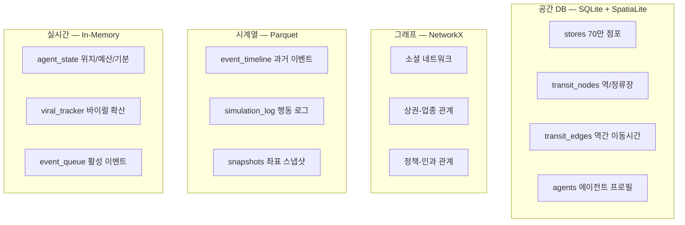

# 확장 로드맵 (v2)

> 현재 구현(v1)을 기반으로 한 고도화 설계.
> v1 현황은 `01_architecture.md`, `02_data.md`, `03_agents.md` 참고.

---

## Part 1 — v2 아키텍처 다이어그램

### 1. 전체 파이프라인



### 2. 데이터 입력층 — 5개 그룹



### 3. 시뮬레이션 엔진 — 3-Layer 구조



### 4. 하루 스케줄 엔진 — 출퇴근 직장인 예시



### 5. 이벤트 처리 — BTS 광화문 공연 (단발성)



### 6. 이벤트 처리 — 맛집 바이럴 (소셜 전파)



### 7. 데이터 저장소 구조



### 8. 데이터 규모 요약

| 구분 | 합계 | 감당 여부 |
|---|---|---|
| 원천 데이터 (1회 적재) | 8~22 GB | ✅ SSD 여유분이면 충분 |
| 가공/참조 데이터 | ~240 MB | ✅ |
| 시뮬레이션 생성 | ~735 MB / 회 | ✅ |
| 시뮬레이션 중 메모리 | ~10 MB | ✅ |

| 병목 | 수치 | 해결 |
|---|---|---|
| KT 유동인구 ETL | 1억행 → Polars 5분 | ✅ |
| 교통 이동시간 캐시 | 424² = 18만 쌍 → 1회 30분 | ✅ 사전 계산 |
| 룰 엔진 시뮬레이션 | 168만 틱 × 0.1ms = 3분 | ✅ |
| **LLM 호출** | **84,000건 × 1초 = 23시간** | ⚠️ 에이전트 수/비율 조절 필요 |
| 대회 시연 (500명, 30일) | ~750건 × 1초 = 12분 | ✅ |

---

## Part 2 — v2 구현 계획서

### v1 → v2 차이점

| 항목 | v1 (현재 구현) | v2 (목표) |
|---|---|---|
| 에이전트 수 | 300~500명 | **1,000~3,000명** |
| 공간 단위 | 행정동 단위 집계 | **개별 점포 + 교통 네트워크** |
| 시간 단위 | 주 LLM + 일 룰엔진 | **매일 LLM 1회 (인격 기반 하루 계획)** |
| 이벤트 | 정책 시나리오 + 뉴스 | **임의 이벤트 (공연/바이럴/쿠폰/날씨/재난)** |
| 데이터 | 샘플 + 합성 데이터 | **풀 데이터 + 점포 + 교통 + 센서스** |
| 채널 | 오프라인만 | **오프라인 + 온라인(배달) 채널 선택** |

---

### 추가 확보 필요 데이터

**필수 (CRITICAL)**

| 데이터 | 출처 | 역할 |
|---|---|---|
| 빅데이터캠퍼스 풀 데이터 | 서울시 빅데이터캠퍼스 | 모든 기반 데이터의 풀 버전 |
| 서울시 상가(상권) 정보 | 소상공인시장진흥공단 | 개별 점포 위치/업종/면적 |
| 지하철 역사 + 노선 | 서울교통공사 | 교통 이동 시간 계산 |
| 버스 노선 + 정류장 | TOPIS | 대중교통 네트워크 완성 |
| 행정동별 인구 (성별/연령) | 통계청 KOSIS | 에이전트 수 배분 기준 |

**리얼리즘 강화 (IMPORTANT)**

| 데이터 | 출처 | 역할 |
|---|---|---|
| 상업용 임대료 | 한국부동산원 | 상권 에이전트 환경 변수 |
| 개폐업 이력 (월별) | 소상공인시장진흥공단 | 상권 dynamics |
| 기상 데이터 (일별) | 기상청 공공 API | 날씨 → 외출/배달 전환 |
| 온라인쇼핑동향 | 통계청 | 오프라인↔온라인 채널 비율 |
| 축제/행사 캘린더 | 서울시 문화관광 | 이벤트 에이전트 입력 |
| 생활시간조사 | 통계청 | 에이전트 하루 스케줄 템플릿 |

---

### 에이전트 생성 파이프라인 (v2)

#### Step 1: IPF 인구 합성

```
입력: 행정동별 인구 센서스 + PURPOSE OD + KT 유동인구 OD
처리: IPF (Iterative Proportional Fitting)
  1. 행정동별 인구 비례로 에이전트 수 배정
  2. 성별/연령대 분포에 따라 속성 할당
  3. 출근 OD 확률로 직장 행정동 추정
  4. 거주지 행정동 → KT 격자 → 위경도 할당
```

#### Step 2: 그룹→개인 소비 분해

```
B079: "을지로3가 + 남 + 30대 + 한식" → 43건, 1,115,948원
  → 건당 평균: 25,952원
  → 1인당 월 이용건수: ~0.66건 (포아송 분포)
  → 1인당 월 소비금액: 0.66 × 25,952 × noise
  → 전 업종 합산: 한식 + 카페 + 편의점 + ... ≈ 월 50~80만원
```

#### Step 3: 성향 벡터 (6차원 Beta 분포)

```python
traits = {
    "price_sensitivity": beta(a=age_factor, b=income_factor),
    "loyalty":           beta(a=visit_freq_factor, b=2),
    "exploration":       beta(a=2, b=age_factor),      # 젊을수록 높음
    "online_preference": beta(a=online_factor, b=3),
    "social_influence":  beta(a=2, b=age_factor),
    "planning_tendency": beta(a=age_factor, b=2),
}
```

#### Step 4: 다축 프로필 (상호배타적 세그먼트 대신 독립 축 조합)

| 축 | 값 | 예상 비율 |
|---|---|---|
| 생활패턴 (lifestyle) | commuter / local / freelance | 55% / 25% / 20% |
| 소비스타일 (spending_style) | budget / moderate / premium | 30% / 50% / 20% |
| 활동시간대 (active_hours) | daytime / evening / mixed | 55% / 30% / 15% |

예시:
```python
agent_0042 = {
    "lifestyle": "commuter",
    "spending_style": "budget",
    "active_hours": "mixed",
    "traits": {"exploration": 0.80, "social_influence": 0.85, "price_sensitivity": 0.75}
}
# → "출퇴근하는 알뜰 MZ 트렌드세터" 자연스럽게 표현
```

---

### 인격 기반 하루 계획 엔진 (v2)

매 에이전트 × 매일 1회 LLM 호출:

```python
prompt = f"""당신은 {agent.name}입니다.
{agent.age}세 {agent.gender}, {agent.home_dong} 거주, {agent.work_dong} 근무.

[당신의 성격]
- 새로운 걸 좋아함 (탐색성향 {agent.traits.exploration:.0%})
- 가격에 민감함 (가격민감도 {agent.traits.price_sensitivity:.0%})

[최근 기억 (지난 7일)]
{format_recent_memory(agent.memory[-7:])}

[오늘 상황]
- 날씨: {context.weather}
- 요일: {day.strftime('%A')}
- 활성 이벤트: {context.events_summary}

오늘 하루 행동을 시간대별로 계획하세요.
"""
```

**그룹 최적화** (LLM 비용 절감):
- 유사 상황 에이전트를 묶어 대표 1명만 LLM 호출 후 개인 노이즈 분배
- 1,000명 에이전트 → 실제 LLM 호출 ~100~200건/일

| 구성 | 에이전트 | 일수 | LLM 호출/일 | 총 시간 |
|---|---|---|---|---|
| 풀 시뮬 | 3,000명 | 168일 | ~200건 | ~9시간 |
| 소규모 풀 | 1,000명 | 168일 | ~100건 | ~4.7시간 |
| 대회 시연용 | 500명 | 30일 | ~80건 | ~40분 |
| 빠른 테스트 | 100명 | 7일 | ~20건 | ~2분 |

---

### 이벤트 주입 시스템 (v2)

자연어 이벤트 → LLM이 1회 파라미터 변환:

```python
# 사용자 입력
event_input = "다음주 토요일, 광화문광장에 BTS 공연. 예상 관객 5만명."

# LLM 변환 결과
event_params = {
    "event_type": "대형공연",
    "location": {"dong": "1111060", "lat": 37.5760, "lng": 126.9769},
    "target_demographics": {"age_10s": 0.9, "age_20s": 0.85, "age_30s": 0.5},
    "area_impact": {
        "광화문": {"pop_multiplier": 8.0, "spending_boost": 1.5},
        "종로": {"pop_multiplier": 2.5, "spending_boost": 1.2},
    },
    "consumption_shift": {"카페": +0.4, "편의점": +0.8, "주점": +0.6},
}
```

이벤트 유형별 처리:

| 이벤트 유형 | 확산 방식 | 시간 스케일 |
|---|---|---|
| 대형 이벤트 | 즉시 (공지) | 단발성 (1~3일) |
| 정책 | 공지 + 점진 | 장기 (수주~수개월) |
| 바이럴 트렌드 | 소셜 전파 | 중기 (수주) |
| 날씨/계절 | 전역 | 일별 변동 |
| 재난/위기 | 즉시 전역 | 가변 |

---

### 교통 네트워크 통합 (v2)

```python
class TransitNetwork:
    def travel_time(self, origin, destination, mode="transit"):
        """두 지점 간 예상 이동 시간 (분)"""
        walk1 = walk_time(origin, nearest_station(origin))
        subway = nx.shortest_path_length(self.subway_graph, ...)
        walk2 = walk_time(nearest_station(destination), destination)
        return walk1 + subway + walk2

    def accessibility_score(self, position):
        dist = haversine(position, nearest_station(position).pos)
        if dist < 300:   return 1.0   # 역세권
        elif dist < 500: return 0.8
        elif dist < 1000: return 0.5
        else:            return 0.2
```

---

### 온라인/배달 소비 모델링 (v2)

```python
def choose_channel(agent, industry, context):
    base_online_ratio = {
        "한식": 0.25, "치킨": 0.45, "피자": 0.55, "카페": 0.05, "패션": 0.60,
    }
    p_online = base_online_ratio.get(industry, 0.15)
    p_online *= (0.5 + agent.traits.online_preference)

    if context.weather.rain:  p_online += 0.25  # 비 오면 배달 증가
    if context.hour >= 21:    p_online += 0.20  # 야간 배달 증가
    p_online += agent.fatigue * 0.15            # 피로 배달 증가

    return "online" if random.random() < min(p_online, 0.95) else "offline"
```

| 요소 | 오프라인 | 온라인 |
|---|---|---|
| 지도 이동 | 에이전트가 점포로 이동 | 이동 없음 |
| 소비금액 | 건당 평균 | 건당 평균 + 배달비 |
| 상권 영향 | 유동인구에 포함 | 포함되지 않음 |

---

### 구현 로드맵

#### Phase 1: 데이터 확보 + ETL 재설계 (2주)
- [ ] 빅데이터캠퍼스 풀 데이터 신청
- [ ] 소상공인시장진흥공단 상가 데이터 다운로드
- [ ] 지하철/버스 노선 + 역사 위치 데이터 확보
- [ ] 통계청 인구 센서스 + 생활시간조사 다운로드
- [ ] ETL 파이프라인 재설계 (점포/교통/인구 통합)
- [ ] event_timeline 테이블 구축 (과거 이벤트 2021~)

#### Phase 2: 에이전트 생성 파이프라인 (1.5주)
- [ ] IPF 기반 인구 합성 모듈 구현
- [ ] 그룹→개인 소비 분해 알고리즘 구현
- [ ] 성향 벡터 생성기 구현
- [ ] 소셜 네트워크 구축 모듈 구현

#### Phase 3: 핵심 엔진 재설계 (2주)
- [ ] 하루 스케줄 엔진 (템플릿 + 노이즈 + 보정)
- [ ] 교통 네트워크 통합 (이동시간 계산)
- [ ] 점포 선택 모델 (위치 기반 확률)
- [ ] 온라인/오프라인 채널 선택 모델
- [ ] Budget Manager 구현

#### Phase 4: 이벤트 시스템 (1.5주)
- [ ] Event Interpreter (LLM → 파라미터 변환)
- [ ] 이벤트 유형별 처리 엔진
- [ ] 바이럴 확산 엔진 (Diffusion Engine)
- [ ] 날씨 보정 모듈

#### Phase 5: 시각화 + 보고서 (1주)
- [ ] 지도 위 에이전트 이동 애니메이션 고도화
- [ ] 상권별 매출/유동인구 히트맵
- [ ] ReportAgent 고도화 (이벤트별 인과 분석)

#### Phase 6: 시나리오 검증 + 백테스트 (1주)
- [ ] 3가지 시나리오 시뮬레이션 실행
- [ ] 과거 이벤트 백테스트 (실제 카드소비 vs 시뮬레이션)
- [ ] 에이전트 수 스케일링 테스트

---

### v2 기술 스택

| 계층 | 기술 |
|---|---|
| 시뮬레이션 엔진 | Python 3.11 |
| 공간 DB | SQLite + SpatiaLite (프로토타입) / PostGIS (확장) |
| 그래프 | NetworkX (프로토타입) / Neo4j (확장) |
| 시계열 | Parquet + DuckDB |
| LLM | Qwen3-32B (Ollama, 로컬) |
| 교통 계산 | NetworkX + GTFS 데이터 |
| 좌표 변환 | pyproj (EPSG:5186 → WGS84) |
| 시각화 | Folium + Deck.gl + Apache ECharts |
| ETL | Pandas + Polars |

### 리스크 및 대안

| 리스크 | 영향 | 대안 |
|---|---|---|
| 풀 데이터 미확보 | 에이전트 정확도 저하 | 합성 데이터 확장 (현재와 동일) |
| 점포 데이터 미확보 | 개별 가게 시뮬 불가 | 업종 그룹 단위로 축소 |
| LLM 비용 과다 | 이벤트 해석 비용 | 로컬 모델(Qwen3) 사용 |
| 에이전트 10,000명 성능 | 시뮬레이션 속도 저하 | 병렬 처리 + 룰 엔진 최적화 |
| 교통 네트워크 복잡도 | 계산 시간 증가 | 사전 이동시간 매트릭스 캐싱 |
| 소셜 네트워크 비현실성 | 바이럴 확산 부정확 | Small-world 네트워크 모델 사용 |
