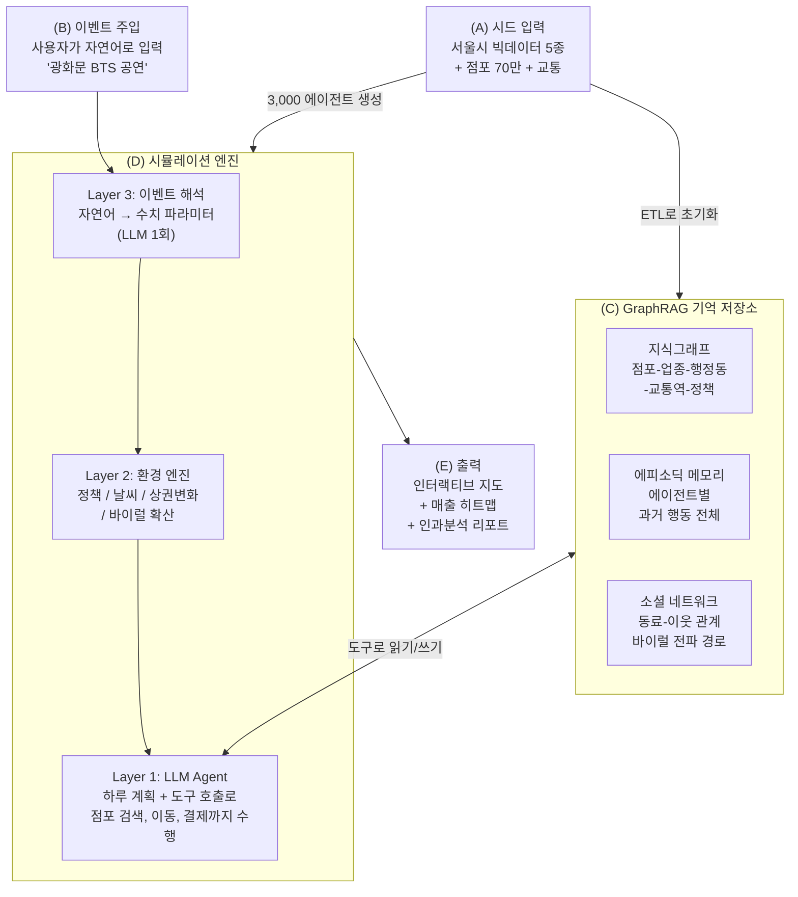
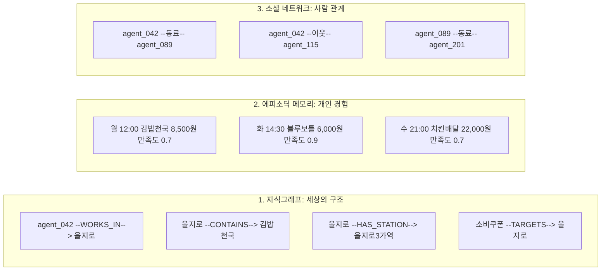

# 아키텍처 딥다이브 (v2)

> [MiroFish](https://github.com/666ghj/MiroFish) 멀티에이전트 아키텍처를 참고, **서울 상권 소비행동에 특화**하여 설계

---

## 전체 그림

아래 한 장이 시스템 전부입니다. 이후 섹션에서 각 영역을 설명합니다.



**읽는 순서**: (A) 데이터가 들어와서 → (C) 기억 저장소를 만들고 → (B) 이벤트가 주입되면 → (D) 엔진이 시뮬레이션하고 → (E) 결과를 출력

---

## (A) 시드 입력: 무엇이 들어오는가

| 그룹 | 데이터 | 용도 |
|:---|:---|:---|
| 소비 | B079 카드소비, B063 소비패턴 | 에이전트 소비 프로필 |
| 이동 | B009 KT 유동인구, B078 생활이동 | 거주지-직장 매핑 |
| 점포 | 상가정보 70만건, 상권발달지수 | 개별 점포 위치/업종 |
| 교통 | 지하철 700역, 버스 6,000정류장 | 이동시간 계산 |
| 인구 | 센서스, 기상, 생활시간조사 | 에이전트 수 배분, 날씨 보정 |

이 데이터가 ETL을 거쳐 → **3,000명 에이전트** + **GraphRAG 초기 상태**가 됩니다.

---

## (B) 이벤트 주입: 시뮬레이션에 어떤 변화를 줄 수 있는가

사용자가 **자연어**로 이벤트를 넣으면, LLM이 **1회만** 호출되어 수치로 변환합니다.

```
입력:  "다음주 토요일 광화문 BTS 공연, 예상 관객 5만명"
         ↓ LLM 1회 변환
출력:  location=광화문, 10~30대 attraction 0.8+
       광화문 유동인구 x8.0, 카페 +0.4, 편의점 +0.8
```

이후에는 LLM 재호출 없이, 이 수치가 **환경 엔진(Layer 2)**에 전달됩니다.

추가로, 시뮬레이션 중 자동으로 생기는 환경 변화도 있습니다:

| 자동 변화 | 작동 방식 |
|:---|:---|
| 날씨 | 비 → 배달 증가, 폭염 → 외출 감소 |
| 상권 변화 | 방문 적은 점포 → 폐업, 많은 점포 → 신규 입점 |
| 정책 | 쿠폰 배포 → 소비 부스트 (점진적 반영) |

---

## (C) GraphRAG: 에이전트의 기억은 어디에 저장되는가

3개의 독립 저장소가 있고, 각각 다른 정보를 담당합니다.



| 저장소 | 담는 것 | LLM이 도구로 조회하는 방식 |
|:---|:---|:---|
| **지식그래프** | 점포/업종/행정동/교통/정책 관계 | `search_stores("한식", radius=500)` |
| **에피소딕 메모리** | 에이전트별 과거 소비 이력 전체 | `get_my_history("김밥천국")` |
| **소셜 네트워크** | 동료/이웃 관계, 커뮤니티 | `get_peer_recommendations()` |

---

## (D) 시뮬레이션 엔진: LLM Agent + Tool Use

### 핵심 구조: LLM이 도구를 호출한다

기존 "LLM이 결정 → 별도 룰엔진이 실행"이 아닌,
**LLM 자체가 도구를 호출하여 점포 검색, 이동, 결제까지 수행**합니다.

```
LLM Agent (에이전트의 두뇌)
│
│  사고: "피곤하니 가까운 데서 간단히 먹자"
│
├── search_stores("분식", radius=500m)
│     → 후보: 김밥천국(180m), 분식왕(300m), 맛나분식(450m)
│
├── get_my_history("김밥천국")
│     → 12회 방문, 만족도 0.8 (자주 감)
│
├── get_my_history("분식왕")
│     → 미방문
│
│  사고: "김밥천국은 질리니까 분식왕 가보자"
│
├── get_travel_time(현위치, "분식왕")
│     → 도보 4분
│
├── move_to("분식왕")
│     → 좌표 이동 완료
│
├── pay(7500)
│     → 결제, 남은 예산 42,500원
│
└── rate(satisfaction=0.85)
      → 에피소딕 메모리에 기록
```

### 도구 목록

| 도구 | 기능 | 데이터 소스 |
|:---|:---|:---|
| `search_stores(업종, 반경)` | 주변 점포 후보 검색 | 지식그래프 (70만 점포) |
| `get_travel_time(출발, 도착)` | 도보/지하철/버스 이동시간 | 교통 네트워크 |
| `get_my_history(점포)` | 과거 방문 횟수, 만족도 | 에피소딕 메모리 |
| `get_peer_recommendations()` | 동료/이웃이 추천한 점포 | 소셜 네트워크 |
| `check_budget()` | 오늘 남은 예산 확인 | 에이전트 상태 |
| `move_to(점포)` | 해당 점포로 좌표 이동 | 지식그래프 (좌표) |
| `pay(금액)` | 결제 + 예산 차감 | 에이전트 상태 |
| `order_delivery(업종)` | 배달 주문 (이동 없음) | 지식그래프 |
| `rate(만족도)` | 만족도 기록 | 에피소딕 메모리 |
| `get_weather()` | 오늘 날씨 확인 | 환경 엔진 |
| `get_active_events()` | 진행 중인 이벤트/정책 | 환경 엔진 |
| `share_sns(점포)` | SNS에 공유 (바이럴 시작) | 소셜 네트워크 |

### 하루 흐름 예시: agent_042의 점심

```
LLM: "12시다, 점심 먹자. 오늘 피곤하니 가까운 데서."

  → search_stores("한식", radius=500m)
    반환: 김밥천국(180m, 12회방문, 만족0.8)
          새 라멘집(250m, 미방문, 신규오픈)
          한우촌(400m, 2회방문, 만족0.9)

  → get_peer_recommendations()
    반환: agent_089가 "새 라멘집 괜찮았어" 추천

LLM: "김밥천국은 질리고, 동료가 새 라멘집 추천했네.
      탐색 성향도 높으니 가보자."

  → get_travel_time(현위치, "새 라멘집")
    반환: 도보 3분

  → check_budget()
    반환: 오늘 남은 예산 50,000원

  → move_to("새 라멘집")
  → pay(9000)
  → rate(0.85)

결과: 에피소딕 메모리에 기록, 지식그래프 VISITS 엣지 생성
      → 내일 LLM이 "어제 새 라멘집 괜찮았다"를 기억
```

### 저녁: 배달 선택

```
LLM: "21시, 집에 왔는데 배고프다. 비도 오고 피곤하다."

  → get_weather()
    반환: 비, 기온 12도

LLM: "비 오니까 나가기 싫다. 배달시키자."

  → order_delivery("치킨")
    반환: 22,000원 + 배달비 3,000원, 이동 없음

  → pay(25000)
  → rate(0.75)
```

### 3개 Layer의 역할 (수정)

```
┌─────────────────────────────────────────────────────┐
│ Layer 3: 이벤트 해석                                 │
│   사용자 자연어 → 수치 파라미터 (LLM 1회)             │
└────────────────────────┬────────────────────────────┘
                         ↓
┌─────────────────────────────────────────────────────┐
│ Layer 2: 환경 엔진                                   │
│   정책 / 날씨 / 상권 개폐업 / 바이럴 확산 계산        │
│   → 도구(get_weather, get_active_events)로 제공      │
└────────────────────────┬────────────────────────────┘
                         ↓
┌─────────────────────────────────────────────────────┐
│ Layer 1: LLM Agent + Tool Use                       │
│   LLM이 직접 생각하고, 도구를 호출하여 행동           │
│                                                     │
│   생각 → search_stores() → 후보 확인                 │
│   생각 → get_my_history() → 과거 기억 확인            │
│   생각 → move_to() / order_delivery() → 실행         │
│   생각 → pay() → 결제                                │
│   생각 → rate() → 만족도 기록                         │
│                                                     │
│   하루 끝 → 전체 행동이 에피소딕 메모리에 저장         │
│          → 내일 LLM 입력에 반영                       │
└─────────────────────────────────────────────────────┘
```

### 바이럴은 어디서 일어나는가

```
Week 1   신규 카페 오픈 (Layer 2: 상권 변화)
           ↓
Week 2   인근 에이전트가 방문, 만족 (LLM Agent: 도구로 방문)
           ↓
Week 3   exploration 높은 에이전트가 share_sns() 호출 (소셜 네트워크)
           ↓
Week 3~4  동료 → 이웃으로 전파 (소셜 네트워크 확산)
           ↓
Week 5   타 지역 에이전트가 get_peer_recommendations()로 발견
          → get_travel_time()으로 이동 가능 여부 판단
          → 원정 방문
           ↓
Week 6   바이럴 피크, 유사 점포 등장 (Layer 2: 상권 변화)
           ↓
Week 8+  감쇠: 충성도 높은 사람만 남고 나머지 이탈
```

---

## 에이전트는 어떻게 만들어지는가

### 생성 과정 (IPF 인구 합성)

```
인구 센서스 (행정동별 인구)
    ↓  행정동별 인구 비례로 에이전트 수 배정
카드소비 데이터 (성별/연령대별 소비)
    ↓  성별, 연령대 할당 + 소비금액 추정
생활이동 OD (출근 패턴)
    ↓  직장 행정동 추정
KT 유동인구 (격자 좌표)
    ↓  거주지/직장 위경도 할당
    ↓
    결과: 3,000명 에이전트, 각각 고유한 프로필
```

### 에이전트 프로필 구성

**3축 프로필** (누구인가):

| 축 | 값 | 의미 |
|---|---|---|
| lifestyle | commuter / local / freelance | 생활 패턴 |
| spending_style | budget / moderate / premium | 소비 수준 |
| active_hours | daytime / evening / mixed | 활동 시간대 |

**6차원 성향** (어떤 성격인가):

| 성향 | 높으면 | 낮으면 |
|---|---|---|
| exploration | 신규 점포 잘 시도 | 단골 위주 |
| loyalty | 단골에 계속 감 | 쉽게 바꿈 |
| price_sensitivity | 저가 선호 | 가격 둔감 |
| online_preference | 배달 선호 | 오프라인 선호 |
| social_influence | 추천에 민감, SNS 활발 | 자기 판단 위주 |
| planning_tendency | 계획적 소비 | 즉흥 소비 |

**예시**: commuter + budget + mixed + exploration 0.8 + social 0.85 = **"출퇴근하는 알뜰 MZ 트렌드세터"**

---

## MiroFish와의 차이

| | MiroFish | 본 프로젝트 |
|---|---|---|
| 시드 | 텍스트 문서 | **실측 빅데이터 + 70만 점포** |
| 에이전트 생성 | LLM이 추출 | **IPF 통계 기반 합성** |
| 공간 모델 | 없음 | **개별 점포 + 교통 네트워크** |
| 에이전트 행동 | LLM 호출 | **LLM + Tool Use** (점포검색/이동/결제 도구) |
| 채널 | 없음 | **오프라인 + 온라인(배달)** |
| 바이럴 | 없음 | **소셜 전파 → 피크 → 감쇠 모델** |

---

## 성능

| 구성 | 에이전트 | 기간 | 소요 시간 |
|---|---|---|---|
| 풀 시뮬레이션 | 3,000명 | 168일 | ~9시간 |
| 소규모 | 1,000명 | 168일 | ~4.7시간 |
| **대회 시연** | **500명** | **30일** | **~40분** |

그룹 최적화: 유사 상태의 에이전트를 묶어 대표 1명만 LLM 호출 → 개인 노이즈 분배
