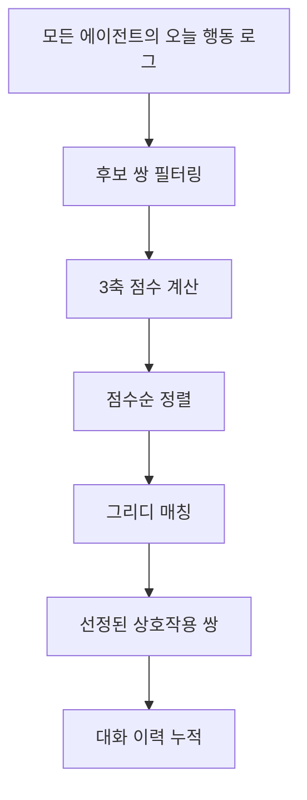

# Night — 상호작용 대상 선정 알고리즘

## 개요

매일 시뮬레이션이 끝난 뒤 (Night 단계), 에이전트들의 **daily log + memory**를 입력으로 받아 **누가 누구와 대화할 것인지** 상호작용 쌍(pair)을 수식 기반으로 결정합니다.

LLM 호출 없이 **3가지 축의 점수를 가중 합산**하여 높은 순으로 상호작용 대상을 매칭합니다.

---

## 전체 수식

```
InteractionScore(A, B) = w₁ · Exposure + w₂ · Relationship + w₃ · Urgency
```

| 가중치 | 기본값 | 의미 |
|--------|--------|------|
| w₁ | **0.4** | 오늘 물리적으로 마주친 정도 |
| w₂ | **0.3** | 평소 관계 깊이 |
| w₃ | **0.3** | 대화 필요성 (정보 격차, 감정 상태 등) |

---

## 축 1: Exposure (물리적 접점) — 0.0 ~ 1.0

오늘 하루 동안 A와 B가 **같은 행정동**에서 **비슷한 시간대**에 활동했는지를 계산합니다.

### 계산 방식

1. A와 B의 오늘 행동 로그를 전수 비교
2. **같은 동 + ±1시간 이내**면 접점(co-visit)으로 판정
3. 접점이 하나도 없으면 **0.0 반환** (물리적 접점 없으면 대화 불가)

### 점수 산출

```
Exposure = frequency × 0.6 + avg_overlap × 0.4
```

- **frequency** = min(접점 횟수, 5) / 5.0 → 최대 5회까지 의미 있음
- **avg_overlap** = 시간 겹침 평균
  - 동시간대 = 1.0
  - 1시간 차이 = 0.5

| 조건 | 점수 | 설명 |
|------|------|------|
| 같은 동 + 같은 시간 | 높음 | 대화 가능성 최대 |
| 같은 동 + ±1시간 | 중간 | 스침 수준 |
| 다른 동 | 0.0 | 상호작용 불가 |

---

## 축 2: Relationship (관계 깊이) — 0.0 ~ 1.0

A와 B 사이의 **기존 관계** + **과거 대화 이력**을 기반으로 관계 깊이를 계산합니다.

### 계산 방식

```
Relationship = base_relation × 0.5 + intimacy × 0.5
```

#### 1) base_relation — 기존 소셜 네트워크 관계

SocialNetwork 그래프의 엣지 타입에 따라 결정:

| 관계 유형 | base_relation | 설명 |
|-----------|---------------|------|
| COLLEAGUE (같은 직장 동) | 0.6 | 매일 마주치는 동료 |
| NEIGHBOR (같은 거주 동) | 0.4 | 동네 이웃 |
| 기타 관계 | 0.3 | 기타 |
| 관계 없음 | 0.0 | 낯선 사람 |

#### 2) intimacy — 과거 대화 이력

```
intimacy = min(누적 대화 횟수 / 10, 1.0)
```

- 대화 0회 → 0.0
- 대화 5회 → 0.5
- 대화 10회 이상 → 1.0 (최대)

> 대화할수록 친밀도가 올라가는 **동적 관계 발전** 구조

---

## 축 3: Urgency (상호작용 필요성) — 0.0 ~ 1.0

A와 B 각각의 **대화 필요성**을 계산한 후, 높은 쪽을 사용합니다 (한 쪽이라도 말하고 싶으면 대화 발생).

### 3-1) 정보 희소성 (Information Scarcity)

| 조건 | urgency 증가 | 설명 |
|------|-------------|------|
| 정책 정보 비대칭 (A는 알고 B는 모름) | **+0.5** | 전파 욕구 |
| 뉴스 인지 격차 (AWARE vs UNAWARE) | **+0.15/건** (max 0.4) | 정보 공유 |

- 정책 정보 보유자: `_news_awareness`에서 정책 키워드 포함 뉴스를 AWARE(2)로 인지한 에이전트
- 정책 키워드: `정책`, `쿠폰`, `할인`, `지원`, `보전`, `바우처`, `상품권`, `지정`, `특구`, `오픈`, `조성`, `보행자`

### 3-2) 감정 임계치 (Emotional Threshold)

| 조건 | urgency 증가 | 설명 |
|------|-------------|------|
| mood < 0.3 (우울) | **+0.0 ~ +0.4** | 힘들 때 누군가와 얘기하고 싶음 |
| mood > 0.7 (흥분) | **+0.0 ~ +0.4** | 좋은 일 있으면 자랑하고 싶음 |
| fatigue 높음 | **× 0.7 ~ 1.0** | 피곤하면 대화 의향 감소 |

- 우울 공식: `max(0, 0.8 - mood)` (mood=0.15 → +0.65, cap 0.4)
- 흥분 공식: `max(0, mood - 0.7) × 1.5` (mood=0.95 → +0.375)
- 피로 보정: `urgency × (1.0 - fatigue × 0.3)`

---

## 매칭 프로세스



### Step 1: 후보 쌍 필터링

- **같은 행정동에 방문한 에이전트끼리만** 후보 쌍으로 추출
- O(N²) 전수 탐색을 회피하기 위해, 동별로 방문 에이전트를 인덱싱

### Step 2: 3축 점수 계산

각 후보 쌍에 대해 Exposure, Relationship, Urgency 계산 후 가중 합산

### Step 3: 점수순 정렬

점수 높은 순으로 정렬

### Step 4: 그리디 매칭

- **에이전트당 최대 2회** 상호작용 제한
- 점수 높은 쌍부터 순차적으로 매칭
- 이미 2회 매칭된 에이전트는 스킵

### Step 5: 대화 이력 누적

- 선정된 쌍의 `interaction_history`를 +1
- 다음 날 Relationship 점수에 반영 (친밀도 상승)

---

## 설정 파라미터

| 파라미터 | 기본값 | 설명 |
|----------|--------|------|
| `W_EXPOSURE` | 0.4 | 접점 가중치 |
| `W_RELATION` | 0.3 | 관계 가중치 |
| `W_URGENCY` | 0.3 | 필요성 가중치 |
| `max_pairs_per_agent` | 2 | 에이전트당 하루 최대 대화 횟수 |
| `threshold` | 0.3 | 매칭 최소 점수 임계치 |

---

## 출력 예시

```python
[
    ("consumer_0042", "consumer_0089", 0.78, {
        "exposure": 0.85,       # 같은 동에서 점심 시간 겹침
        "relationship": 0.60,   # 직장 동료 + 3회 대화 이력
        "urgency": 0.90,        # 정책 정보 비대칭 + B가 우울
    }),
    ("consumer_0012", "consumer_0145", 0.52, {
        "exposure": 0.50,
        "relationship": 0.40,
        "urgency": 0.70,
    }),
]
```

---

## 시뮬레이션 통합 위치

`simulation.py`의 **Phase 3.5** (일간 루프 직후, 뉴스 인지 전파 이후)에서 매일 실행됩니다.

```python
# Phase 3.5: Night — 상호작용 대상 선정
policy_info_holders = extract_policy_info_holders(agents)
night_pairs = select_interaction_pairs(
    agents, today_logs, memories, graph_mgr.social,
    interaction_history, policy_info_holders,
)
update_interaction_history(night_pairs, interaction_history)
```
